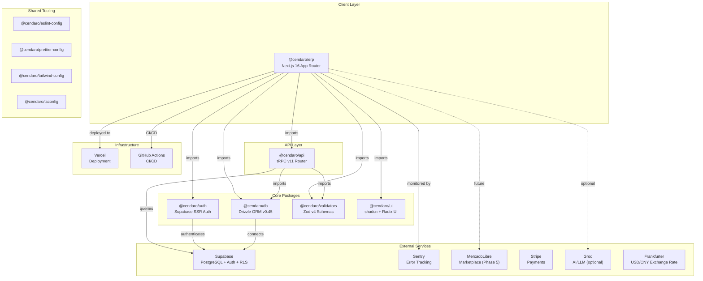
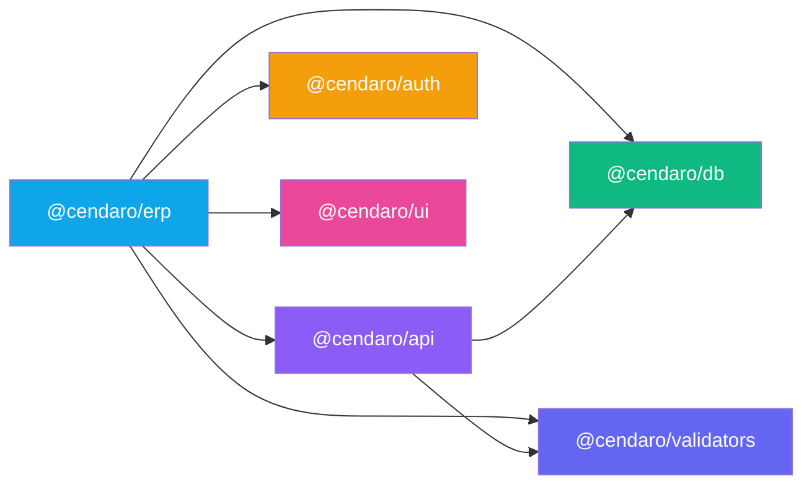

# Cendaro ERP — Architecture Map

> Auto-generated from zero-trust repository audit. Every statement is empirically verified.

---

## High-Level Architecture



---

## Package Descriptions

### `@cendaro/erp` — `apps/erp/`

**Purpose**: Next.js 16 ERP frontend application — the single user-facing app.

- **Framework**: Next.js 16 with App Router + Turbopack dev server
- **UI**: React 19 + Tailwind CSS v4 + shadcn/ui components
- **State/Data**: tRPC client via TanStack React Query v5
- **Auth**: Supabase SSR auth with middleware-based session management
- **Env Validation**: `@t3-oss/env-nextjs` with Zod v4
- **Path Alias**: `~/` → `./src/*`
- **Key directories**:
  - `src/app/(app)/` — 22 authenticated route groups (dashboard, inventory, catalog, vendors, sales, POS, etc.)
  - `src/app/login/` — public login page
  - `src/app/api/trpc/` — tRPC HTTP handler
  - `src/app/api/auth/` — Supabase auth callback
  - `src/app/api/ai/` — AI/LLM proxy endpoint
  - `src/modules/` — domain-specific modules (audit, auth, catalog, integrations, inventory, payments, pricing, receivables, receiving, reporting, sales, vendors)
  - `src/components/` — shared layout components (sidebar, top-bar, dialogs, forms, theme)
  - `src/hooks/` — custom hooks (`use-current-user`, `use-debounce`)
  - `src/trpc/` — tRPC client setup (client, server, query-client, shared)
  - `src/lib/` — utilities (file parsing)

### `@cendaro/api` — `packages/api/`

**Purpose**: tRPC v11 server-side router layer — all business logic lives here.

- **Technologies**: tRPC v11, Drizzle ORM, Zod v4, superjson
- **Exports**: `appRouter`, `AppRouter` type, `createTRPCContext`, `createCallerFactory`, `createCaller`, `logger`
- **16 Router modules**:
  - `users`, `audit`, `approvals`, `catalog`, `inventory`, `container`
  - `pricing`, `quotes`, `sales`, `payments`, `receivables`, `reporting`
  - `vendor`, `integrations`, `dashboard`, `health`
- **Tests**: Vitest v4
- **Dependencies**: `@cendaro/db`, `@cendaro/validators`, `@supabase/supabase-js`

### `@cendaro/auth` — `packages/auth/`

**Purpose**: Supabase SSR authentication helpers with clean server/client/middleware separation.

- **Technologies**: `@supabase/ssr` ^0.6.1, `@supabase/supabase-js` ^2.98
- **Exports**:
  - `.` — barrel (index)
  - `./server` — server-side Supabase client creation
  - `./client` — browser-side Supabase client creation
  - `./middleware` — Next.js middleware auth integration

### `@cendaro/db` — `packages/db/`

**Purpose**: Database schema, client, and query layer using Drizzle ORM.

- **Technologies**: Drizzle ORM v0.45, `drizzle-zod` v0.8, `postgres` (pg.js) v3.4, Zod v4
- **Exports**:
  - `.` — barrel (index)
  - `./client` — database client connection
  - `./schema` — Drizzle schema definitions (~60KB, comprehensive ERP schema)
- **Scripts**: `push` (schema push), `generate` (migration generation), `studio` (Drizzle Studio)

### `@cendaro/ui` — `packages/ui/`

**Purpose**: Shared UI component library built with shadcn/ui patterns.

- **Technologies**: Radix UI v1.4, class-variance-authority, clsx, tailwind-merge, sonner (toasts)
- **Exports**:
  - `.` — barrel (index with `cn` utility, Toaster)
  - `./button` — Button component
- **Peer deps**: React 19, Zod v4

### `@cendaro/validators` — `packages/validators/`

**Purpose**: Shared Zod v4 validation schemas consumed by both `@cendaro/api` and `@cendaro/erp`.

- **Technologies**: Zod v4
- **Exports**: Single barrel at `.`
- **Schema size**: ~4.6KB of validation schemas

---

## Dependency Graph (Inter-Package)



**Key observations**:

- `@cendaro/erp` depends on ALL internal packages
- `@cendaro/api` depends on `@cendaro/db` + `@cendaro/validators` (not auth — auth context is injected via tRPC context)
- `@cendaro/auth`, `@cendaro/db`, `@cendaro/ui`, `@cendaro/validators` are leaf packages with no internal dependencies

---

## Data Flow

### Request Lifecycle

```
Browser → Next.js Middleware (auth check via @cendaro/auth/middleware)
  → App Router Page (Server Component)
    → tRPC Server Caller (packages/api)
      → Drizzle ORM Query (packages/db)
        → Supabase PostgreSQL
```

### Client-Side Data Flow

```
React Client Component
  → tRPC React Query Hook (useQuery/useMutation)
    → HTTP POST to /api/trpc/:procedure
      → tRPC HTTP Handler (apps/erp/src/app/api/trpc/)
        → tRPC Context (auth session + DB client)
          → Router Procedure (packages/api/src/modules/)
            → Drizzle ORM → PostgreSQL
```

### Auth Flow

```
Login Page → Supabase Auth (email/password)
  → Auth Callback (/api/auth/) → Set SSR cookies
    → Middleware validates session on every request
      → Protected routes redirect to /login if no session
```

### File Upload Flow (3-Tier Pipeline)

```
Client: Browser file parsing (xlsx, pdf, csv)
  → Client-side extraction + chunked JSON
    → API Route / tRPC mutation
      → Drizzle batch insert → PostgreSQL
```

---

## Deployment Topology

### Production

- **Platform**: Vercel
- **Framework preset**: Next.js
- **Build command**: `pnpm build`
- **Install command**: `pnpm install`
- **Output directory**: `.next`
- **Ignore command**: `npx turbo-ignore` (skips deploy if no changes detected)
- **Serverless functions**: Next.js API routes + tRPC handler

### CI/CD

- **Platform**: GitHub Actions
- **Trigger**: Push to `main` + all PRs
- **Pipeline**: install → typecheck → lint → build → test
- **Concurrency**: Cancels previous runs on same ref
- **Remote caching**: Turborepo with `TURBO_TOKEN` + `TURBO_TEAM`

### Environment Variables

| Variable                               | Scope    | Purpose                          |
| -------------------------------------- | -------- | -------------------------------- |
| `DATABASE_URL`                         | Server   | Supabase PostgreSQL connection   |
| `NEXT_PUBLIC_SUPABASE_URL`             | Client   | Supabase project URL             |
| `NEXT_PUBLIC_SUPABASE_ANON_KEY`        | Client   | Supabase anonymous key           |
| `SUPABASE_SERVICE_ROLE_KEY`            | Server   | Supabase admin operations        |
| `SENTRY_DSN`                           | Server   | Error tracking (optional)        |
| `GROQ_API_KEY`                         | Server   | AI/LLM access (optional)         |
| `MERCADOLIBRE_APP_ID`                  | Server   | Marketplace integration (future) |
| `MERCADOLIBRE_SECRET`                  | Server   | Marketplace auth (future)        |
| `MERCADOLIBRE_REDIRECT_URI`            | Server   | OAuth callback (future)          |
| `PORT`                                 | Server   | App port (default: 3000)         |
| `NODE_ENV`                             | Passthru | Runtime environment              |
| `CI`                                   | Passthru | CI detection                     |
| `VERCEL` / `VERCEL_ENV` / `VERCEL_URL` | Passthru | Vercel runtime context           |
