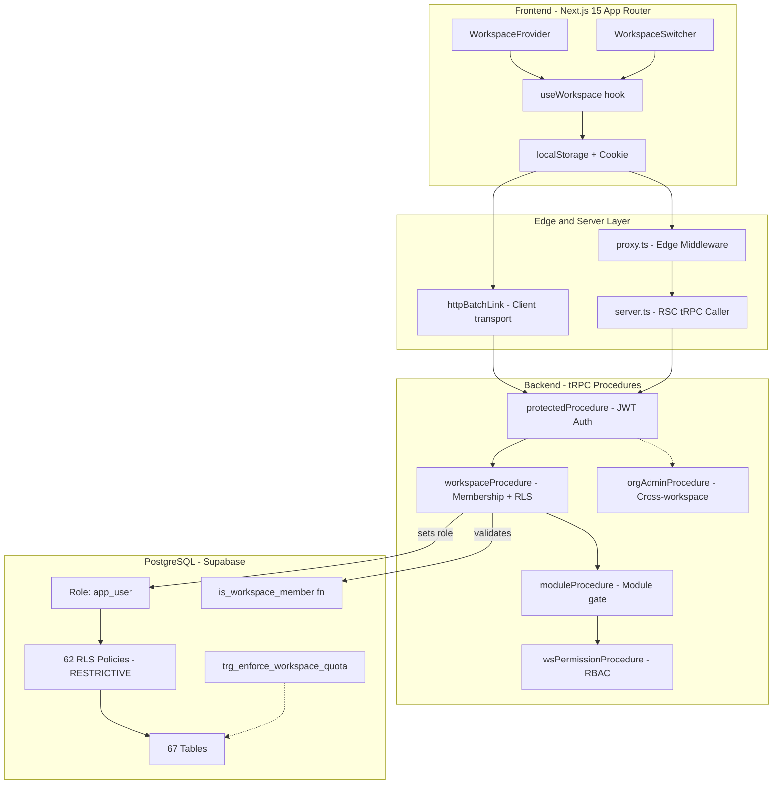
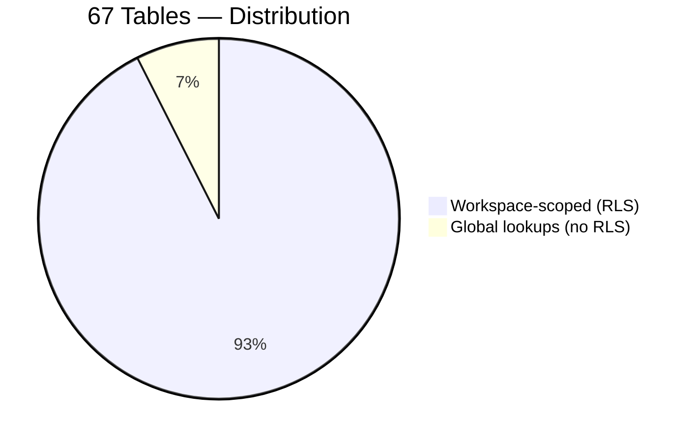
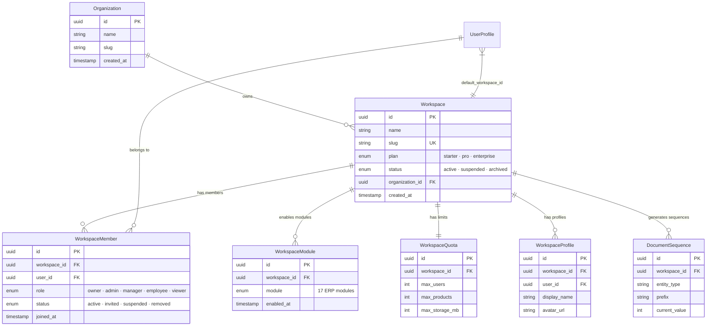
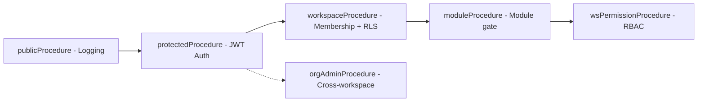
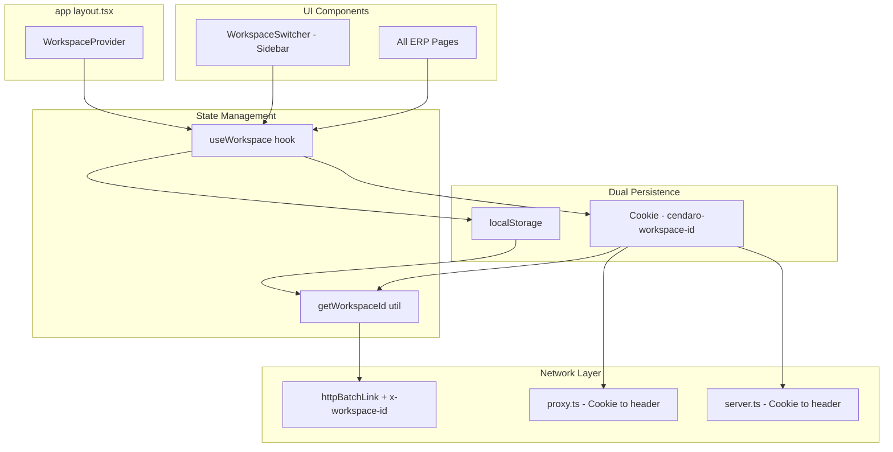
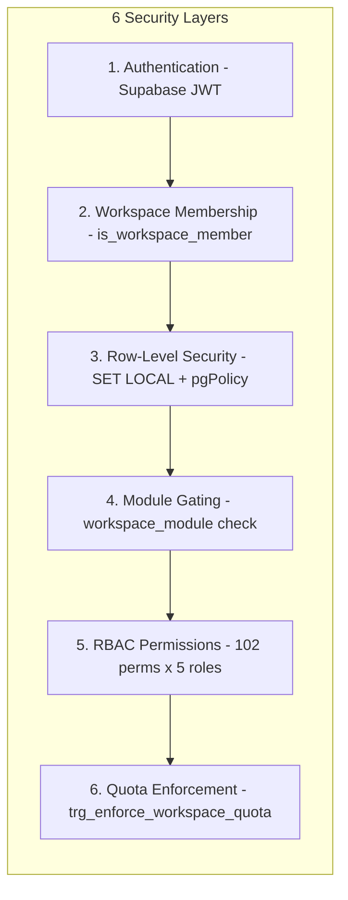

# Cendaro ERP — Multi-Tenant Architecture

> **Technical Reference Document** · v1.0 · 2026-03-24
> **Model**: Workspace-Level Data Isolation via PostgreSQL Row-Level Security (RLS)
> **Status**: Infrastructure complete · Stripe provisioning pending

---

## Executive Summary

### 🏗 Overview

Cendaro implements **shared-database, shared-schema** multi-tenancy. All tenants share one PostgreSQL instance — data isolation is enforced at the row level using native RLS policies. Every domain table carries a `workspace_id` column, and every query runs inside a transaction with `SET LOCAL ROLE app_user` + `SET LOCAL app.workspace_id`, making cross-workspace data leaks structurally impossible.

### 🗄 Database — At a Glance

- **67 tables** total: 62 with RLS + `workspaceId`, 5 global lookups
- **62 RLS policies** with `RESTRICTIVE` mode — `workspace_id = current_setting('app.workspace_id')::uuid`
- **`app_user`** role with scoped CRUD grants on all workspace tables
- **`is_workspace_member()`** SQL function (SECURITY DEFINER) validates active membership
- **`trg_enforce_workspace_quota`** trigger blocks exceeding plan limits
- **12 schema phases**, **34 enums**, **102 RBAC permissions**, **301 role-permission mappings**

### 🔒 Backend — At a Glance

- **19 tRPC routers**: 18 domain routers on `workspaceProcedure`, 1 health (public)
- **4-layer middleware chain**: `protectedProcedure` → `workspaceProcedure` → `moduleProcedure` → `wsPermissionProcedure`
- Every workspace call: validates JWT → validates membership → `SET LOCAL ROLE` → `SET LOCAL app.workspace_id` → executes inside transaction
- **`orgAdminProcedure`** for cross-workspace owner access (no RLS)

### 🖥 Frontend — At a Glance

- **`WorkspaceProvider`** context wraps the authenticated app (`(app)/layout.tsx`)
- **`useWorkspace()`** hook: manages state, `switchWorkspace()`, dual persistence (localStorage + cookie)
- **`WorkspaceSwitcher`** component: sidebar UI with plan badges, keyboard a11y, 44px touch targets
- **3 propagation paths**: Client → `httpBatchLink` header, RSC → `server.ts` cookie read, Pages → `proxy.ts` header injection

---

## Table of Contents

1. [Architecture Overview](#1-architecture-overview)
2. [Request Lifecycle](#2-request-lifecycle)
3. [Database Layer](#3-database-layer)
4. [Middleware Stack](#4-middleware-stack-trpc)
5. [Frontend Integration](#5-frontend-integration)
6. [Plans & Quotas](#6-plans--quotas)
7. [Security Model](#7-security-model)
8. [Key Metrics](#8-key-metrics)
9. [Completeness Matrix](#9-completeness-matrix)

---

## 1. Architecture Overview



---

## 2. Request Lifecycle

Every workspace-scoped request follows this exact sequence. No shortcuts, no exceptions.

```mermaid
sequenceDiagram
    actor U as User
    participant FE as Next.js
    participant MW as workspaceProcedure
    participant PG as PostgreSQL

    Note over U,PG: Every request carries workspace context

    U->>FE: User action
    FE->>FE: Read workspace ID from localStorage or Cookie

    alt Client Component - CSR
        FE->>MW: POST /api/trpc with x-workspace-id header
    else Server Component - RSC
        FE->>FE: proxy.ts reads cookie, injects header
        FE->>MW: Direct procedure call via server.ts
    end

    rect rgb(50, 50, 80)
        Note right of MW: 1 - Authentication Gate
        MW->>MW: protectedProcedure verifies Supabase JWT
    end

    rect rgb(60, 40, 80)
        Note right of MW: 2 - Membership Validation
        MW->>PG: is_workspace_member(user_id, workspace_id)
        PG-->>MW: member_id, role, status
    end

    rect rgb(80, 30, 60)
        Note right of MW: 3 and 4 - RLS Enforcement in transaction
        MW->>PG: BEGIN
        MW->>PG: SET LOCAL ROLE app_user
        MW->>PG: SET LOCAL app.workspace_id
        MW->>PG: SELECT * FROM product
        Note over PG: Policy: workspace_id = current_setting
        PG-->>MW: Only rows from active workspace
        MW->>PG: COMMIT
    end

    MW-->>FE: Isolated data response
    FE-->>U: UI renders workspace-scoped data
```



---

## 3. Database Layer

### 3.1 Table Distribution



#### Workspace-Scoped Tables (62)

Every table below has:

- `workspace_id UUID NOT NULL` — FK to `workspace.id`
- `.enableRLS()` — RLS enabled at table level
- `workspacePolicy()` — Restrictive isolation policy

| Schema Phase | Tables                                                                                                                                                                                                                                                                                                   | Domain          |
| :----------: | -------------------------------------------------------------------------------------------------------------------------------------------------------------------------------------------------------------------------------------------------------------------------------------------------------- | --------------- |
|      1       | `audit_log`                                                                                                                                                                                                                                                                                              | Core            |
|      2       | `brand`, `category`, `category_alias`, `product`, `product_attribute`                                                                                                                                                                                                                                    | Catalog         |
|      3       | `product_price`, `product_supplier`, `product_uom_equivalence`                                                                                                                                                                                                                                           | Catalog (ext)   |
|      4       | `import_session`, `import_session_row`                                                                                                                                                                                                                                                                   | Data Import     |
|      5       | `supplier`, `warehouse`, `warehouse_location`, `stock_ledger`, `channel_allocation`, `stock_movement`, `inventory_count`, `inventory_count_item`, `inventory_discrepancy`                                                                                                                                | Inventory       |
|      6       | `container`, `container_item`, `container_document`                                                                                                                                                                                                                                                      | Containers      |
|      7       | `ai_prompt_config`, `exchange_rate`                                                                                                                                                                                                                                                                      | AI & Config     |
|      8       | `price_history`, `pricing_rule`, `repricing_event`                                                                                                                                                                                                                                                       | Pricing         |
|      9       | `customer`, `customer_address`, `sales_order`, `order_item`, `payment`, `payment_evidence`, `payment_allocation`, `cash_closure`, `quote`, `quote_item`, `delivery_note`, `delivery_note_item`, `internal_invoice`, `internal_invoice_item`, `vendor_commission`, `account_receivable`, `ar_installment` | Sales & Finance |
|      9       | `ml_listing`, `ml_order`, `integration_log`, `mercadolibre_account`, `mercadolibre_order_event`, `integration_failure`                                                                                                                                                                                   | Integrations    |
|      9       | `system_alert`, `approval`, `signature`                                                                                                                                                                                                                                                                  | Operations      |
|      10      | `workspace_member`, `workspace_module`, `workspace_profile`, `workspace_quota`, `document_sequence`                                                                                                                                                                                                      | Multi-tenancy   |
|      11      | `notification_bucket`, `notification_bucket_assignee`, `notification_routing_rule`                                                                                                                                                                                                                       | Notifications   |

#### Global Tables (5) — No RLS

| Table             | Why global                                 |
| ----------------- | ------------------------------------------ |
| `organization`    | Parent entity above workspaces             |
| `workspace`       | Must be queried to list user's workspaces  |
| `user_profile`    | Cross-workspace user identity              |
| `permission`      | Static permission definitions (102 rows)   |
| `role_permission` | Static role↔permission mappings (301 rows) |

### 3.2 RLS Policy Template

```sql
-- Applied identically to all 62 workspace-scoped tables
CREATE POLICY "{table}_workspace_isolation"
  ON public.{table}
  AS RESTRICTIVE          -- Combines with AND (strictest mode)
  FOR ALL                 -- SELECT, INSERT, UPDATE, DELETE
  TO app_user             -- Only applies when role = app_user
  USING (
    workspace_id = current_setting('app.workspace_id', true)::uuid
  )
  WITH CHECK (
    workspace_id = current_setting('app.workspace_id', true)::uuid
  );
```

**Key design decisions:**

- `AS RESTRICTIVE` → Cannot be bypassed by permissive policies
- `current_setting(..., true)` → Returns NULL if not set (0 rows, not error)
- `FOR ALL` → Single policy covers all DML operations
- `TO app_user` → Only activates when `SET LOCAL ROLE app_user` is called

### 3.3 Workspace Entity Relationships



### 3.4 SQL Infrastructure

| Object                            | Type                        | Purpose                                                                 |
| --------------------------------- | --------------------------- | ----------------------------------------------------------------------- |
| `app_user`                        | PostgreSQL Role             | RLS-restricted role with CRUD on 62 tables, SELECT on 5 global          |
| `is_workspace_member(uuid, uuid)` | Function (SECURITY DEFINER) | Validates active membership, returns `{member_id, role, status}`        |
| `trg_enforce_workspace_quota`     | Trigger (BEFORE INSERT)     | Blocks new `workspace_member` rows if `max_users` exceeded              |
| `trg_order_number`                | Trigger (BEFORE INSERT)     | Auto-generates workspace-scoped order numbers using `document_sequence` |

---

## 4. Middleware Stack (tRPC)

### 4.1 Procedure Chain



### 4.2 Procedure Reference

| Procedure                         | Inherits  | Validates                       |             Routers              |
| --------------------------------- | --------- | ------------------------------- | :------------------------------: |
| `publicProcedure`                 | —         | Request logging                 |            1 (health)            |
| `protectedProcedure`              | public    | Supabase JWT session            | 2 (`users.me`, `workspace.list`) |
| **`workspaceProcedure`**          | protected | **Membership + SET LOCAL**      |              **18**              |
| `moduleProcedure(mod)`            | workspace | Module in `workspace_module`    |            Available             |
| `wsPermissionProcedure(mod, act)` | module    | Permission in `role_permission` |            Available             |
| `orgAdminProcedure`               | protected | Owner role (no SET LOCAL)       |            Admin ops             |

### 4.3 Router Migration Status

All 18 domain routers have been migrated to `workspaceProcedure`:

```
approvals     ✅    catalog        ✅    catalog-import ✅
containers    ✅    dashboard      ✅    integrations   ✅
inventory     ✅    inventory-imp  ✅    payments       ✅
pricing       ✅    quotes         ✅    receivables    ✅
reporting     ✅    sales          ✅    users (partial)✅
vendors       ✅    workspace      ✅    audit-router   ✅
```

> `users.ts` retains 2 `protectedProcedure` for `me` and org-level queries (correct by design).
> `workspace.ts` retains 3 `protectedProcedure` for cross-workspace listing/creation (correct by design).

---

## 5. Frontend Integration

### 5.1 Component Architecture



### 5.2 Propagation Paths

| Path              | Source             | Transport                | Reads from                    |
| ----------------- | ------------------ | ------------------------ | ----------------------------- |
| **Client → tRPC** | `getWorkspaceId()` | `httpBatchLink` header   | localStorage / cookie         |
| **RSC → tRPC**    | `server.ts`        | Direct caller            | Cookie `cendaro-workspace-id` |
| **Page render**   | `proxy.ts`         | Request header injection | Cookie `cendaro-workspace-id` |

---

## 6. Plans & Quotas

### 6.1 Plan Comparison

| Feature                 | 🟢 Starter |  🔵 Pro   | 🟣 Enterprise |
| ----------------------- | :--------: | :-------: | :-----------: |
| **Modules**             |     6      | 17 (all)  |  17 + custom  |
| **Users per workspace** |     1      | Unlimited |   Unlimited   |
| **Products**            |    500     | Unlimited |   Unlimited   |
| **Storage**             |   500 MB   |   10 GB   |    Custom     |
| **Enforcement**         | DB trigger |     —     |       —       |

### 6.2 Starter Modules (6)

`dashboard` · `catalog` · `inventory` · `orders` · `pos` · `customers`

### 6.3 All Modules (17)

`dashboard` · `catalog` · `inventory` · `orders` · `pos` · `customers` · `pricing` · `suppliers` · `accounting` · `reports` · `integrations` · `crm` · `hr` · `logistics` · `quality` · `maintenance` · `settings`

---

## 7. Security Model

### 7.1 Defense in Depth



### 7.2 Security Guarantees

| Layer | Mechanism                           |  Can be bypassed?  | Bypass scenario |
| :---: | ----------------------------------- | :----------------: | --------------- |
|   ①   | Supabase JWT                        |         ❌         | —               |
|   ②   | SQL function (SECURITY DEFINER)     |         ❌         | —               |
|   ③   | PostgreSQL native RLS (RESTRICTIVE) |         ❌         | —               |
|   ④   | tRPC middleware                     | Only by owner role | Design decision |
|   ⑤   | DB-driven permission check          | Only by owner role | Design decision |
|   ⑥   | PostgreSQL trigger                  |         ❌         | —               |

> **Key guarantee**: Even if the application layer is compromised, layers ①②③⑥ operate at the database level and cannot be bypassed by application code.

---

## 8. Key Metrics

| Metric                                 |    Value    |
| -------------------------------------- | :---------: |
| Total tables                           |   **67**    |
| Tables with RLS + workspace isolation  |   **62**    |
| Global tables (no RLS)                 |    **5**    |
| RLS policies with USING/WITH CHECK     | **62 / 62** |
| Domain routers on `workspaceProcedure` | **18 / 18** |
| RBAC permissions defined               |   **102**   |
| Role-permission mappings               |   **301**   |
| Active workspaces                      |    **1**    |
| Users with membership                  |    **2**    |
| Modules enabled (current workspace)    |   **17**    |
| Security layers (defense in depth)     |    **6**    |
| Schema phases                          |   **12**    |
| Database enums                         |   **34**    |

---

## 9. Completeness Matrix

### ✅ Implemented & Verified

| Component                                      | Verification                       |
| ---------------------------------------------- | ---------------------------------- |
| Schema — 62 tables with `workspaceId` FK       | Drizzle schema audit               |
| 62 RLS policies with correct USING/WITH CHECK  | `pg_policy` query: 62/62 non-null  |
| `app_user` role + GRANT privileges             | `pg_roles` confirmed               |
| `is_workspace_member()` SQL function           | SECURITY DEFINER, correct logic    |
| `workspaceProcedure` + SET LOCAL + transaction | `trpc.ts` L259-312                 |
| 18 domain routers migrated                     | grep: 0 stale `protectedProcedure` |
| Frontend Provider + Hook + Cookie              | `use-workspace.tsx`                |
| Server-side propagation (RSC + Proxy)          | `server.ts` + `proxy.ts`           |
| WorkspaceSwitcher UI (273 LOC, a11y)           | Manual verification                |
| Quota enforcement trigger                      | `trg_enforce_workspace_quota`      |
| `pnpm typecheck`                               | ✅ Exit 0                          |
| `pnpm test` (39 tests)                         | ✅ All pass                        |

### ❌ Pending — Subscription & Provisioning

| Component                                             | Required for production |
| ----------------------------------------------------- | :---------------------: |
| Stripe products (Starter, Pro, Enterprise)            |           Yes           |
| Stripe Checkout integration                           |           Yes           |
| Webhook endpoint (`/api/webhooks/stripe`)             |           Yes           |
| Auto-provisioning (payment → workspace creation)      |           Yes           |
| Onboarding flow (signup → plan → payment → dashboard) |           Yes           |
| Plan upgrade/downgrade handler                        |           Yes           |

---

> **Document generated from live audit of Cendaro ERP monorepo**
> Last verified: 2026-03-24 · All metrics sourced from production Supabase instance
