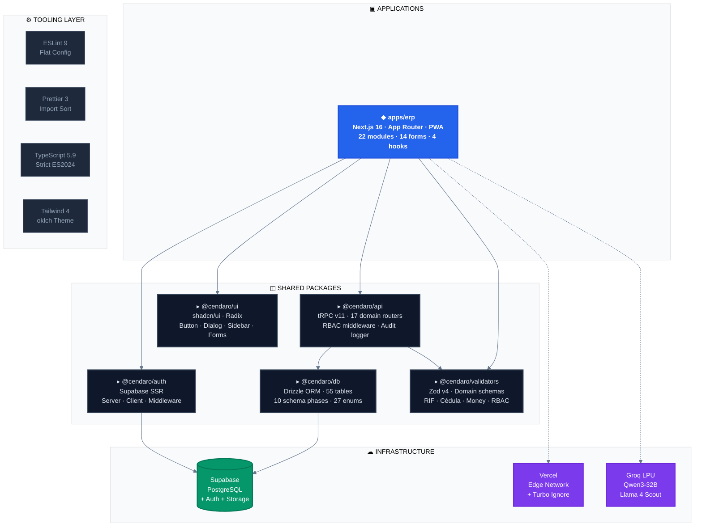
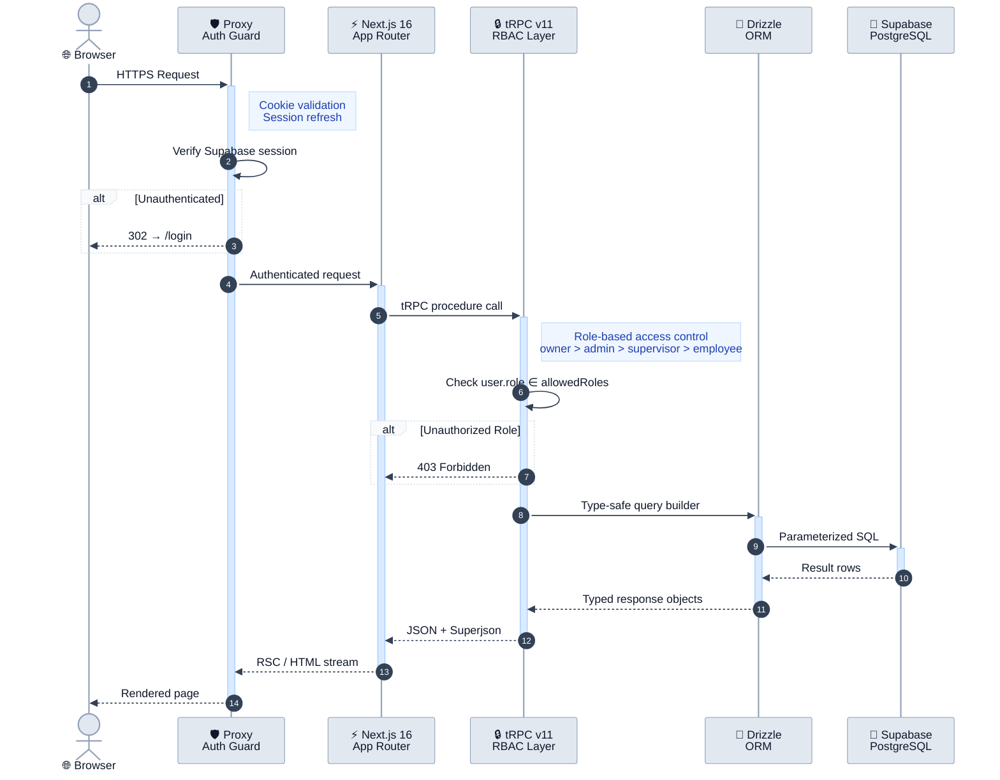
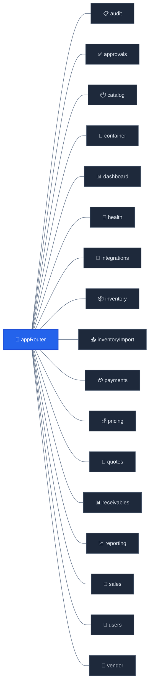
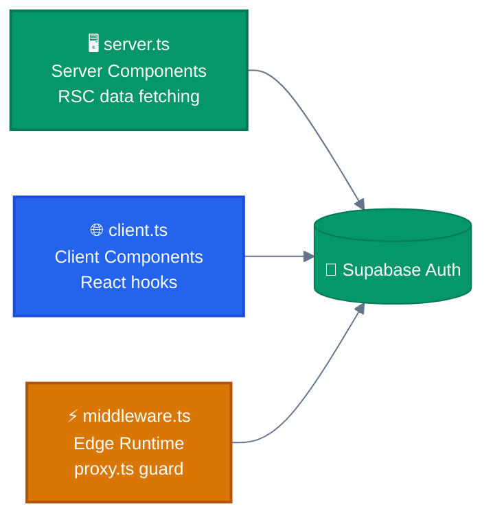
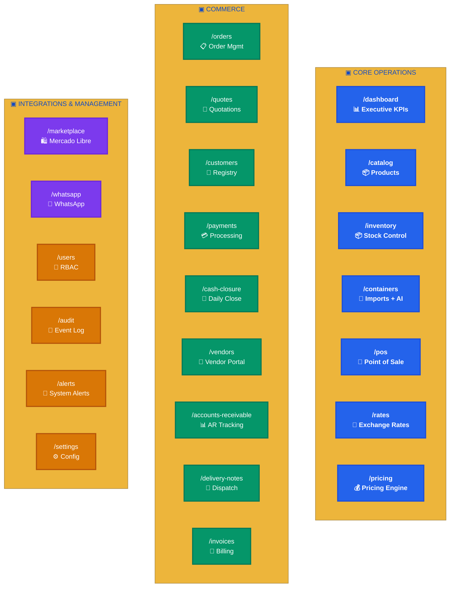
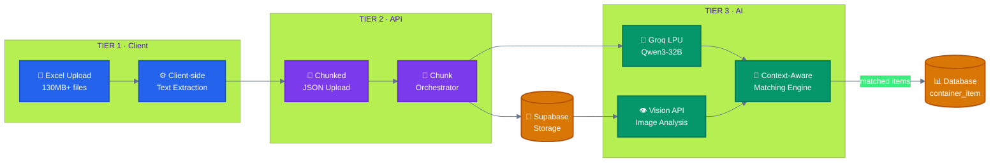
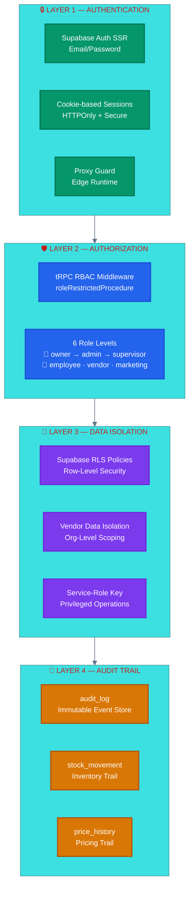

<p align="center">
  <picture>
    <source media="(prefers-color-scheme: dark)" srcset="https://img.shields.io/badge/%E2%96%B2_CENDARO-ERP_PLATFORM-2463eb?style=for-the-badge&labelColor=0a0a0a" />
    
  </picture>
</p>

<p align="center">
  
  
  
  
  
  
  
  
</p>

<p align="center">
  <strong>Enterprise-grade omnichannel ERP</strong> for wholesale + retail commerce in Venezuela.<br/>
  Unified inventory · Multi-currency pricing engine · AI-powered container processing · Marketplace integrations
</p>

<p align="center">
  <a href="#-architecture">Architecture</a> · 
  <a href="#-tech-stack">Stack</a> · 
  <a href="#-monorepo-packages">Packages</a> · 
  <a href="#-erp-modules">Modules</a> · 
  <a href="#-database-schema">Schema</a> · 
  <a href="#-ai-pipeline">AI</a> · 
  <a href="#-security">Security</a> · 
  <a href="#-getting-started">Start</a>
</p>

<br/>

## 🏗 Architecture

### System Overview



### Request Lifecycle



### Monorepo File Tree

```
cendaro/
├── apps/
│   └── erp/                              ← Next.js 16 (App Router + PWA)
│       └── src/
│           ├── app/(app)/                 ← 22 authenticated route groups
│           ├── app/api/                   ← tRPC + AI + Auth endpoints
│           ├── components/                ← Sidebar, TopBar, Dialog, 14 forms
│           ├── hooks/                     ← useBcvRate, useCnyRate, useCurrentUser, useDebounce
│           ├── modules/                   ← 12 client-side domain modules
│           ├── trpc/                      ← Client, server, query-client setup
│           └── proxy.ts                   ← Edge auth guard
│
├── packages/
│   ├── api/                              ← tRPC v11 business logic
│   │   └── src/modules/                  ← 17 domain routers
│   ├── auth/                             ← Supabase SSR (3 clients)
│   ├── db/                               ← Drizzle schema (55 tables)
│   ├── ui/                               ← shadcn/ui components
│   └── validators/                       ← Zod v4 domain schemas
│
├── tooling/
│   ├── eslint/                           ← ESLint 9 flat config
│   ├── prettier/                         ← Import sorting + TW plugin
│   ├── typescript/                       ← Strict ES2024 base configs
│   └── tailwind/                         ← oklch theme + design tokens
│
├── turbo.json                            ← Turborepo pipeline (12 tasks)
├── vercel.json                           ← Deployment config
├── pnpm-workspace.yaml                   ← Workspace + dependency catalog
└── .husky/                               ← Git hooks (lint-staged)
```

---

## ⚡ Tech Stack

<table>
<tr>
<td width="50%">

### 🖥 Frontend & Framework

|     | Technology               | Version   |
| --- | ------------------------ | --------- |
| ⚡  | **Next.js** (App Router) | `16.0.10` |
| ⚛️  | **React**                | `19.1.4`  |
| 🟦  | **TypeScript** (strict)  | `5.9.3`   |
| 🎨  | **Tailwind CSS** v4      | `4.2.1`   |
| 🧩  | **shadcn/ui** + Radix    | new-york  |
| 📊  | **TanStack Query**       | `5.90.21` |

</td>
<td width="50%">

### ⚙️ Backend & Data

|     | Technology              | Version   |
| --- | ----------------------- | --------- |
| 🔌  | **tRPC** v11            | `11.12.0` |
| 💎  | **Drizzle** ORM         | `0.45.1`  |
| 🐘  | **Supabase** PostgreSQL | Managed   |
| 🔐  | **Supabase Auth** SSR   | `0.6.1`   |
| ✅  | **Zod** v4              | `4.3.6`   |
| 🤖  | **Groq** LPU (AI)       | API       |

</td>
</tr>
<tr>
<td>

### 🔧 Build & Quality

|     | Technology              | Version    |
| --- | ----------------------- | ---------- |
| 🚀  | **Turborepo**           | `2.8.14`   |
| 📦  | **pnpm**                | `10.30.3`  |
| 🟢  | **Node.js**             | `≥ 20 LTS` |
| 🔍  | **ESLint** 9 (flat)     | `9.39.4`   |
| ✨  | **Prettier**            | `3.8.1`    |
| 🐶  | **Husky** + lint-staged | Latest     |

</td>
<td>

### 🚢 Deployment

|     | Technology       | Details               |
| --- | ---------------- | --------------------- |
| ▲   | **Vercel**       | Edge network          |
| 🏗  | **turbo-ignore** | Smart build skipping  |
| 🌍  | **dotenv-cli**   | Env management        |
| 📊  | **Sentry**       | Error tracking (prod) |

</td>
</tr>
</table>

> **📌 Version policy:** All dependencies are centralized in `pnpm-workspace.yaml` → `catalog:` section. Pinned to latest verified stable — not bleeding-edge.

---

## 📦 Monorepo Packages

### `@cendaro/api` — Business Logic Layer

> End-to-end type-safe API with tRPC v11, RBAC middleware, and structured audit logging.



| Router            | Domain                                  | Key Operations                             | Access                  |
| ----------------- | --------------------------------------- | ------------------------------------------ | ----------------------- |
| `users`           | Profiles, RBAC                          | Create, update roles/status                | 👑 Admin, Owner         |
| `audit`           | Event trail                             | Query immutable logs                       | 👑 Admin+               |
| `approvals`       | Workflow approvals                      | Request, approve, reject, expire           | 👑 Admin, 🔧 Supervisor |
| `catalog`         | Products, brands, categories, suppliers | Full CRUD, attribute management            | 📋 Role-based           |
| `inventory`       | Warehouses, stock, movements            | Transfers, cycle counts, adjustments       | 📋 Role-based           |
| `inventoryImport` | Spreadsheet imports                     | Initialize, replace, adjust stock via xlsx | 📋 Role-based           |
| `container`       | Import tracking, AI packing lists       | Create, receive, close, AI parse           | 👑 Admin, 🔧 Supervisor |
| `pricing`         | Rates, repricing events                 | Auto-repricing on BCV ≥ 5% change          | 👑 Admin, 🔧 Supervisor |
| `quotes`          | Customer quotes                         | Create, send, convert to order             | 📋 Role-based           |
| `sales`           | Customers, orders, payments             | Order lifecycle, multi-method payment      | 📋 Role-based           |
| `payments`        | Payment processing                      | Record, validate, allocate payments        | 📋 Role-based           |
| `receivables`     | Accounts receivable                     | AR tracking, installments, aging           | 👑 Admin, 🔧 Supervisor |
| `reporting`       | Reports & analytics                     | Sales, inventory, financial reports        | 👑 Admin+               |
| `vendor`          | Portal, commissions, AR                 | Self-service orders, client management     | 🤝 Vendor (self)        |
| `integrations`    | Mercado Libre, WhatsApp                 | Order sync, listing management             | 👑 Admin                |
| `dashboard`       | Executive KPIs                          | Sales analytics, margin reports            | 👑 Admin+               |
| `health`          | System status                           | Readiness check                            | 🌐 Public               |

---

### `@cendaro/db` — Database & Schema

> 55 tables, 27 enums, 10 implementation phases — the entire data domain in one schema file.

```mermaid
%%{init: {'theme': 'base', 'themeVariables': {'primaryColor': '#0f172a', 'primaryTextColor': '#e2e8f0', 'primaryBorderColor': '#334155', 'lineColor': '#475569', 'fontSize': '12px'}}}%%

graph TB
  classDef phase1 fill:#2463eb,stroke:#1d4ed8,color:#fff,stroke-width:2px
  classDef phase2 fill:#7c3aed,stroke:#6d28d9,color:#fff,stroke-width:2px
  classDef phase3 fill:#059669,stroke:#047857,color:#fff,stroke-width:2px
  classDef phase4 fill:#d97706,stroke:#b45309,color:#fff,stroke-width:2px
  classDef phase5 fill:#dc2626,stroke:#b91c1c,color:#fff,stroke-width:2px
  classDef phase5b fill:#f59e0b,stroke:#d97706,color:#000,stroke-width:2px
  classDef phase6 fill:#0891b2,stroke:#0e7490,color:#fff,stroke-width:2px
  classDef phase7 fill:#c026d3,stroke:#a21caf,color:#fff,stroke-width:2px
  classDef phase8 fill:#e11d48,stroke:#be123c,color:#fff,stroke-width:2px
  classDef phase9 fill:#6366f1,stroke:#4f46e5,color:#fff,stroke-width:2px

  subgraph P1["◆ PHASE 1 — Identity & RBAC"]
    O[Organization]:::phase1
    UP[UserProfile]:::phase1
    PM[Permission]:::phase1
    RP[RolePermission]:::phase1
    AL[AuditLog]:::phase1
  end

  subgraph P2["◆ PHASE 2 — Catalog"]
    BR[Brand]:::phase2
    CT[Category]:::phase2
    SP[Supplier]:::phase2
    PR[Product]:::phase2
    PA[ProductAttribute]:::phase2
    PUE[ProductUomEquivalence]:::phase2
    PS[ProductSupplier]:::phase2
    PP[ProductPrice]:::phase2
  end

  subgraph P3["◆ PHASE 3 — Inventory & Containers"]
    WH[Warehouse]:::phase3
    WL[WarehouseLocation]:::phase3
    SL[StockLedger]:::phase3
    CA[ChannelAllocation]:::phase3
    SM[StockMovement]:::phase3
    IC[InventoryCount]:::phase3
    ICI[InventoryCountItem]:::phase3
    ID[InventoryDiscrepancy]:::phase3
    CN[Container]:::phase3
    CI[ContainerItem]:::phase3
    CD[ContainerDocument]:::phase3
    APC[AiPromptConfig]:::phase3
  end

  subgraph P4["◆ PHASE 4 — Pricing Engine"]
    ER[ExchangeRate]:::phase4
    PH[PriceHistory]:::phase4
    PRL[PricingRule]:::phase4
    RE[RepricingEvent]:::phase4
  end

  subgraph P5["◆ PHASE 5 — Sales & Payments"]
    CU[Customer]:::phase5
    CAD[CustomerAddress]:::phase5
    OR[SalesOrder]:::phase5
    OI[OrderItem]:::phase5
    PY[Payment]:::phase5
    PE[PaymentEvidence]:::phase5
    PAL[PaymentAllocation]:::phase5
    CC[CashClosure]:::phase5
  end

  subgraph P5B["◆ PHASE 5b — Quotes & Documents"]
    QT[Quote]:::phase5b
    QI[QuoteItem]:::phase5b
    DN[DeliveryNote]:::phase5b
    DNI[DeliveryNoteItem]:::phase5b
    II[InternalInvoice]:::phase5b
    III[InternalInvoiceItem]:::phase5b
  end

  subgraph P6["◆ PHASE 6 — Vendor Portal & AR"]
    VC[VendorCommission]:::phase6
    AR[AccountReceivable]:::phase6
    ARI[ArInstallment]:::phase6
  end

  subgraph P7["◆ PHASE 7 — Integrations"]
    ML[MlListing]:::phase7
    MO[MlOrder]:::phase7
    IL[IntegrationLog]:::phase7
    MA[MercadolibreAccount]:::phase7
    MOE[MercadolibreOrderEvent]:::phase7
    IF[IntegrationFailure]:::phase7
  end

  subgraph P8["◆ PHASE 8 — Alerts"]
    SA[SystemAlert]:::phase8
  end

  subgraph P9["◆ PHASE 9 — Approvals & Signatures"]
    APR[Approval]:::phase9
    SIG[Signature]:::phase9
  end

  O --> UP
  UP --> AL
  BR --> PR
  CT --> PR
  SP --> PR
  PR --> PA
  PR --> PP
  WH --> SL
  WH --> WL
  PR --> SL
  PR --> CA
  PR --> SM
  SP --> CN
  CN --> CI
  CN --> CD
  PR --> CI
  IC --> ICI
  PR --> PH
  ER --> RE
  CU --> OR
  CU --> CAD
  OR --> OI
  OR --> PY
  PY --> PE
  OR --> DN
  QT --> QI
  II --> III
  UP --> VC
  CU --> AR
  AR --> ARI
  ML --> MO
  APR --> SIG
```

<details>
<summary><strong>📊 Click to expand full schema map</strong></summary>



</details>

| Phase  | Color | Domain                 | Tables                                                                                                                                                                                                                                            |
| :----: | :---: | ---------------------- | ------------------------------------------------------------------------------------------------------------------------------------------------------------------------------------------------------------------------------------------------- |
| **1**  |  🔵   | Identity & RBAC        | `organization` · `user_profile` · `permission` · `role_permission` · `audit_log`                                                                                                                                                                  |
| **2**  |  🟣   | Catalog                | `brand` · `category` · `supplier` · `product` · `product_attribute` · `product_uom_equivalence` · `product_supplier` · `product_price`                                                                                                            |
| **3**  |  🟢   | Inventory & Containers | `warehouse` · `warehouse_location` · `stock_ledger` · `channel_allocation` · `stock_movement` · `inventory_count` · `inventory_count_item` · `inventory_discrepancy` · `container` · `container_item` · `container_document` · `ai_prompt_config` |
| **4**  |  🟠   | Pricing Engine         | `exchange_rate` · `price_history` · `pricing_rule` · `repricing_event`                                                                                                                                                                            |
| **5**  |  🔴   | Sales & Payments       | `customer` · `customer_address` · `sales_order` · `order_item` · `payment` · `payment_evidence` · `payment_allocation` · `cash_closure`                                                                                                           |
| **5b** |  🟡   | Quotes & Documents     | `quote` · `quote_item` · `delivery_note` · `delivery_note_item` · `internal_invoice` · `internal_invoice_item`                                                                                                                                    |
| **6**  |  🔷   | Vendor Portal & AR     | `vendor_commission` · `account_receivable` · `ar_installment`                                                                                                                                                                                     |
| **7**  |  🟪   | Integrations           | `ml_listing` · `ml_order` · `integration_log` · `mercadolibre_account` · `mercadolibre_order_event` · `integration_failure`                                                                                                                       |
| **8**  |  💗   | Alerts                 | `system_alert`                                                                                                                                                                                                                                    |
| **9**  |  🔮   | Approvals & Signatures | `approval` · `signature`                                                                                                                                                                                                                          |

---

### `@cendaro/auth` — Authentication

> Supabase Auth SSR with three specialized clients for the Next.js App Router lifecycle.



---

### `@cendaro/ui` — Component Library

> Design system built on shadcn/ui (new-york) + Radix — accessible, composable, themed.

| Category       | Components                                                                                                                                                                                                                                        |
| -------------- | ------------------------------------------------------------------------------------------------------------------------------------------------------------------------------------------------------------------------------------------------- |
| **Layout**     | `Sidebar` · `TopBar` · `Dialog`                                                                                                                                                                                                                   |
| **Controls**   | `Button` (7 variants × 4 sizes) · `ThemeToggle`                                                                                                                                                                                                   |
| **Auth**       | `RoleGuard` — RBAC-based conditional rendering                                                                                                                                                                                                    |
| **Forms (14)** | `CreateProduct` · `EditProduct` · `CreateOrder` · `UpdateOrderStatus` · `CreateCustomer` · `CreateContainer` · `CreateBrand` · `CreateCategory` · `CreateSupplier` · `CreateClosure` · `CycleCount` · `TransferStock` · `CreateUser` · `EditUser` |
| **Utilities**  | `cn()` — Tailwind Merge + clsx                                                                                                                                                                                                                    |

---

### `@cendaro/validators` — Domain Validation

> Venezuelan business domain schemas shared across frontend and backend via Zod v4.

| Schema                  | Pattern                | Example                                                      |
| ----------------------- | ---------------------- | ------------------------------------------------------------ |
| `rifSchema`             | `^[JVGEP]-\d{8}-\d$`   | `J-12345678-9`                                               |
| `cedulaSchema`          | `^[VE]-\d{6,8}$`       | `V-1234567`                                                  |
| `moneySchema`           | `≥ 0, max 2 decimals`  | `100.50`                                                     |
| `exchangeRateSchema`    | `> 0, max 4 decimals`  | `36.5812`                                                    |
| `percentageSchema`      | `0 – 100`              | `15`                                                         |
| `skuCodeSchema`         | `1–64 chars`           | `SKU-001`                                                    |
| `barcodeSchema`         | `max 128 chars`        | `7591234567890`                                              |
| `phoneSchema`           | VE format              | `0414-1234567`                                               |
| `orderNumberSchema`     | `^ORD-[A-Z0-9]{4,16}$` | `ORD-A1B2C3D4`                                               |
| `containerNumberSchema` | `4–64 chars`           | `CONT-2024-001`                                              |
| `userRoleSchema`        | 6 enum values          | `owner` `admin` `supervisor` `employee` `vendor` `marketing` |
| `createOrderSchema`     | Composite form         | Order with items, channel, notes                             |
| `createQuoteSchema`     | Composite form         | Quote with items, expiry, notes                              |
| `createPaymentSchema`   | Composite form         | Payment with method, amount, reference                       |

---

## 🖥 ERP Modules



|  #  | Route                  | Module                                                         | Status |
| :-: | ---------------------- | -------------------------------------------------------------- | :----: |
|  1  | `/dashboard`           | Executive Dashboard — KPI widgets, charts, filters             |   ✅   |
|  2  | `/catalog`             | Product Catalog — CRUD, brands, categories, suppliers          |   ✅   |
|  3  | `/inventory`           | Inventory Control — stock ledger, movements, cycle counts      |   ✅   |
|  4  | `/containers`          | Container Management — import tracking, AI packing list parser |   ✅   |
|  5  | `/pos`                 | Point of Sale — scanner, cart, payment registration            |   ✅   |
|  6  | `/rates`               | Exchange Rates — BCV, parallel, RMB rates dashboard            |   ✅   |
|  7  | `/pricing`             | Pricing Engine — repricing events, price history               |   ✅   |
|  8  | `/orders`              | Order Management — create, status workflow, dispatch           |   ✅   |
|  9  | `/quotes`              | Quotations — create, send, convert to sales order              |   ✅   |
| 10  | `/customers`           | Customer Registry — types, credit limits, history              |   ✅   |
| 11  | `/payments`            | Payment Processing — multi-method, evidence upload             |   ✅   |
| 12  | `/cash-closure`        | Daily Cash Closure — reconciliation, approval                  |   ✅   |
| 13  | `/delivery-notes`      | Delivery Notes — dispatch tracking, recipient confirmation     |   ✅   |
| 14  | `/invoices`            | Internal Invoices — billing, document management               |   ✅   |
| 15  | `/vendors`             | Vendor Portal — self-service orders, commissions               |   ✅   |
| 16  | `/accounts-receivable` | Accounts Receivable — AR tracking, aging, payments             |   ✅   |
| 17  | `/marketplace`         | Mercado Libre — listing sync, order import                     |   ✅   |
| 18  | `/whatsapp`            | WhatsApp Sales — assisted sales channel                        |   ✅   |
| 19  | `/users`               | User Management — RBAC, profiles, status                       |   ✅   |
| 20  | `/audit`               | Audit Log — immutable event trail                              |   ✅   |
| 21  | `/alerts`              | System Alerts — low stock, rate changes, overdue AR            |   ✅   |
| 22  | `/settings`            | Configuration — organization, preferences                      |   ✅   |

---

## 🗄 Database Schema

```mermaid
%%{init: {'theme': 'base', 'themeVariables': {'primaryColor': '#1e293b', 'primaryTextColor': '#e2e8f0', 'lineColor': '#475569', 'fontSize': '12px'}}}%%

erDiagram
  Organization ||--o{ UserProfile : "employs"
  UserProfile ||--o{ AuditLog : "creates"
  UserProfile ||--o{ VendorCommission : "earns"

  Brand ||--o{ Product : "brands"
  Category ||--o{ Product : "classifies"
  Supplier ||--o{ Product : "supplies"
  Product ||--o{ ProductAttribute : "describes"
  Product ||--o{ ProductPrice : "priced as"
  Product ||--o{ ProductUomEquivalence : "converts"
  Product ||--o{ ProductSupplier : "sourced from"

  Warehouse ||--o{ StockLedger : "stores"
  Warehouse ||--o{ WarehouseLocation : "contains"
  Product ||--o{ StockLedger : "stocked in"
  Product ||--o{ ChannelAllocation : "allocated to"
  Product ||--o{ StockMovement : "tracked by"

  Supplier ||--o{ Container : "ships"
  Container ||--o{ ContainerItem : "contains"
  Container ||--o{ ContainerDocument : "attached"
  Product ||--o{ ContainerItem : "referenced"

  ExchangeRate }o--|| RepricingEvent : "triggers"
  Product ||--o{ PriceHistory : "price logged"

  Customer ||--o{ CustomerAddress : "addressed at"
  Customer ||--o{ SalesOrder : "places"
  SalesOrder ||--o{ OrderItem : "includes"
  SalesOrder ||--o{ Payment : "paid via"
  Payment ||--o{ PaymentEvidence : "evidenced by"
  Customer ||--o{ AccountReceivable : "owes"
  AccountReceivable ||--o{ ArInstallment : "split into"

  Customer ||--o{ Quote : "quoted for"
  Quote ||--o{ QuoteItem : "includes"
  SalesOrder ||--o{ DeliveryNote : "dispatched via"
  DeliveryNote ||--o{ DeliveryNoteItem : "contains"
  SalesOrder ||--o{ InternalInvoice : "invoiced as"
  InternalInvoice ||--o{ InternalInvoiceItem : "includes"

  Approval ||--o{ Signature : "signed by"
```



---

## 🤖 AI Pipeline



| Component            | Technology                               | Purpose                                              |
| -------------------- | ---------------------------------------- | ---------------------------------------------------- |
| **Text Extraction**  | Client-side Excel parsing                | Parse large files (130MB+) in the browser            |
| **Translation**      | Groq LPU · Qwen3-32B                     | Translate Chinese → Spanish, normalize names         |
| **Product Matching** | Context-aware scoring · `AiPromptConfig` | Match parsed items to catalog with confidence scores |
| **Image Processing** | Supabase Storage + Groq Vision           | Extract product details from packing list images     |
| **Fallback Model**   | Llama 4 Scout                            | Secondary model for rate-limit recovery              |

---

## 🔐 Security



---

## 🎨 Design System

<table>
<tr>
<td width="50%">

### 🎯 Color Palette

| Token           | Value                  | Preview |
| --------------- | ---------------------- | :-----: |
| **Primary**     | `#2463eb` (oklch)      |   🔵    |
| **Success**     | `oklch(0.70 0.15 145)` |   🟢    |
| **Warning**     | `oklch(0.75 0.15 75)`  |   🟡    |
| **Destructive** | `oklch(0.55 0.2 25)`   |   🔴    |

</td>
<td width="50%">

### 🖌 Design Tokens

| Token             | Value                  |
| ----------------- | ---------------------- |
| **Typography**    | Inter (Google Fonts)   |
| **Shadows**       | 5-level (`xs` → `2xl`) |
| **Dark Mode**     | Class-based (`.dark`)  |
| **Border Radius** | Consistent system      |
| **Spacing**       | Tailwind v4 scale      |

</td>
</tr>
</table>

> Defined in `tooling/tailwind/theme.css` — imported globally via `@import "@cendaro/tailwind-config/theme"`.

---

## 🚀 Getting Started

### Prerequisites

| Requirement  | Version                 |
| ------------ | ----------------------- |
| **Node.js**  | ≥ 20.0.0                |
| **pnpm**     | 10.30.3                 |
| **Supabase** | Project with PostgreSQL |

### Installation

```bash
# 1. Clone & install
git clone <repo-url> cendaro && cd cendaro
pnpm install

# 2. Configure environment
cp .env.example .env
# → Edit .env with Supabase credentials

# 3. Push schema to database
pnpm db:push

# 4. Start development
pnpm dev          # All packages in watch mode
pnpm dev:erp      # ERP app only
```

### Environment Variables

| Variable                        | Required | Description                  |
| ------------------------------- | :------: | ---------------------------- |
| `DATABASE_URL`                  |    ✅    | PostgreSQL connection string |
| `NEXT_PUBLIC_SUPABASE_URL`      |    ✅    | Supabase project URL         |
| `NEXT_PUBLIC_SUPABASE_ANON_KEY` |    ✅    | Supabase anonymous key       |
| `SUPABASE_SERVICE_ROLE_KEY`     |    ✅    | Service role key (backend)   |
| `SENTRY_DSN`                    |    —     | Error tracking (production)  |
| `MERCADOLIBRE_APP_ID`           |    —     | Mercado Libre OAuth          |
| `MERCADOLIBRE_SECRET`           |    —     | Mercado Libre OAuth          |
| `PORT`                          |    —     | Custom server port           |

---

## 📜 Scripts

<table>
<tr>
<td width="50%">

### 🔨 Development

| Script         | Description               |
| -------------- | ------------------------- |
| `pnpm dev`     | All packages — watch mode |
| `pnpm dev:erp` | ERP app + dependencies    |
| `pnpm build`   | Production build          |

</td>
<td width="50%">

### ✅ Quality

| Script           | Description             |
| ---------------- | ----------------------- |
| `pnpm typecheck` | TypeScript verification |
| `pnpm lint`      | ESLint (type-checked)   |
| `pnpm format`    | Prettier check          |
| `pnpm test`      | Test suites             |

</td>
</tr>
<tr>
<td>

### 🗄 Database

| Script             | Description            |
| ------------------ | ---------------------- |
| `pnpm db:push`     | Push schema → Supabase |
| `pnpm db:generate` | Generate migrations    |
| `pnpm db:studio`   | Drizzle Studio GUI     |

</td>
<td>

### 🧩 UI

| Script            | Description             |
| ----------------- | ----------------------- |
| `pnpm ui-add`     | Add shadcn/ui component |
| `pnpm lint:fix`   | Auto-fix all lint       |
| `pnpm format:fix` | Auto-format all         |

</td>
</tr>
</table>

---

## 🗺 Roadmap

| Phase | Domain                                          | Status |
| :---: | ----------------------------------------------- | :----: |
| **0** | Foundation — monorepo, tooling, design system   |   ✅   |
| **1** | Schema, RBAC, audit trail, permissions          |   ✅   |
| **2** | Catalog, inventory, containers, AI pipeline     |   ✅   |
| **3** | Pricing engine, exchange rates, auto-repricing  |   ✅   |
| **4** | Sales, payments, cash closure, order workflow   |   ✅   |
| **5** | Mercado Libre + WhatsApp integrations           |   ✅   |
| **6** | Executive dashboard, vendor portal, commissions |   ✅   |
| **7** | Testing, hardening, CI/CD, Git lifecycle        |   ✅   |
| **8** | Dashboard KPIs, system alerts, AI inference     |   ✅   |
| **9** | Approvals, signatures, quotes, documents        |   ✅   |

---

## 📄 Documentation

> **Source of truth**: The [`docs/`](docs/README.md) folder contains the canonical ERP v1.0 specification package. See [ADR-001](docs/adr/001-erp-v1-source-of-truth.md) for the migration decision.

| Document                   | Path                                                                                                                         |   Status    |
| -------------------------- | ---------------------------------------------------------------------------------------------------------------------------- | :---------: |
| **PRD v1.0**               | [`docs/product/PRD_v1.0.md`](docs/product/PRD_v1.0.md)                                                                       |  ✅ Active  |
| **ERD & Schema Blueprint** | [`docs/architecture/erd_schema_blueprint_v1.md`](docs/architecture/erd_schema_blueprint_v1.md)                               |  ✅ Active  |
| **Module & API Blueprint** | [`docs/architecture/module_api_blueprint_v1.md`](docs/architecture/module_api_blueprint_v1.md)                               |  ✅ Active  |
| **DBML Schema**            | [`docs/data/erp_schema_v1.dbml`](docs/data/erp_schema_v1.dbml)                                                               |  ✅ Active  |
| **Schema Alignment**       | [`docs/data/SCHEMA_ALIGNMENT.md`](docs/data/SCHEMA_ALIGNMENT.md)                                                             |  ✅ Active  |
| **Spreadsheet Import PRD** | [`docs/product/features_prd/FEATURE_PRD_SPREADSHEET_IMPORT.md`](docs/product/features_prd/FEATURE_PRD_SPREADSHEET_IMPORT.md) |  ✅ Active  |
| **Inventory Import PRD**   | [`docs/product/features_prd/FEATURE_PRD_INVENTORY_IMPORT.md`](docs/product/features_prd/FEATURE_PRD_INVENTORY_IMPORT.md)     |  ✅ Active  |
| **Catalog Import PRD**     | [`docs/product/features_prd/FEATURE_PRD_CATALOG_IMPORT.md`](docs/product/features_prd/FEATURE_PRD_CATALOG_IMPORT.md)         |  ✅ Active  |
| **ADR-001**                | [`docs/adr/001-erp-v1-source-of-truth.md`](docs/adr/001-erp-v1-source-of-truth.md)                                           |  ✅ Active  |
| **Legacy PRD v0.7**        | [`docs/product/LEGACY_PRD_v0.7.md`](docs/product/LEGACY_PRD_v0.7.md)                                                         | 🗄️ Archived |
| **README**                 | this file                                                                                                                    |  ✅ Active  |
| **Workflows**              | `.agents/workflows/`                                                                                                         |  ✅ Active  |

> **Sync policy:** Critical changes must be verified against the PRD v1.0 and reflected here. See `.agents/workflows/prd-sync.md`.

---

<p align="center">
  <sub><strong>Cendaro</strong> © 2026 — Built with ❤️ for Venezuelan commerce</sub>
</p>
