# ERP Omnicanal — ERD & Schema Blueprint v1

## 1) Objetivo

Traducir el PRD maestro a un modelo relacional inicial, consistente y construible para PostgreSQL/Drizzle.

## 2) Módulos de dominio

- Identity & RBAC
- Catalog
- Warehouses & Channels
- Inventory Ledger
- Receiving & Containers
- Pricing & Exchange Rates
- Sales & Documents
- Payments & Cash Closure
- Accounts Receivable
- Vendor Portal
- Mercado Libre Integration
- Audit & Approvals

## 3) Entidades principales

### Identity / Authorization

- `users`
- `roles`
- `permissions`
- `role_permissions`
- `user_roles`

### Core Catalog

- `brands`
- `categories`
- `products`
- `product_technical_attributes`
- `product_uom_equivalences`
- `product_suppliers`

### Warehouses / Channels

- `warehouses`
- `warehouse_locations`
- `sales_channels`
- `channel_stock_allocations`

### Inventory

- `inventory_balances`
- `inventory_ledger`
- `inventory_counts`
- `inventory_count_items`
- `inventory_discrepancies`

### Receiving / Containers

- `containers`
- `container_documents`
- `packing_list_imports`
- `packing_list_rows`
- `container_items`
- `container_receipts`

### Pricing

- `exchange_rates`
- `pricing_rules`
- `product_prices`
- `price_change_batches`
- `price_history`

### Commercial / Sales

- `customers`
- `customer_addresses`
- `quotes`
- `quote_items`
- `orders`
- `order_items`
- `delivery_notes`
- `delivery_note_items`
- `internal_invoices`
- `internal_invoice_items`

### Payments / Credit / Cash

- `payments`
- `payment_allocations`
- `payment_evidence`
- `accounts_receivable`
- `ar_installments`
- `cash_closures`

### Integrations

- `mercadolibre_accounts`
- `mercadolibre_listings`
- `mercadolibre_orders`
- `mercadolibre_order_events`
- `integration_failures`

### Audit / Workflow

- `approvals`
- `audit_logs`
- `system_alerts`
- `signatures`

## 4) Reglas de modelado clave

- Cada variante es un SKU independiente: no existe parent/child variant model.
- WhatsApp e Instagram consumen stock de tienda.
- El stock real se reconstruye desde `inventory_ledger`; `inventory_balances` es tabla de proyección/lectura.
- No se permiten notas de crédito en v1.
- Factura interna es opcional; recibo existe siempre cuando hay pago.
- Todo pago debe cuadrar exactamente con el total a cerrar.
- Producto con discrepancia puede quedar bloqueado hasta aprobación.
- Precios masivos se recalculan por batch con snapshot de tasas.

## 5) ERD lógico (Mermaid)

```mermaid
erDiagram
  USERS ||--o{ USER_ROLES : has
  ROLES ||--o{ USER_ROLES : grants
  ROLES ||--o{ ROLE_PERMISSIONS : grants
  PERMISSIONS ||--o{ ROLE_PERMISSIONS : maps

  BRANDS ||--o{ PRODUCTS : owns
  CATEGORIES ||--o{ PRODUCTS : classifies
  PRODUCTS ||--o{ PRODUCT_TECHNICAL_ATTRIBUTES : has
  PRODUCTS ||--o{ PRODUCT_UOM_EQUIVALENCES : has
  PRODUCTS ||--o{ PRODUCT_SUPPLIERS : has

  WAREHOUSES ||--o{ WAREHOUSE_LOCATIONS : contains
  PRODUCTS ||--o{ INVENTORY_BALANCES : tracked_in
  WAREHOUSES ||--o{ INVENTORY_BALANCES : tracked_in
  PRODUCTS ||--o{ INVENTORY_LEDGER : moves
  WAREHOUSES ||--o{ INVENTORY_LEDGER : source_or_dest
  SALES_CHANNELS ||--o{ CHANNEL_STOCK_ALLOCATIONS : allocates
  PRODUCTS ||--o{ CHANNEL_STOCK_ALLOCATIONS : allocates

  CONTAINERS ||--o{ CONTAINER_ITEMS : contains
  PRODUCTS ||--o{ CONTAINER_ITEMS : expected
  PACKING_LIST_IMPORTS ||--o{ PACKING_LIST_ROWS : contains
  CONTAINERS ||--o{ PACKING_LIST_IMPORTS : sourced_from

  PRODUCTS ||--o{ PRODUCT_PRICES : priced
  EXCHANGE_RATES ||--o{ PRICE_CHANGE_BATCHES : snapshots
  PRICE_CHANGE_BATCHES ||--o{ PRICE_HISTORY : generates
  PRODUCTS ||--o{ PRICE_HISTORY : changes

  CUSTOMERS ||--o{ QUOTES : requests
  QUOTES ||--o{ QUOTE_ITEMS : contains
  CUSTOMERS ||--o{ ORDERS : places
  ORDERS ||--o{ ORDER_ITEMS : contains
  ORDERS ||--o| INTERNAL_INVOICES : may_generate
  INTERNAL_INVOICES ||--o{ INTERNAL_INVOICE_ITEMS : contains
  ORDERS ||--o{ DELIVERY_NOTES : fulfills

  INTERNAL_INVOICES ||--o{ PAYMENTS : paid_by
  PAYMENTS ||--o{ PAYMENT_EVIDENCE : has
  INTERNAL_INVOICES ||--o{ ACCOUNTS_RECEIVABLE : may_create
  ACCOUNTS_RECEIVABLE ||--o{ AR_INSTALLMENTS : schedules
  CASH_CLOSURES ||--o{ PAYMENTS : groups

  MERCADOLIBRE_ACCOUNTS ||--o{ MERCADOLIBRE_LISTINGS : owns
  MERCADOLIBRE_LISTINGS ||--o{ PRODUCTS : maps_to
  MERCADOLIBRE_ORDERS ||--o{ MERCADOLIBRE_ORDER_EVENTS : emits
  ORDERS ||--o| MERCADOLIBRE_ORDERS : mirrored_by

  USERS ||--o{ APPROVALS : performs
  USERS ||--o{ AUDIT_LOGS : performs
  USERS ||--o{ SIGNATURES : signs
```

## 6) Tablas núcleo sugeridas

### `products`

Campos mínimos:

- `id` UUID PK
- `internal_code` text unique not null
- `barcode` text unique not null
- `name` text not null
- `brand_id` uuid fk
- `category_id` uuid fk
- `short_description` text not null
- `long_description` text null
- `weight_grams` integer not null
- `volume_ml` integer not null
- `compatibility` text null
- `is_blocked` boolean default false
- `is_active` boolean default true
- `created_at`, `updated_at`

### `product_technical_attributes`

- `id`
- `product_id`
- `attribute_key`
- `attribute_label`
- `attribute_type` (text, number, boolean, enum)
- `attribute_value_text`
- `attribute_value_number`
- `sort_order`

### `product_uom_equivalences`

- `id`
- `product_id`
- `uom` enum(`unit`,`dozen`,`box`,`bundle`)
- `units_per_uom` numeric(12,4)
- `is_default_sale_uom` boolean
- `created_by`

### `warehouses`

- `id`
- `code`
- `name`
- `warehouse_type` enum(`main`,`store`,`in_transit`,`reserved`,`defective`)
- `is_sellable`

### `sales_channels`

- `id`
- `code` enum(`store`,`mercadolibre`,`vendors`,`whatsapp`,`instagram`)
- `name`
- `consumes_from_channel_id` nullable fk (WhatsApp/Instagram -> store)

### `inventory_balances`

- `product_id`
- `warehouse_id`
- `channel_id` nullable
- `on_hand_qty`
- `allocated_qty`
- `available_qty`
- unique (`product_id`,`warehouse_id`,`channel_id`)

### `inventory_ledger`

- `id`
- `product_id`
- `movement_type` enum(`receipt`,`sale`,`transfer_out`,`transfer_in`,`adjustment`,`count_lock`,`count_release`,`allocation`,`deallocation`,`mercadolibre_sync`)
- `source_warehouse_id` nullable
- `destination_warehouse_id` nullable
- `channel_id` nullable
- `quantity`
- `reference_type`
- `reference_id`
- `reason`
- `performed_by`
- `approved_by` nullable
- `occurred_at`

### `containers`

- `id`
- `container_number` text unique
- `status` enum(`created`,`in_transit`,`received_total`,`closed`)
- `departure_date`
- `arrival_date`
- `fob_cost_usd` numeric(14,2)
- `notes`
- `approved_by` nullable

### `container_items`

- `id`
- `container_id`
- `product_id`
- `expected_qty`
- `received_qty`
- `cost_base_china`
- `cost_freight`
- `cost_total_imported`
- `average_cost_after_receipt`

### `exchange_rates`

- `id`
- `rate_type` enum(`bcv`,`parallel`,`rmb`)
- `rate_value`
- `effective_at`
- `created_by`

### `product_prices`

- `id`
- `product_id`
- `price_type` enum(`store_retail`,`store_wholesale`,`national_vendor`,`online_promo`)
- `amount`
- `currency` enum(`VES`,`USD`)
- `active_from`
- `active_to` nullable
- unique (`product_id`,`price_type`,`active_from`)

### `price_change_batches`

- `id`
- `trigger_type` enum(`rate_threshold`,`manual_rate_edit`,`manual_batch`)
- `bcv_rate_snapshot`
- `parallel_rate_snapshot`
- `rmb_rate_snapshot`
- `threshold_percent`
- `auto_applied` boolean
- `requires_admin_review_until` timestamptz nullable
- `status` enum(`pending_review`,`approved`,`superseded`)
- `created_by`

### `price_history`

- `id`
- `batch_id`
- `product_id`
- `price_type`
- `old_amount`
- `new_amount`
- `reason`
- `created_at`

### `customers`

- `id`
- `customer_type` enum(`retail`,`wholesale`,`distributor`,`vip`,`marketplace`,`vendor_customer`)
- `name`
- `document_type`
- `document_number`
- `assigned_vendor_user_id` nullable
- `credit_days` nullable
- `credit_due_date` nullable
- `credit_balance_pending` numeric nullable
- `is_credit_blocked` boolean default false

### `orders`

- `id`
- `order_number` text unique
- `customer_id` nullable
- `channel_id`
- `seller_user_id`
- `status` enum(`draft`,`pending_confirmation`,`confirmed`,`invoiced`,`dispatched`,`delivered`,`cancelled`)
- `document_flow_type` enum(`quote_order_invoice_receipt`,`order_invoice_receipt`,`direct_sale_receipt`)
- `subtotal`,`discount_total`,`tax_total`,`grand_total`
- `created_at`

### `order_items`

- `id`
- `order_id`
- `product_id`
- `uom`
- `uom_quantity`
- `base_units_quantity`
- `unit_price`
- `line_total`

### `internal_invoices`

- `id`
- `order_id`
- `invoice_number` unique
- `customer_snapshot_json`
- `issued_by`
- `issued_at`

### `payments`

- `id`
- `order_id`
- `invoice_id` nullable
- `payment_method` enum(`mobile_payment`,`bank_transfer`,`cash`,`pos`,`zelle`,`other`)
- `amount`
- `reference_number`
- `payer_name`
- `payer_document`
- `paid_at`
- `validated_by`

### `accounts_receivable`

- `id`
- `invoice_id`
- `customer_id`
- `original_amount`
- `pending_amount`
- `due_date`
- `status` enum(`open`,`overdue`,`paid`,`blocked`)
- `created_by`
- `approved_by`

### `cash_closures`

- `id`
- `closure_date`
- `status` enum(`open`,`closed`,`reopened`)
- `expected_total`
- `counted_total`
- `difference_total`
- `closed_by`
- `approved_by` nullable

### `mercadolibre_orders`

- `id`
- `ml_order_id` unique
- `account_id`
- `listing_id`
- `order_id` nullable
- `shipping_status`
- `sync_status` enum(`imported`,`pending_review`,`failed`,`synced`)
- `raw_payload_json`
- `last_synced_at`

### `audit_logs`

- `id`
- `actor_user_id`
- `module`
- `entity_type`
- `entity_id`
- `action`
- `before_json`
- `after_json`
- `ip_address` nullable
- `created_at`

### `approvals`

- `id`
- `approval_type` enum(`credit_sale`,`inventory_adjustment`,`channel_stock_move`,`product_unblock`,`price_change`,`container_close`,`cash_closure`,`edit_post_issue_document`)
- `reference_type`
- `reference_id`
- `requested_by`
- `approved_by` nullable
- `status` enum(`pending`,`approved`,`rejected`)
- `notes`

## 7) Índices mínimos

- `products(internal_code)` unique
- `products(barcode)` unique
- `inventory_balances(product_id, warehouse_id, channel_id)` unique
- `inventory_ledger(product_id, occurred_at desc)`
- `orders(order_number)` unique
- `orders(status, created_at desc)`
- `payments(order_id, paid_at desc)`
- `accounts_receivable(customer_id, status, due_date)`
- `product_prices(product_id, price_type, active_from desc)`
- `price_history(product_id, created_at desc)`
- `mercadolibre_orders(ml_order_id)` unique
- `audit_logs(entity_type, entity_id, created_at desc)`

## 8) Constraints/Reglas críticas

- No cerrar venta si `sum(payments.amount) != orders.grand_total`.
- No permitir `inventory_balances.available_qty < 0`.
- Solo admin puede editar documentos ya emitidos.
- Solo admin puede forzar venta con deuda.
- Producto bloqueado no puede venderse.
- WhatsApp e Instagram deben mapear a stock/allocación de tienda.
- Notas de crédito fuera de v1.

## 9) Eventos de dominio sugeridos

- `rate.changed`
- `pricing.batch_generated`
- `pricing.batch_approved`
- `inventory.received`
- `inventory.transferred`
- `inventory.discrepancy_detected`
- `inventory.product_blocked`
- `order.created`
- `order.confirmed`
- `invoice.issued`
- `payment.recorded`
- `cash.closed`
- `mercadolibre.order_imported`
- `integration.failure_detected`

## 10) Jobs sugeridos

- Sync BCV / tasas internas
- Repricing batch generator
- Mercado Libre order import sync
- Mercado Libre stock sync retry
- Alert digest generator
- Inventory balance projection rebuild

## 11) Orden recomendado de migraciones

1. auth & permissions
2. catalog core
3. warehouses & channels
4. inventory balances & ledger
5. receiving & containers
6. pricing & exchange rates
7. customers & credit
8. sales & documents
9. payments & cash closure
10. integrations
11. approvals & audit

## 12) Decisiones abiertas para v1.1+

- Política contable definitiva más allá de costo promedio operativo
- Profundidad de historial de envío Mercado Libre
- Evolución a PWA instalable
- Política de backups obligatoria
