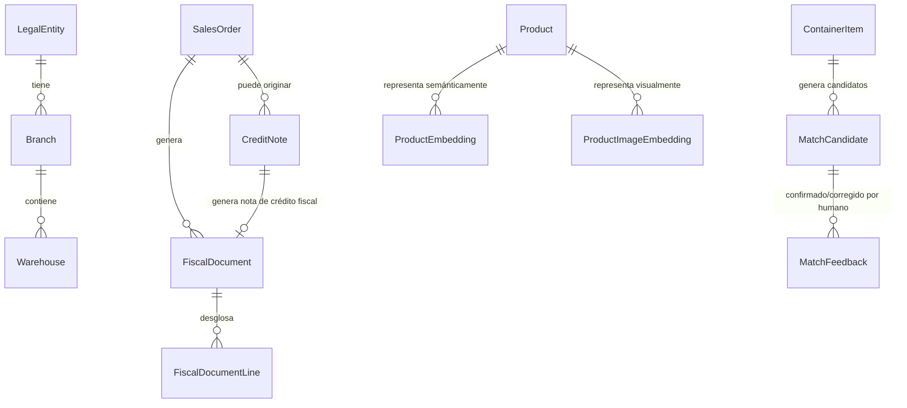

# PRD v2.0 — Cendaro Rumbo a Producción y Mercado

## Estado del documento

- **Versión:** 2.0 (reemplaza y absorbe el borrador anterior de "Multiempresa + Facturación Fiscal", que queda integrado como secciones 7 y 8 de este documento).
- **Estado:** Borrador maestro para revisión de negocio, listo para convertirse en backlog técnico.
- **Idioma operativo:** Español.
- **Relación con el PRD v1.0:** No lo reemplaza como especificación funcional base — lo usa como referencia de reglas de negocio ya cerradas. Este documento se enfoca en **cerrar la brecha entre lo especificado/escaffoldeado y lo que realmente funciona en producción**, y en las capacidades nuevas que el mercado y la regulación venezolana exigen hoy.
- **Premisa de partida (confirmada directamente por el dueño del producto):** la mayoría de los 19 routers / 22 rutas que el README marca como "✅ completos" tienen **estructura y algo de lógica, pero no están funcionalmente terminados al 100%**. Módulos como integración con Mercado Libre, portal de vendedores, factura interna, cierre de caja y cuentas por cobrar son, a día de hoy, **solo estructurales**. El pipeline de IA de contenedores está en pausa deliberada.
- **Filosofía de esta etapa:** calidad y confiabilidad por encima de velocidad de entrega. Es preferible tener menos módulos, pero sólidos, que muchos módulos a medias.

---

## 0. Resumen ejecutivo

Cendaro construyó en tiempo récord el esqueleto completo de un ERP omnicanal — 67 tablas, 19 routers tRPC, 22 rutas de aplicación. Es una base técnica seria. Pero un esqueleto no es un sistema que se pueda poner en producción real ni vender como producto: **el negocio no puede operar con seguridad hoy sobre módulos que son "solo estructurales"**, y no puede facturar legalmente en Venezuela sin un módulo fiscal que hoy no existe.

Este documento es la hoja de ruta para llevar Cendaro de "prototipo funcional avanzado" a **"sistema de producción confiable, auditable y legalmente correcto"**, cubriendo seis frentes simultáneos:

1. **Cierre de brechas de implementación** en todos los módulos ya scaffoldeados (el "casi todos" que mencionaste).
2. **Notas de crédito y devoluciones** — flujo completo, ya no fuera de alcance.
3. **Facturación fiscal integrada**, aprovechando que el SENIAT abrió la puerta a sistemas de facturación de terceros homologados.
4. **Multiempresa / multi-sucursal real** — fundamento ahora, operación completa después.
5. **Rediseño del pipeline de IA de contenedores** hacia una arquitectura RAG eficiente (propuesta técnica incluida en este documento).
6. **Seguridad y auditoría de nivel profesional**, alineadas a estándares reconocidos (ISO 27001, OWASP ASVS, SOC 2) aunque la certificación formal quede para más adelante.

La estrategia de ejecución que definiste es clara: **un núcleo sólido primero** (hasta diciembre de 2026), y todo lo que no quepa con calidad en ese plazo, se mueve a una Fase 2 sin drama. Este documento refleja esa priorización de forma explícita en la sección 16.

---

## 1. Qué significa "solo estructural" y por qué es el problema central

Para que este documento sirva como backlog real, hay que ser preciso con el vocabulario. En esta etapa, un módulo se considera:

| Estado                | Definición                                                                                                                                                                                                                                                                                                                             |
| --------------------- | -------------------------------------------------------------------------------------------------------------------------------------------------------------------------------------------------------------------------------------------------------------------------------------------------------------------------------------- |
| **Estructural**       | Existe tabla en base de datos, existe router/endpoint, existe pantalla. Pero: falta validación real de reglas de negocio, falta manejo de casos borde, puede haber datos de ejemplo/mock, no está probado con volumen real, o simplemente el flujo no se puede completar de principio a fin sin intervención manual fuera del sistema. |
| **Funcional parcial** | El flujo principal funciona, pero le faltan reglas específicas del PRD v1.0 (ej. una validación de permisos, un estado del flujo, una alerta).                                                                                                                                                                                         |
| **Producción-grade**  | Cumple el checklist completo de la sección 4: lógica de negocio 100% según especificación, validación exhaustiva, permisos correctos, auditoría, manejo de errores, sin datos mock, probado con volumen realista (5.000+ SKU, historial de meses).                                                                                     |

El objetivo de esta etapa es mover **todo lo que hoy es "estructural"** a **"producción-grade"**, no agregar más superficie nueva antes de consolidar lo que ya existe — con la única excepción de las capacidades que la ley y el mercado exigen ya (fiscal, notas de crédito).

---

## 2. Principios rectores de esta etapa

1. **No se factura nada sin trazabilidad real.** Si un módulo toca dinero (ventas, pagos, cuentas por cobrar, notas de crédito), no se considera terminado hasta que su auditoría sea completa y verificable.
2. **Terminar antes que expandir.** No se agregan pantallas ni routers nuevos en un módulo hasta que el flujo principal de ese módulo esté probado de punta a punta.
3. **La seguridad y la auditoría no son una fase aparte.** Se aplican de forma transversal a cada módulo que se termine en esta etapa, no como un "sprint de hardening" al final.
4. **Ninguna decisión de esta etapa debe cerrarle la puerta al futuro SaaS ni a la app móvil**, aunque ninguna de las dos se construya todavía.
5. **El pipeline de IA de contenedores permanece en pausa operativa**, pero se diseña ahora (sección 9) para no perder el contexto ganado y para que la implementación futura sea directa.

---

## 3. Alcance de esta etapa — mapa completo

### 3.1 Se cierra ahora (Fase 1, ver roadmap sección 16)

- Todo módulo comercial crítico (ventas, factura interna, pagos, cierre de caja, cuentas por cobrar, portal de vendedores, integración Mercado Libre) llevado a producción-grade.
- Notas de crédito y devoluciones (flujo completo).
- Fundamento técnico y legal de facturación fiscal (modelo de datos, capa de integración, elección de proveedor, ambiente de pruebas).
- Fundamento de datos de multi-sucursal (sin operación diaria completa todavía).
- Hardening de seguridad transversal.
- Auditoría completa (interna + lista para auditor externo).
- Diseño detallado (no implementación) del pipeline RAG de IA.

### 3.2 Se diseña ahora, se opera después (Fase 2)

- Emisión fiscal en producción real (depende de contrato con proveedor externo).
- Multi-sucursal operando el día a día (transferencias, caja por sucursal, reportes consolidados).
- Implementación real del pipeline RAG.
- App móvil nativa para vendedores.
- Camino hacia certificación formal (ISO 27001 / SOC 2), si el negocio decide invertir en ella.

### 3.3 Sigue fuera de alcance

- Multiempresa con razones sociales distintas operando ya (solo se deja el modelo de datos listo).
- Procesamiento de pagos con tarjeta dentro de Cendaro (sigue siendo responsabilidad del POS bancario externo).
- Homologación de Cendaro como software ante el SENIAT (se integra con terceros ya homologados, no se certifica Cendaro mismo).

---

## 4. Definición de "Producción-Grade" — checklist transversal

Este checklist se aplica a **cada** módulo de la sección 5. Un módulo no se marca como terminado en esta etapa si no cumple los ocho puntos:

1. **Lógica de negocio completa** según las reglas cerradas del PRD v1.0 (sin excepciones "para después").
2. **Validación exhaustiva de inputs** (Zod en el borde de la API, no solo en el formulario del cliente).
3. **RBAC verificado** — cada acción del módulo se probó con cada uno de los 6 roles, confirmando qué ve y qué no ve cada uno.
4. **Auditoría real** — toda escritura sensible queda en `audit_log` con actor, antes/después, fecha/hora, y es consultable desde la UI de bitácora.
5. **Manejo de errores y casos borde** — qué pasa si falla la red a mitad de una operación larga (ver PRD v1.0, sección 19.4–19.5), qué pasa con datos duplicados, qué pasa con concurrencia (dos usuarios editando lo mismo).
6. **Cero datos mock/hardcodeados** en el camino de producción.
7. **Probado con volumen realista** — 5.000+ SKU, cientos de pedidos, no solo con 10 registros de prueba.
8. **Documentado** — al menos un párrafo de "cómo funciona" y sus reglas de negocio, para que un segundo desarrollador (o tú mismo en 6 meses) no tenga que releer el código para entenderlo.

---

## 5. Cierre de brechas por módulo (Definition of Done)

Esta tabla es la más importante de todo el documento. Está construida sobre lo que el PRD v1.0 exige y lo que tú mismo señalaste como incompleto. **Revísala con lupa** — donde yo no tengo señal directa tuya, marqué "a validar contigo", porque no quiero inventar un diagnóstico de un módulo que no he visto en código.

| Módulo (router)                                | Diagnóstico                                                                           | Qué falta para producción-grade                                                                                                                                                                                                               | Fase                                         |
| ---------------------------------------------- | ------------------------------------------------------------------------------------- | --------------------------------------------------------------------------------------------------------------------------------------------------------------------------------------------------------------------------------------------- | -------------------------------------------- |
| `sales`                                        | Estructural según tu confirmación                                                     | Flujo completo mostrador→documento→pago debe cerrar sin intervención manual; regla de "suma de pagos = total exacto" (PRD v1.0 §15.3) verificada; bloqueo real por stock insuficiente; atribución correcta de vendedor/empleado en cada venta | **1**                                        |
| `payments`                                     | Estructural según tu confirmación                                                     | Pago mixto (múltiples métodos) probado de verdad; metadatos completos por método (§15.5); conciliación con evidencia adjunta; validación de que un pago no se puede "inventar" sin venta asociada                                             | **1**                                        |
| Cierre de caja (dentro de `sales`/`payments`)  | Estructural según tu confirmación                                                     | Resumen de caja diario real con cifras que cuadren; bloqueo de cierre si hay pagos pendientes de conciliar con POS externo (ver sección 6.4 sobre reconciliación)                                                                             | **1**                                        |
| Factura interna (dentro de `sales`)            | Estructural según tu confirmación                                                     | Generación real del documento con todos los campos de §16; relación 1-a-1 con la venta; solo editable por admin post-emisión (§16.6); impresión funcional                                                                                     | **1**                                        |
| `receivables` (CxC)                            | Estructural según tu confirmación                                                     | Cálculo real de saldo pendiente y vencimiento; bloqueo de venta por deuda vencida (§14.3) funcionando de verdad; visibilidad correcta por rol (§14.4)                                                                                         | **1**                                        |
| `vendor` (portal vendedores)                   | Estructural según tu confirmación                                                     | Un vendedor real debe poder: crear pedido, ver su stock de canal, ver solo sus clientes/ventas/CxC — de punta a punta, sin ayuda de un admin                                                                                                  | **1**                                        |
| `integrations` (Mercado Libre)                 | Estructural según tu confirmación                                                     | Sincronización real de pedidos y stock; manejo de fallo con reintento y alerta (§13.5) verificado con un fallo real simulado, no solo en teoría                                                                                               | **1**                                        |
| `container` (recepción, sin el pipeline de IA) | El flujo manual de recepción/standby/cierre debe funcionar aunque la IA esté en pausa | Verificar que el flujo de contenedores es 100% operable de forma manual (carga de packing list sin IA, mapeo manual a productos, aprobación, liberación de stock) — la IA es una asistencia, no una dependencia dura                          | **1**                                        |
| `catalog` / `catalogImport`                    | A validar contigo                                                                     | Confirmar si CRUD de productos, atributos dinámicos por categoría (§9.8) y equivalencias (§9.3) están realmente completos o si son también "estructurales"                                                                                    | **A validar**                                |
| `inventory` / `inventoryImport`                | A validar contigo                                                                     | Confirmar si el bloqueo de stock negativo (§10.6), el flujo de diferencias con aprobación (§10.7) y los conteos físicos (§10.8) funcionan de extremo a extremo                                                                                | **A validar**                                |
| `pricing`                                      | A validar contigo                                                                     | Confirmar si el repricing automático ≥5% BCV (§12.5) realmente se dispara solo, con la ventana de 24h de ratificación, o si hoy es manual                                                                                                     | **A validar**                                |
| `quotes`                                       | A validar contigo                                                                     | Confirmar flujo cotización→pedido (§16.3) y que la cotización no esté disponible para Mercado Libre (regla explícita)                                                                                                                         | **A validar**                                |
| `users`                                        | A validar contigo                                                                     | Confirmar que los 6 roles tienen sus permisos exactos aplicados (no solo declarados) en cada endpoint sensible                                                                                                                                | **1 (crítico, es la base de todo lo demás)** |
| `workspace`                                    | Ya validado como funcional (multi-tenancy base)                                       | Ninguna acción urgente; se extiende en la sección 8                                                                                                                                                                                           | —                                            |
| `audit`                                        | Existe pero se amplía                                                                 | Ver sección 11 — se lleva a nivel "listo para auditor externo"                                                                                                                                                                                | **1**                                        |
| `approvals`                                    | A validar contigo                                                                     | Confirmar que la matriz de aprobación cerrada (§23.1) está realmente aplicada, no solo modelada                                                                                                                                               | **A validar**                                |
| `dashboard` / `reporting`                      | A validar contigo                                                                     | Confirmar que los KPIs y reportes obligatorios (§17, §18.2) usan datos reales y no placeholders                                                                                                                                               | **A validar**                                |
| `health`                                       | Probablemente ya funcional (es un router trivial)                                     | Ninguna acción                                                                                                                                                                                                                                | —                                            |

> **Acción para ti:** en las filas marcadas "A validar contigo", dime en una frase si cada uno está más cerca de "funciona pero tiene huecos" o de "es solo estructural" — con eso convierto esta tabla en un backlog de tickets accionable con estimados.

---

## 6. Notas de crédito y devoluciones — especificación completa

Esto era "fuera de alcance" en el PRD v1.0 (§16.2) y ahora entra completo, porque una operación fiscal real casi siempre lo exige.

### 6.1 Qué cubre

- Devolución total o parcial de una venta ya facturada (interna y/o fiscalmente).
- Anulación de una venta antes de que exista documento fiscal (caso simple).
- Corrección de errores de facturación después de emitido el documento fiscal (caso que exige nota de crédito formal, no solo edición).

### 6.2 Nueva entidad: `credit_note`

Campos mínimos:

- `id`, `sales_order_id` / `fiscal_document_id` (a qué venta/documento corresponde)
- `type` (devolución de mercancía / corrección de monto / corrección de datos del cliente)
- `reason` (motivo, obligatorio, texto libre + categoría cerrada para reportes)
- `items` (qué productos y cantidades se devuelven, si aplica)
- `amount` (monto acreditado)
- `restock` (si la mercancía devuelta vuelve o no a inventario, y a qué estado — normal, defectuoso)
- `approved_by`, `created_by`, `created_at`, `approved_at`
- `linked_fiscal_credit_note_id` (cuando exista el documento fiscal correspondiente, ver 6.5)

### 6.3 Reglas de negocio

- Toda nota de crédito **requiere aprobación exclusiva de `admin`** (confirmado). `employee` y `supervisor` nunca pueden aprobar una nota de crédito, sin excepción por monto — se cierra así la pregunta abierta que existía en la sección 19 de la versión anterior de este documento.
- Si la mercancía devuelta se reintegra a inventario, se registra como un `inventory_movement` de tipo "devolución", auditado igual que cualquier movimiento.
- Una nota de crédito **nunca edita** la venta original — la venta original queda inmutable (igual que ya exige el PRD v1.0 §16.6 para documentos emitidos), y la nota de crédito es un documento nuevo que la referencia.
- Si la venta original ya tiene `fiscal_document`, la nota de crédito debe generar su propio **documento fiscal de crédito** (ver 6.5) — no puede quedar solo como ajuste interno.

### 6.4 Reconciliación con pagos externos (POS bancario)

Como confirmaste que los pagos con tarjeta van por un POS externo y el vendedor anota el número de transacción para cotejar en el cierre de caja de la tarde, una devolución con reembolso por tarjeta tiene una particularidad: **Cendaro no puede reversar el cobro en el POS**, solo puede registrar que se debe reversar. Se agrega:

- Estado `refund_pending_external` en la nota de crédito cuando el método original fue tarjeta/POS.
- Checklist de cierre de caja: toda nota de crédito con reembolso pendiente de POS debe quedar visible y resuelta (marcada como "reembolsada externamente, número de referencia X") antes de poder cerrar la caja del día — así el cuadre de caja no se rompe.

### 6.5 Relación con facturación fiscal

Ver sección 7.8 para el detalle de cómo la nota de crédito genera su propio documento fiscal (nota de crédito fiscal), requisito de la Providencia 102.

---

## 7. Facturación fiscal integrada

_(Esta sección retoma y amplía el análisis regulatorio ya hecho antes, ahora con la confirmación de que el SENIAT abrió el camino para sistemas de terceros — lo cual valida la decisión de arquitectura.)_

### 7.1 Contexto regulatorio confirmado

- El SENIAT permite operar con **proveedores de facturación digital ya homologados** (Providencia 102) sin que Cendaro mismo tenga que certificarse (Providencia 121) — esta es la vía que tú mismo confirmaste que ahora es más accesible.
- Ventas en mostrador siguen requiriendo **máquina fiscal** física, registrada a la dirección fiscal de cada sucursal.
- Ventas por canales electrónicos (Mercado Libre, WhatsApp, Instagram) requieren **facturación digital homologada**, obligatoria desde marzo de 2025.
- Debe existir libro de ventas separado por modalidad (máquina vs. digital) y por domicilio fiscal.
- Transmisión de cada operación y cada Reporte Z en tiempo real al SENIAT (Providencia 141).

### 7.2 Decisión de arquitectura (confirmada)

Cendaro **no se homologa a sí mismo**. Se integra vía API con:

- Un proveedor de **máquina fiscal** con conector documentado, para el canal mostrador.
- Un proveedor de **imprenta digital autorizada**, para los canales electrónicos.

### 7.3 Nueva entidad: `fiscal_document`

(igual que en el documento anterior — se mantiene sin cambios: `sales_order_id`, `branch_id`, `channel_type`, `provider`, `control_number`, `fiscal_number`, `status`, `emitted_at`, `tax_breakdown`, `retention_applied`, `igtf_applied`, `raw_response`).

### 7.4 Reglas de emisión

- Toda venta cobrada dispara un intento de `fiscal_document`.
- Si el proveedor falla, la venta **no se bloquea** — queda "pendiente de fiscal", genera alerta, reintenta automáticamente.
- Numeración de máquina fiscal y numeración de imprenta digital son independientes, nunca se mezclan.

### 7.5 IVA, exenciones, retenciones e IGTF

Se calcula al momento de generar el `fiscal_document`, no antes (para no interferir con el pricing operativo ya cerrado en el PRD v1.0). Debe soportar tasa general, exentos por categoría, retención de IVA para clientes agentes de retención, e IGTF para pagos en divisas.

**Confirmado: el cálculo debe ser 100% automático por producto, sin intervención manual en cada venta.** Esto requiere agregar un campo de **clasificación fiscal** a nivel de producto (o heredado de su categoría, con posibilidad de excepción por producto individual): `gravado_general` / `exento` / `tasa_reducida`. Esta clasificación vive en `catalog`, se asigna una sola vez por producto (o categoría) al momento de darlo de alta, y el motor de facturación fiscal la lee automáticamente para calcular el IVA correcto de cada línea sin que nadie tenga que decidirlo venta por venta. Se agrega el campo `tax_classification` a `product` (con posibilidad de override a nivel de `category` como valor por defecto heredado).

### 7.6 Libro de ventas

Nuevo reporte obligatorio, exportable, filtrable por sucursal y por modalidad — se agrega a la lista de reportes de la sección 18.2 del PRD v1.0.

### 7.7 Contingencia

Procedimiento de numeración de respaldo documentado para caídas del proveedor externo, y conservación indefinida de todo `fiscal_document` dentro de Cendaro (no depender solo del proveedor), dado el requisito de consulta a 10 años.

### 7.8 Notas de crédito fiscales (nuevo, integrado con sección 6)

- Toda `credit_note` (sección 6) que corresponda a una venta con `fiscal_document` ya emitido debe generar, a través del mismo proveedor homologado, una **nota de crédito fiscal** formal.
- Campos adicionales en `credit_note`: `fiscal_credit_note_number`, `fiscal_credit_note_status`, `fiscal_provider_response`.
- Regla: no se puede cerrar una nota de crédito como "completa" si tenía documento fiscal asociado y la nota de crédito fiscal sigue pendiente de emisión.

### 7.9 Fase de esta etapa

Fase 1 (ahora–diciembre): modelo de datos, capa de abstracción de proveedor, investigación y contacto con al menos 2 proveedores candidatos, validación con un contador/asesor tributario, integración en ambiente de pruebas (sandbox) con al menos uno.
Fase 2 (2027): contrato con proveedor elegido, emisión real en producción, piloto en una sucursal, expansión.

> ⚠️ Se mantiene la recomendación de validar esta sección completa con un asesor contable/tributario antes de construir — la normativa se resume aquí de forma práctica para diseño de producto, no como asesoría legal.

---

## 8. Multiempresa / Multi-sucursal — fundamento ahora, operación después

_(Contenido técnico igual al documento anterior, re-priorizado según el roadmap de esta etapa.)_

### 8.1 Jerarquía

```
Workspace (tenant técnico, ya existe)
 └─ Empresa legal (legal_entity) — nueva
     └─ Sucursal (branch) — nueva, mismo RIF que la empresa
         ├─ Almacén (warehouse) — ya existe, se le agrega branch_id
         ├─ Caja / cierre — ya existe, se le agrega branch_id
         └─ Canal — ya existe, se le agrega fiscal_channel_type
```

### 8.2 Alcance de Fase 1 (fundamento, no operación completa)

- Tablas `legal_entity`, `branch`, `user_branch_scope` creadas.
- RBAC preparado con el concepto de alcance por sucursal, aunque hoy solo exista una.
- **Plan de migración concreto** (no solo la intención, los pasos):
  1. Crear automáticamente una `legal_entity` "principal" con el RIF real del negocio.
  2. Crear automáticamente una `branch` "principal" ligada a esa empresa.
  3. Backfill: todo `warehouse` y `cash_closure` existente recibe el `branch_id` de esa sucursal principal por defecto, en una sola migración de base de datos, sin intervención manual.
  4. Verificación post-migración: un script que confirme que el 100% de almacenes y cierres de caja quedaron con `branch_id` asignado (cero nulos) antes de considerar la migración cerrada.
  5. Ningún flujo existente (ventas, inventario, caja) cambia de comportamiento visible para el usuario mientras exista una sola sucursal — la migración debe ser invisible para la operación diaria actual.

### 8.3 Alcance de Fase 2 (operación completa)

- Transferencias entre sucursales, caja por sucursal, reportes consolidados vs. por sucursal, `BranchSwitcher` en la UI — todo lo detallado en el documento anterior (secciones 5.3 a 5.10 de esa versión) se ejecuta aquí, cuando exista una segunda sucursal real que lo justifique.

### 8.4 Por qué se pospone la operación completa

Construir transferencias, caja multi-sucursal y reportes consolidados **sin una segunda sucursal real que lo use** es trabajo especulativo — va en contra del principio rector #2 de este documento ("terminar antes que expandir"). Se deja el terreno preparado (Fase 1) para que, el día que abras una segunda sucursal, sea una extensión y no una reconstrucción.

---

## 9. Rediseño del pipeline de IA de contenedores — de prompting masivo a RAG eficiente

### 9.1 El problema del enfoque actual

El pipeline documentado hoy (Excel client-side → chunked upload → Groq/Qwen3-32B para traducción y matching → Vision API) probablemente compara cada ítem del packing list contra el catálogo **a través de razonamiento del modelo de lenguaje**, lo cual con 5.000+ SKU es costoso en tokens y lento — exactamente lo que describiste como "gastar tokens como loco". Un LLM es una herramienta cara y lenta para hacer _búsqueda_; es una herramienta excelente para _decidir_ entre pocas opciones ya filtradas. El rediseño separa esas dos responsabilidades.

**Confirmaste el volumen real: más de 100.000 ítems por contenedor**, y el flujo de negocio que quieres es subir el packing list completo en XLSX **antes** de descargar físicamente el contenedor, para agilizar la recepción. Esto cambia el cálculo por completo respecto a mi primera propuesta: a esa escala, una búsqueda de texto clásica (`pg_trgm`) sigue siendo válida como primer filtro, pero **ya se justifica invertir en embeddings vectoriales de verdad**, porque la diferencia de precisión entre "texto parecido" y "significa lo mismo" importa mucho más cuando hay 100.000 oportunidades de equivocarse por contenedor.

> ⚠️ Antes de finalizar el diseño necesito una precisión tuya: **¿esos 100.000 son líneas distintas de producto a matchear, o unidades/piezas totales repartidas en un número mucho menor de líneas (ej. 100.000 piezas en 800 líneas de producto)?** El diseño de abajo funciona en ambos casos, pero si son 100.000 líneas distintas reales, hay que dimensionar la infraestructura de forma muy distinta a si son 800-2.000 líneas con cantidades grandes. Mientras tanto, diseño para el caso más exigente (líneas distintas en el orden de decenas de miles).

### 9.2 Arquitectura propuesta: Retrieval-Augmented Matching

**Principio central:** en vez de que el LLM "piense" sobre miles de productos, un motor de búsqueda vectorial (barato, rapidísimo) reduce el universo a 5–10 candidatos probables, y el LLM solo decide entre esos pocos. Esto es exactamente "que la IA ya entienda por cuál camino ir" antes de gastar el razonamiento caro.

**Componentes:**

1. **Base de conocimiento vectorial del catálogo (`product_embedding`)**
   Cada producto del catálogo se convierte en un vector (embedding) que representa su significado semántico: nombre, categoría, marca, atributos técnicos, y — muy importante — todo alias o descripción histórica en chino que ya se haya visto para ese producto en contenedores anteriores.
   _Elección técnica:_ usar un **modelo de embeddings multilingüe** (que entiende chino y español en el mismo espacio vectorial) elimina un paso completo del pipeline actual: **ya no hace falta traducir primero para poder comparar** — se puede buscar directamente con el texto chino original contra el catálogo en español. Esto reduce una llamada costosa a Groq por cada ítem.

2. **Almacén vectorial: `pgvector` sobre el Postgres de Supabase**
   No se introduce infraestructura nueva — Supabase ya soporta la extensión `pgvector`. Esto respeta tu decisión de mantener el stack actual (sección F16 de tus respuestas) y evita depender de un servicio vectorial externo adicional.

3. **Paso de enrutamiento/clasificación previo (barato)**
   Antes de la búsqueda vectorial fina, un paso ligero de clasificación (puede ser reglas + el propio embedding) determina la categoría probable (electrónica, ferretería, hogar, etc.), acotando el espacio de búsqueda. Esto es el "camino" que mencionas: el sistema decide primero _dónde_ buscar, después busca.

4. **Búsqueda de similitud (top-k)**
   Para cada ítem del packing list, se recuperan los 5–10 productos más similares del catálogo por distancia vectorial. Esta operación es matemática pura (rapidísima, prácticamente sin costo comparado con una llamada a un LLM).

5. **Razonamiento acotado y por niveles de confianza (LLM solo cuando hace falta)**
   Con decenas de miles de líneas por contenedor, invocar al LLM una vez por ítem sigue siendo demasiado — incluso con candidatos ya acotados. Por eso el paso de razonamiento se divide en tres niveles:
   - **Confianza muy alta** (similitud vectorial por encima de un umbral, ej. 95%+): se asigna el match automáticamente, **sin llamar al LLM en absoluto**. En un catálogo maduro, esto debería resolver la mayoría de las líneas de un contenedor recurrente (proveedores que ya se han recibido antes).
   - **Confianza media/ambigua**: aquí sí se invoca a Groq/Qwen, pero **en lotes** (ej. 20–50 ítems ambiguos por llamada, no uno por uno), cada uno con sus candidatos ya recuperados — maximiza el aprovechamiento de cada llamada al modelo.
   - **Confianza baja** (ningún candidato razonable): se marca directamente como "posible producto nuevo" para revisión humana, sin gastar ni un token de LLM en adivinar.
     El tamaño de cada prompt no depende del tamaño del catálogo (5.000 o 50.000 SKU da igual), solo de los candidatos recuperados, y el _número_ de llamadas al LLM depende de cuántas líneas caen en el nivel medio — que con un catálogo que aprende (punto 6) debería reducirse contenedor tras contenedor.

6. **Ciclo de aprendizaje continuo (la parte de "gran conocimiento del producto")**
   Cada vez que un supervisor confirma manualmente un match (o crea un producto nuevo a partir de un ítem no reconocido), esa decisión se guarda como un nuevo embedding de referencia. El sistema **mejora con cada contenedor recibido**, sin necesidad de reentrenar ningún modelo — es memoria acumulativa, no aprendizaje de parámetros.

7. **Imágenes: mismo principio, con embeddings visuales**
   Para packing lists que vienen mal descritos mas con fotos, se aplica la misma lógica: embeddings de imagen para recuperar productos visualmente similares del catálogo, y solo se invoca el modelo de visión (Groq Vision) cuando la recuperación por texto no dio un candidato con confianza suficiente — no como primer recurso.

8. **Modelo de respaldo**
   Llama 4 Scout se mantiene como ya está documentado, pero ahora como respaldo del paso 5 (razonamiento acotado), no como respaldo de una comparación masiva — mucho más barato de invocar en caso de rate-limit.

### 9.3 Nuevas tablas necesarias

```
product_embedding          — vector por producto (texto + histórico de alias)
product_image_embedding    — vector por imagen de referencia del producto
match_candidate            — candidatos recuperados por ítem de packing list, con score
match_feedback             — decisiones humanas confirmadas (alimenta el aprendizaje continuo)
```

### 9.4 Impacto esperado

- Reducción drástica de tokens consumidos por contenedor (el LLM ya no "lee" todo el catálogo, solo un puñado de candidatos por ítem).
- Escala sin degradación: el costo de la búsqueda vectorial crece de forma insignificante aunque el catálogo pase de 5.000 a 50.000 SKU; el costo del LLM se mantiene casi constante por ítem.
- Mejora continua sin intervención técnica: cada corrección humana hace al sistema más preciso.

### 9.5 Sobre MCP (Model Context Protocol) — no es la pieza correcta para esto

Preguntaste si vale la pena usar MCP aquí. Respuesta directa: **no, no para este pipeline específico**, y vale la pena que entiendas por qué para no invertir tiempo en la dirección equivocada.

MCP es un protocolo para que un **agente conversacional de IA** (como un asistente tipo Claude) pueda llamar herramientas externas _durante una conversación interactiva_ — por ejemplo, "Claude, revisa mi calendario" o "Claude, búscame esto en mi Google Drive". Está pensado para llamadas puntuales, una a la vez, iniciadas por una persona conversando con un agente.

Lo que necesitas para el matching de contenedores es exactamente lo opuesto: un **proceso batch de altísimo volumen** (decenas de miles de comparaciones) que corre automáticamente, sin que nadie "converse" con nada. Meter una capa MCP ahí agregaría una vuelta de protocolo pensada para interacciones ocasionales a algo que necesita ser un pipeline interno directo y lo más rápido posible — overhead sin beneficio.

**Dónde sí tendría sentido MCP para Cendaro, como idea totalmente aparte:** si en el futuro quieres un asistente conversacional interno — por ejemplo, que un admin le pregunte en lenguaje natural "¿cuánto stock me queda del producto X en la sucursal Y?" o "muéstrame las notas de crédito pendientes de esta semana" — ahí sí exponer tus routers de `@cendaro/api` como herramientas MCP tendría sentido, porque calza exactamente con el caso de uso para el que MCP fue diseñado. Es una posible función de Fase 2 en adelante, no relacionada con el pipeline de contenedores.

### 9.6 Fase de esta etapa

En el documento original propuse dejar todo esto en Fase 2 asumiendo que el módulo estaba en pausa total. Con lo que acabas de describir — subir el packing list completo en XLSX antes de descargar físicamente el contenedor, para 100.000+ ítems, con exigencia real de velocidad — esto suena más urgente de lo que "en pausa" sugería al principio.

**Necesito que me confirmes**: ¿sigue siendo aceptable que la implementación completa (embeddings, búsqueda vectorial, niveles de confianza) quede en Fase 2, y en Fase 1 solo se deja el diseño documentado + se habilita `pgvector` en Supabase? ¿O el volumen que acabas de confirmar hace que esto deba entrar como parte de la Fase 1b (ver sección 16), aunque sea en una versión inicial más simple (por ejemplo, solo el filtro de similitud sin el ciclo de aprendizaje continuo del punto 6)? Tu respuesta aquí cambia directamente cómo prioricé el roadmap de la sección 16.

---

## 10. Seguridad — hardening alineado a estándares reconocidos

No se busca certificación formal todavía (por costo), pero sí **diseñar y documentar como si un auditor de ISO 27001, OWASP ASVS o SOC 2 fuera a revisar el sistema mañana** — eso es lo que te deja listo para certificar el día que decidas pagarlo, sin rehacer nada.

### 10.1 Lo que ya está bien encaminado (según tu propio README)

MFA/TOTP obligatorio para admin/owner, rate limiting dual-vector, RLS por workspace, auditoría base, headers de transporte (HSTS, CSP, etc.). Esto ya cubre varios controles de OWASP ASVS nivel 1–2 y de ISO 27001 Anexo A (control de acceso, criptografía en tránsito).

### 10.2 Brechas típicas a cerrar para nivel producción-grade (a verificar una por una)

| Control                                                                                                                                         | Framework de referencia                                               | Estado a confirmar                                                                                                                                                                     |
| ----------------------------------------------------------------------------------------------------------------------------------------------- | --------------------------------------------------------------------- | -------------------------------------------------------------------------------------------------------------------------------------------------------------------------------------- |
| Cifrado de datos sensibles en reposo (no solo en tránsito)                                                                                      | ISO 27001 A.8.24 / OWASP ASVS V6                                      | A validar                                                                                                                                                                              |
| Rotación y gestión segura de secretos (`SUPABASE_SERVICE_ROLE_KEY`, `GROQ_API_KEY`, etc.)                                                       | ISO 27001 A.8.12                                                      | A validar                                                                                                                                                                              |
| Política de retención y borrado de datos (cuánto tiempo se guardan logs, evidencias de pago, imágenes)                                          | ISO 27001 A.5.33                                                      | Pendiente de definir                                                                                                                                                                   |
| Pruebas de penetración o al menos análisis de dependencias vulnerables automatizado                                                             | OWASP ASVS V14                                                        | CodeQL ya corre (buena señal); falta pentest o SCA dedicado                                                                                                                            |
| Principio de mínimo privilegio verificado con pruebas automatizadas de RBAC (no solo revisión manual)                                           | ISO 27001 A.8.2                                                       | Pendiente                                                                                                                                                                              |
| Registro y alerta de intentos de acceso anómalos (más allá del rate limiting de login)                                                          | SOC 2 - Security                                                      | Pendiente                                                                                                                                                                              |
| **Observabilidad y alertas de producción** — ya tienes Sentry en el stack (`SENTRY_DSN`), pero no está integrado al plan de auditoría/seguridad | SOC 2 - Availability                                                  | Definir qué eventos de negocio críticos (fallo de emisión fiscal, fallo de sync con Mercado Libre, intento de acceso fuera de rol) generan alerta en Sentry, no solo errores de código |
| Plan de respuesta a incidentes probado (no solo documentado)                                                                                    | Ya existe `docs/security/INCIDENT_RESPONSE.md` — falta simulacro real | A programar                                                                                                                                                                            |
| Copias de seguridad con prueba de restauración real (no solo backups automáticos de Supabase)                                                   | ISO 27001 A.8.13                                                      | Pendiente — el PRD v1.0 ya marcaba backups como "deseable, no bloqueante"; en esta etapa deja de ser opcional                                                                          |

### 10.3 Alcance PCI-DSS (confirmado, fuera de alcance directo)

Como los pagos con tarjeta pasan siempre por un POS bancario externo y Cendaro nunca toca, almacena ni transmite datos de tarjeta, **Cendaro no entra en alcance PCI-DSS**. Se documenta esta decisión explícitamente (con el diagrama de flujo de datos de pago) porque es exactamente el tipo de evidencia que un cliente B2B futuro (en el escenario SaaS) va a pedir para confiar en el producto.

### 10.4 Hacia dónde apuntar en el futuro

Si el negocio decide certificar formalmente más adelante (relevante sobre todo para el futuro SaaS, donde los clientes B2B suelen exigirlo), el candidato más práctico y reconocido internacionalmente para un producto SaaS B2B es **SOC 2 Tipo II**, seguido de **ISO 27001** si se buscan mercados que lo piden explícitamente (gobierno, banca). No se recomienda perseguir ambos a la vez.

---

## 11. Auditoría profesional — interna y lista para auditor externo

Cubre ambas dimensiones que confirmaste (E14):

### 11.1 Auditoría interna (mejora del sistema actual)

- Todo evento sensible (los ya listados en PRD v1.0 §20.3, más los nuevos de esta etapa: notas de crédito, documentos fiscales, altas de sucursal) queda en `audit_log` con actor, IP, antes/después.
- **Integridad del log de auditoría**: se recomienda un mecanismo de encadenamiento (cada registro incluye un hash del registro anterior) para que una manipulación posterior del log sea detectable — esto es exactamente lo que un auditor de sistemas revisa primero.
- Retención definida explícitamente (hoy es "deseable"; en esta etapa se define una política concreta, alineada además con el requisito fiscal de 10 años para documentos fiscales — sección 7.7).

### 11.2 Lista para auditor externo (financiero o de sistemas)

- Exportación de bitácora en formato que un auditor externo pueda revisar sin acceso directo a la base de datos (CSV/PDF firmado, con rango de fechas y filtros).
- Trazabilidad completa venta → factura interna → documento fiscal → pago → conciliación de caja, consultable como una sola cadena, no como tablas sueltas que hay que cruzar manualmente.
- Libro de ventas (sección 7.6) ya pensado desde el día uno como un documento que un auditor fiscal externo pueda tomar y usar directamente.

---

## 12. Protección de datos personales — recomendación de diseño

Como aclaramos: Venezuela no exige hoy una ley integral tipo GDPR. Recomendación práctica para esta etapa, sin sobre-construir:

1. Minimizar qué datos personales de clientes se piden si no son estrictamente necesarios para el documento fiscal/interno.
2. Dejar un campo de consentimiento simple al capturar datos de cliente para factura (nombre, cédula/RIF) — no requiere una funcionalidad compleja, solo un checkbox y un timestamp.
3. Documentar internamente (aunque no se publique) qué datos personales se guardan y por cuánto tiempo — te sirve tanto si mañana Venezuela legisla esto, como si el futuro SaaS tiene clientes fuera del país.

No se recomienda construir un módulo completo de "derecho al olvido" en esta etapa — sería sobre-ingeniería para el problema real de hoy.

---

## 13. Preparación para el futuro SaaS (sin construirlo todavía)

Confirmaste que el objetivo de largo plazo es SaaS, pero que ahora mismo la prioridad es que madure dentro de tu propia empresa. Lo importante en esta etapa es que ninguna decisión técnica de ahora **cierre esa puerta**:

- `workspace` ya es multi-tenant — no se toca, se sigue usando igual.
- `legal_entity`/`branch` (sección 8) deben modelarse pensando en que, en el futuro SaaS, un solo `workspace` podría eventualmente pertenecer a un cliente con una sola empresa y una sola sucursal (el caso simple debe seguir siendo simple).
- La capa de facturación fiscal (sección 7) debe diseñarse como **plugin por workspace** (cada cliente futuro podría usar un proveedor fiscal distinto) — la capa de abstracción de proveedor ya prevista en 7.2 cumple esto de fábrica si se implementa bien.
- Nada de lo anterior implica trabajo adicional ahora — es solo un criterio de revisión de diseño antes de aprobar cada pieza nueva.

---

## 14. App móvil de vendedores — qué dejar listo ahora

Confirmaste que está en el horizonte cercano. Para no tener que rehacer el backend cuando llegue ese momento:

- El portal de vendedores (sección 5) debe terminarse en Fase 1 **como API-first** — es decir, la lógica de negocio vive en `@cendaro/api` (tRPC), no en componentes de la web que mezclen lógica y presentación. Una app móvil nativa (React Native/Expo sería la opción más natural dado que ya usan React 19) podría consumir los mismos endpoints tRPC sin duplicar lógica.
- Cualquier regla de negocio nueva de esta etapa (notas de crédito, fiscal) debe vivir en el router, nunca solo en el componente de UI — esto ya debería ser el estándar del proyecto, pero se refuerza explícitamente aquí.

No se diseña la app móvil en este documento — es intencionalmente una nota de arquitectura, no una especificación funcional todavía.

---

## 15. Modelo de datos — resumen de todas las tablas nuevas de esta etapa

```
-- Notas de crédito (sección 6)
credit_note

-- Facturación fiscal (sección 7)
fiscal_document
fiscal_document_line
fiscal_provider_config
tax_rate
retention_rule

-- Multiempresa / sucursal (sección 8)
legal_entity
branch
user_branch_scope
branch_transfer          (Fase 2)
branch_transfer_item     (Fase 2)

-- RAG de contenedores (sección 9, diseño; implementación Fase 2)
product_embedding
product_image_embedding
match_candidate
match_feedback
```



---

## 16. Roadmap por fases

### FASE 1a — Núcleo innegociable (para diciembre 2026)

Estos bloques son los que, si quedan a medias, significan que el negocio sigue sin poder confiar en sus propios números o queda expuesto legalmente. No se negocian en el plazo:

| Bloque                                            | Contenido                                                                                     | Depende de             |
| ------------------------------------------------- | --------------------------------------------------------------------------------------------- | ---------------------- |
| **1.1 RBAC verificado**                           | `users`, permisos por rol probados en cada endpoint sensible                                  | — (es la base de todo) |
| **1.2 Ciclo comercial completo**                  | `sales`, `payments`, cierre de caja, factura interna a producción-grade                       | 1.1                    |
| **1.3 Cuentas por cobrar y crédito**              | `receivables` a producción-grade                                                              | 1.2                    |
| **1.4 Notas de crédito**                          | Flujo completo, aprobación exclusiva de admin (sección 6)                                     | 1.2                    |
| **1.5 Auditoría profesional**                     | Encadenamiento de logs, exportación para auditor, retención definida (sección 11)             | Transversal a 1.1–1.4  |
| **1.6 Seguridad hardening**                       | Checklist de la sección 10.2, incluyendo observabilidad con Sentry                            | Transversal            |
| **1.7 Validación de módulos "a validar contigo"** | Cerrar la tabla de la sección 5 con tus respuestas y llevar a producción-grade lo que aplique | Continuo               |

### FASE 1b — Valioso, puede correr hasta enero/febrero sin que sea un fracaso

| Bloque                                                              | Contenido                                                                                                      | Depende de               |
| ------------------------------------------------------------------- | -------------------------------------------------------------------------------------------------------------- | ------------------------ |
| **1.8 Portal de vendedores**                                        | `vendor` a producción-grade, API-first (sección 14)                                                            | 1.2, 1.3                 |
| **1.9 Mercado Libre real**                                          | `integrations` sincronizando de verdad, con manejo de fallo probado                                            | 1.2                      |
| **1.10 Fundamento fiscal**                                          | Modelo de datos, capa de abstracción, evaluación de proveedores, validación contable, sandbox con uno          | Puede correr en paralelo |
| **1.11 Fundamento multi-sucursal**                                  | `legal_entity`, `branch`, plan de migración (sección 8.2)                                                      | Puede correr en paralelo |
| **1.12 Diseño (y posible implementación inicial) del pipeline RAG** | Ver sección 9.6 — depende de tu confirmación sobre si esto sube a 1b completo o se queda en pura documentación | Puede correr en paralelo |

> **Sé transparente sobre una decisión que tomé aquí y que puedes corregir:** puse el portal de vendedores y Mercado Libre en 1b, no en 1a, aunque juntos son ~35% del volumen de ventas según el PRD v1.0. La lógica es que hoy esos canales ya operan de alguna forma (aunque sea manual/asistida), mientras que un ciclo comercial (1.1–1.4) roto o una auditoría no confiable son riesgos que duelen todos los días. Si sientes que el canal de vendedores o Mercado Libre no puede esperar a enero, dímelo y lo subo a 1a — pero entonces algo más tiene que bajar a 1b para que el plazo siga siendo realista.

### FASE 2 — Expansión (2027 en adelante, sin fecha forzada)

- Emisión fiscal real en producción.
- Multi-sucursal operando el día a día.
- Implementación del pipeline RAG.
- App móvil nativa.
- Evaluación de certificación formal (SOC 2 / ISO 27001) si el negocio lo justifica.

---

## 17. Riesgos

- **Subestimar el esfuerzo de "terminar" vs. "construir nuevo".** Cerrar brechas de módulos existentes suele tomar más tiempo del esperado porque implica entender y a veces corregir decisiones previas, no solo escribir código nuevo.
- **Dependencia de terceros para lo fiscal** — el cronograma de esa pieza no está 100% bajo tu control (selección y contratación de proveedor homologado).
- **Riesgo de un solo desarrollador**: sin un segundo par de ojos, revisiones de seguridad y RBAC son más lentas y más fáciles de dar por buenas sin serlo — vale la pena, aunque sea puntualmente, buscar una revisión externa antes de ir a producción con el módulo de pagos/fiscal.
- **Cambio regulatorio continuo** — el pipeline fiscal debe tratarse como una capa desacoplada (ya lo prevé la sección 7.2), precisamente porque ya ha cambiado varias veces en dos años.

---

## 18. Criterios de aceptación globales de esta etapa

1. Un vendedor nacional puede operar todo su flujo (pedido → revisión → factura → cobro → CxC) sin que un admin tenga que intervenir manualmente por fuera del sistema.
2. Una venta de Mercado Libre se sincroniza, descuenta stock y se refleja en el dashboard sin intervención manual, y un fallo simulado de sincronización genera alerta y reintento reales.
3. Una devolución completa su ciclo: nota de crédito interna → (si aplica) nota de crédito fiscal → ajuste de inventario → reflejo correcto en cierre de caja.
4. El cierre de caja diario cuadra exactamente, incluyendo pagos por POS externo reconciliados.
5. Ningún endpoint sensible es alcanzable por un rol que no debería tener acceso — verificado con pruebas, no solo con revisión de código.
6. La bitácora de auditoría puede exportarse y entregarse a un auditor externo sin acceso directo a la base de datos.
7. El modelo de datos de sucursal y de facturación fiscal existen y no requieren romper nada de lo operativo actual (una sola sucursal, sin fiscal en producción aún) para seguir funcionando exactamente igual que hoy.

---

## 19. Preguntas abiertas remanentes

1. **Costo de la integración fiscal:** los proveedores homologados de facturación digital/máquina fiscal normalmente cobran por documento emitido o una tarifa mensual fija. Este documento no tiene todavía ningún número — necesito que, al menos de forma aproximada, investiguemos o me des un rango de lo que estarías dispuesto a pagar mensualmente por esto, porque puede cambiar qué tan realista es la Fase 1b.
2. **Volumen real de contenedores (sección 9.1):** ¿los 100.000+ ítems son líneas distintas de producto o unidades/piezas repartidas en menos líneas? Cambia el dimensionamiento de la infraestructura de búsqueda.
3. **Fase del pipeline RAG (sección 9.6):** ¿se queda como diseño puro en Fase 1 e implementación en Fase 2, o el volumen que confirmaste lo sube a Fase 1b en una versión inicial?
4. Para la elección de proveedor fiscal (sección 7.9): ¿ya tienes referencias o conocidos en el sector retail venezolano que ya operen con facturación digital homologada, para acortar la fase de evaluación?
5. Para el fundamento multi-sucursal (sección 8.2): ¿hay una fecha aproximada, aunque sea tentativa, para abrir una segunda sucursal? Esto no cambia el alcance de Fase 1, pero sí ayuda a priorizar cuánto esfuerzo extra vale la pena invertir en dejarlo "listo para usar" vs. solo "listo para extender".
6. Sobre la tabla de la sección 5: necesito tu confirmación módulo por módulo en las filas marcadas "A validar contigo" para convertir esto en un backlog con estimados reales.
7. ¿Confirmas o corriges la decisión de poner portal de vendedores y Mercado Libre en Fase 1b en vez de 1a (ver nota al final de la sección 16)?

---

## 20. Próximos entregables recomendados

1. Tu retroalimentación sobre la tabla de la sección 5 (el entregable más urgente y de mayor valor).
2. Backlog técnico con tickets y estimados por bloque de la Fase 1 (sección 16), una vez cerrada la sección 5.
3. Contacto inicial con un contador/asesor tributario para validar la sección 7 antes de tocar código fiscal.
4. Un ADR formal (siguiendo el formato de ADR-001 de tu repo) documentando la decisión de arquitectura RAG de la sección 9, para que quede registrada aunque su implementación sea Fase 2.
