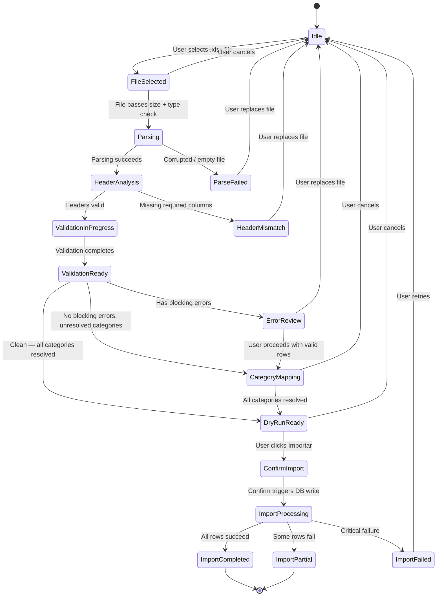

# Feature PRD — Spreadsheet Catalog Import (`.xlsx` → Validate → Category Map → Preview → Commit)

> **Parent PRD**: [FEATURE_PRD_SPREADSHEET_IMPORT.md](./FEATURE_PRD_SPREADSHEET_IMPORT.md)  
> **Sibling PRD**: [FEATURE_PRD_INVENTORY_IMPORT.md](./FEATURE_PRD_INVENTORY_IMPORT.md)  
> **Version:** 1.0  
> **Status:** Implementation-Ready  
> **Module:** M2 — Catálogo de Productos  
> **Stack:** Next.js 16 (App Router) · TypeScript · Zod v4 · Drizzle ORM · Supabase PostgreSQL · `xlsx` (SheetJS) ^0.18.5  
> **Audience:** Product, Frontend, Backend, QA  
> **Language:** English (technical), Spanish (UI copy where applicable)  
> **Last Updated:** 2026-03-14  
> **Author:** Cendaro Product & Engineering

---

## Table of Contents

1. [Executive Summary](#1-executive-summary)
2. [Problem Statement](#2-problem-statement)
3. [Goals & Non-Goals](#3-goals--non-goals)
4. [User Personas & RBAC](#4-user-personas--rbac)
5. [User Flow — State Machine](#5-user-flow--state-machine)
6. [Functional Requirements](#6-functional-requirements)
7. [Non-Functional Requirements](#7-non-functional-requirements)
8. [Data Model — Existing Schema](#8-data-model--existing-schema)
9. [New Schema Requirements](#9-new-schema-requirements)
10. [Data Contracts & Zod Schemas](#10-data-contracts--zod-schemas)
11. [Validation Strategy](#11-validation-strategy)
12. [Transformation & Normalization](#12-transformation--normalization)
13. [Category Reconciliation](#13-category-reconciliation)
14. [Database Strategy](#14-database-strategy)
15. [API Contracts — tRPC Procedures](#15-api-contracts--trpc-procedures)
16. [Frontend Implementation](#16-frontend-implementation)
17. [Backend Implementation](#17-backend-implementation)
18. [Security Considerations](#18-security-considerations)
19. [Project Structure](#19-project-structure)
20. [Acceptance Criteria](#20-acceptance-criteria)
21. [Detailed State Transitions](#21-detailed-state-transitions)
22. [Edge Cases & Error Boundaries](#22-edge-cases--error-boundaries)
23. [End-to-End Pseudocode](#23-end-to-end-pseudocode)
24. [Recommended Implementation Order](#24-recommended-implementation-order)
25. [Appendix A — Header Alias Map](#appendix-a--header-alias-map)
26. [Appendix B — Error Code Reference](#appendix-b--error-code-reference)
27. [Appendix C — Excel Template Specification](#appendix-c--excel-template-specification)

---

## 1. Executive Summary

### Feature

A **staged, validated spreadsheet import pipeline** that allows Cendaro ERP users to upload `.xlsx` catalog files, parse them with SheetJS (`xlsx`), validate every row and cell against Zod schemas, **reconcile imported categories against the hierarchical `Category` table** (exact + fuzzy matching via `pg_trgm`), present a detailed error/preview table, display a dry-run summary of planned database operations (inserts, updates, skips), and — only after explicit user confirmation — commit valid rows to PostgreSQL via Drizzle ORM.

### Business Value

Cendaro manages 5,000+ SKUs across multiple suppliers and categories. New product batches arrive as Excel files from suppliers (often with headers in Chinese, Spanish, or English). The current workflow requires manual product creation one-by-one via the `/catalog/new` form. A bulk import pipeline eliminates this bottleneck and ensures consistent data quality through structured validation and category reconciliation.

### Why Category Reconciliation Is Critical

- Supplier spreadsheets use freeform category text (often in Chinese or Spanglish). Without normalization and matching, every import creates orphaned categories.
- The pricing engine depends on category membership for batch repricing rules. An unmapped category means a product's price won't update when BCV moves ≥5%.
- Channel stock allocation reports aggregate by category — unmapped categories create blind spots.

### Why Staged Import (Not Direct DB Insertion)

| Stage          | Purpose                             | Reversible?                      |
| -------------- | ----------------------------------- | -------------------------------- |
| Upload + Parse | Extract raw data from workbook      | Yes — user can replace file      |
| Validate       | Apply Zod schemas row-by-row        | Yes — user reviews errors        |
| Category Map   | Reconcile categories to DB entities | Yes — user resolves ambiguities  |
| Dry-Run        | Calculate insert/update/skip counts | Yes — user can abort             |
| Commit         | Write to DB in batched transactions | Partial — compensation via audit |

**AI integration is currently disabled and out of scope.** The packing list AI pipeline (Groq) remains in the codebase but is not invoked by this feature.

---

## 2. Problem Statement

### Operational Problems

1. **No bulk product creation** — new products can only be added one-by-one via the `/catalog/new` form (~3 minutes per product).
2. **Category drift** — supplier category strings don't match the hierarchical `Category` table, creating orphaned products invisible to pricing rules and channel allocation.
3. **Duplicate proliferation** — re-uploading the same file or importing a product with an existing SKU creates duplicates without upsert logic.
4. **No preview** — users cannot inspect what will be created or updated before it happens.
5. **No bulk update** — existing products cannot be updated in bulk (e.g., changing category or cost for 200 products at once).

### Common Catalog Spreadsheet Failure Modes

| Failure Mode                                | Frequency | Impact                                     |
| ------------------------------------------- | --------- | ------------------------------------------ |
| Missing required columns (SKU, name)        | High      | Entire import fails silently               |
| Duplicate SKUs in same file                 | Medium    | Ambiguous insert/update behavior           |
| Mixed cell types (number stored as text)    | Very High | Cost parsing fails or truncates            |
| Freeform category strings (Chinese/Spanish) | Very High | Orphaned categories, broken pricing        |
| Locale-specific decimals (`,` vs `.`)       | High      | Cost values truncated or inflated          |
| Formula cells returning `#REF!` or `#N/A`   | Medium    | Raw error string persisted as product name |
| Blank rows between data sections            | High      | Row count inflation, phantom products      |
| BOM characters in headers                   | Low       | Header matching fails silently             |
| Missing barcode or duplicate barcode        | Medium    | Product lookup ambiguity                   |

### Impact

| Before                                           | After                                                                     |
| ------------------------------------------------ | ------------------------------------------------------------------------- |
| 100 products × 3min/product = **5h manual work** | Upload 1 file, review, commit → **15 minutes**                            |
| Freeform categories → orphaned products          | Category reconciliation ensures every product maps to a valid DB category |
| No visibility into what will change              | Dry-run summary shows exact insert/update/skip counts                     |
| No audit trail for bulk changes                  | Every import logged in `AuditLog` with full traceability                  |
| SKU duplicates created silently                  | Duplicate SKU detection with upsert-vs-insert decision                    |

---

## 3. Goals & Non-Goals

### Goals (MVP)

| ID   | Goal                                                                                                                                                |
| ---- | --------------------------------------------------------------------------------------------------------------------------------------------------- |
| G-1  | Accept `.xlsx` / `.xls` / `.csv` files with up to **10,000 rows**                                                                                   |
| G-2  | Parse client-side → validate → category reconciliation → preview → dry-run → commit                                                                 |
| G-3  | Import new products and **update existing products** (upsert by `sku`)                                                                              |
| G-4  | Support required fields: `sku`, `name`, `quantity` and optional: `category`, `brand`, `cost`, `barcode`, `weight`, `volume`, `description`, `notes` |
| G-5  | **Reconcile categories** against `Category` table with exact + fuzzy matching (pg_trgm)                                                             |
| G-6  | Allow user-assisted category mapping for unresolved categories                                                                                      |
| G-7  | Generate dry-run summary: inserts, updates, skips, rejects                                                                                          |
| G-8  | Record full audit trail in `AuditLog`                                                                                                               |
| G-9  | Allow download of failed/skipped rows as `.xlsx` for correction                                                                                     |
| G-10 | Optionally create initial stock entries in `StockLedger` for new products                                                                           |

### Non-Goals

| ID   | Non-Goal                                                                                | Reason               |
| ---- | --------------------------------------------------------------------------------------- | -------------------- |
| NG-1 | Inventory stock updates for existing products — see Inventory Import PRD                | Scope separation     |
| NG-2 | AI-assisted field inference or translation — AI pipeline is currently disabled          | Disabled by decision |
| NG-3 | Image upload or extraction from packing lists                                           | Separate pipeline    |
| NG-4 | Automatic category creation — unresolved categories require explicit user mapping       | Data integrity       |
| NG-5 | Multi-file batch import — one file per session                                          | Simplicity           |
| NG-6 | Price calculation or repricing — only `costAvg` import, pricing engine handles the rest | Scope separation     |

### Future Enhancements

> These items are **specific to catalog import**. Shared infrastructure (template download, import history, saved mappings, background processing) is defined in the [parent PRD](./FEATURE_PRD_SPREADSHEET_IMPORT.md) §3.

- **Brand auto-creation** — import creates new brands if they don't exist in the `Brand` table.
- **Supplier linking** — auto-link imported products to suppliers via `ProductSupplier` table.
- **Image URL column** — accept product image URLs in the spreadsheet, download and attach to created products.
- **Product status control** — allow the spreadsheet to specify product status (`draft`, `active`, `discontinued`) instead of defaulting to `draft`.
- **Cross-file dependency import** — upload a category file + product file in a single session, creating categories before products.

---

## 4. User Personas & RBAC

### Primary Persona: Admin / Dueño

| Attribute            | Detail                                                                                                                                                               |
| -------------------- | -------------------------------------------------------------------------------------------------------------------------------------------------------------------- |
| **Role**             | `admin` / `owner` — full system access per PRD v1.0 §7.3                                                                                                             |
| **Goal**             | Bulk-import new product catalog from supplier spreadsheet accurately and quickly                                                                                     |
| **Risk**             | Bad data entering the product catalog, incorrect costs, orphaned categories, duplicate SKUs                                                                          |
| **Success Criteria** | Every imported row is validated, categories are resolved, and the dry-run summary matches expectations before commit                                                 |
| **JTBD**             | "When I receive a product list from the supplier, I want to upload it and see exactly what will be created or updated, so I can confirm the import with confidence." |

### Secondary Persona: Supervisor

| Attribute | Detail                                                                                                                                              |
| --------- | --------------------------------------------------------------------------------------------------------------------------------------------------- |
| **Role**  | `supervisor` — can upload and preview, cannot commit                                                                                                |
| **Goal**  | Validate the supplier data before the admin commits it                                                                                              |
| **Risk**  | Approving a file with incorrect categories or duplicate SKUs                                                                                        |
| **JTBD**  | "When the supplier sends us a new product list, I want to upload and preview the validation results so I can flag issues before the admin commits." |

### Tertiary Persona: Employee (View-Only)

| Attribute | Detail                                       |
| --------- | -------------------------------------------- |
| **Role**  | `employee` — cannot import, can view catalog |
| **Goal**  | See new products after an import             |
| **Risk**  | None (read-only)                             |

**Enforcement**: Upload + preview: `roleRestrictedProcedure(["owner", "admin", "supervisor"])`. Commit: `roleRestrictedProcedure(["owner", "admin"])`.

---

## 5. User Flow — State Machine

### Mermaid State Diagram



### Step Descriptions

| Step                    | User Action                            | System Action                                     |
| ----------------------- | -------------------------------------- | ------------------------------------------------- |
| 1. Upload File          | Drag & drop or click to upload `.xlsx` | Client-side: `XLSX.read()` → extract `string[][]` |
| 2. Header Detection     | Review auto-mapped columns             | Map headers using alias map (Appendix A)          |
| 3. Validation & Preview | Review row-level results               | Validate required fields, types, duplicates       |
| 4. Category Mapping     | Resolve unmatched categories           | `pg_trgm` fuzzy match + user-assisted mapping UI  |
| 5. Dry-Run Summary      | Review aggregate changes               | Show: X inserts, Y updates, Z skips               |
| 6. Confirm / Cancel     | Click "Importar" or "Cancelar"         | Commit to DB or discard session                   |
| 7. Result               | View final summary + download errors   | Show committed count + failed rows download link  |

---

## 6. Functional Requirements

### File Upload

| ID   | Requirement                                                                                         |
| ---- | --------------------------------------------------------------------------------------------------- |
| FR-1 | Accept `.xlsx`, `.xls`, `.csv` (MIME validation)                                                    |
| FR-2 | Maximum file size: **10 MB**                                                                        |
| FR-3 | Maximum rows: **10,000** (excluding header)                                                         |
| FR-4 | Drag-and-drop upload zone with file type indicator                                                  |
| FR-5 | Parse client-side using `XLSX.read(buffer, { type: "array", cellFormula: false, cellHTML: false })` |

### Header Detection

| ID    | Requirement                                                                                                          |
| ----- | -------------------------------------------------------------------------------------------------------------------- |
| FR-6  | **Required columns**: `sku`, `name`                                                                                  |
| FR-7  | **Optional columns**: `category`, `brand`, `cost`, `quantity`, `barcode`, `weight`, `volume`, `description`, `notes` |
| FR-8  | Auto-detect headers using alias map — case-insensitive, accent-insensitive                                           |
| FR-9  | If required headers missing, show error with available column names                                                  |
| FR-10 | User can manually remap columns if auto-detection fails                                                              |

### Validation

| ID    | Requirement                                                                                 |
| ----- | ------------------------------------------------------------------------------------------- |
| FR-11 | **SKU validation**: non-empty, max 64 chars, unique within file                             |
| FR-12 | **Name validation**: non-empty, max 512 chars                                               |
| FR-13 | **Cost validation**: if provided, must be a valid decimal ≥ 0                               |
| FR-14 | **Quantity validation**: if provided, must be non-negative integer                          |
| FR-15 | **Duplicate SKU**: detect existing SKU in `Product` table → mark as "update" (not "insert") |
| FR-16 | **Duplicate SKU in file**: keep last occurrence, warn user                                  |
| FR-17 | **Empty row handling**: skip rows where all mapped fields are empty                         |
| FR-18 | **Barcode validation**: if provided, max 128 chars                                          |

### Category Reconciliation

| ID    | Requirement                                                                                                          |
| ----- | -------------------------------------------------------------------------------------------------------------------- |
| FR-19 | For each distinct category string, attempt exact match (case-insensitive) against `Category.name` or `Category.slug` |
| FR-20 | If no exact match, attempt fuzzy match using `pg_trgm` (`similarity()` function) with threshold ≥ 0.3                |
| FR-21 | Show user-assisted mapping UI for unresolved categories: dropdown with top-5 suggestions                             |
| FR-22 | User can select an existing category or choose "Skip" (leave `categoryId` null)                                      |
| FR-23 | Maintain a `category_aliases` table for future auto-resolution of the same string                                    |
| FR-24 | Category mapping must be completed before dry-run                                                                    |

### Preview

| ID    | Requirement                                                                                         |
| ----- | --------------------------------------------------------------------------------------------------- | --------- | ---------- | -------- | --------- |
| FR-25 | Show table with columns: Row #, SKU, Name, Category, Cost, Qty, Status, Action (Insert/Update/Skip) |
| FR-26 | Color-code rows: ✅ green (insert), 🔄 blue (update), ⚠️ yellow (warning), ❌ red (error)           |
| FR-27 | Show aggregate counters: `Insert: X                                                                 | Update: Y | Warning: Z | Error: W | Total: N` |
| FR-28 | Allow filtering table by status (all / insert / update / warnings / errors)                         |
| FR-29 | For "update" rows, show current vs. imported values side-by-side                                    |

### Dry-Run

| ID    | Requirement                                                                        |
| ----- | ---------------------------------------------------------------------------------- |
| FR-30 | Generate summary: total inserts, total updates, total skips, new categories mapped |
| FR-31 | Expandable groups: new products, updated products, skipped/rejected products       |
| FR-32 | Show category mapping summary: X exact matches, Y fuzzy matches, Z user-resolved   |

### Commit

| ID    | Requirement                                                                                                       |
| ----- | ----------------------------------------------------------------------------------------------------------------- |
| FR-33 | **New products**: `INSERT INTO product` with all mapped fields                                                    |
| FR-34 | **Existing products** (by SKU): `UPDATE product SET ...` for all non-null imported fields                         |
| FR-35 | If `quantity` column provided and product is new: create `StockLedger` entry with `movementType: 'initial_stock'` |
| FR-36 | If `cost` column provided: update `Product.costAvg`                                                               |
| FR-37 | Batch commit: 100 rows per batch transaction                                                                      |
| FR-38 | Return result summary: `{ inserted: N, updated: M, skipped: K, failed: J, errors: [...] }`                        |
| FR-39 | Failed rows available for download as `.xlsx`                                                                     |
| FR-40 | Category alias entries saved for resolved mappings                                                                |
| FR-41 | Record import session metadata in `AuditLog`                                                                      |

---

## 7. Non-Functional Requirements

| ID    | Requirement                               | Target                                 |
| ----- | ----------------------------------------- | -------------------------------------- |
| NFR-1 | Parse 10,000 rows client-side             | ≤ 3 seconds                            |
| NFR-2 | Validate 10,000 rows against product list | ≤ 5 seconds                            |
| NFR-3 | Category fuzzy matching (server-side)     | ≤ 2 seconds for 50 distinct categories |
| NFR-4 | Commit 10,000 rows (100/batch)            | ≤ 45 seconds                           |
| NFR-5 | Max tRPC payload size                     | ≤ 4 MB                                 |
| NFR-6 | One active import session per user        | Enforced via session table             |
| NFR-7 | Session expiration                        | 24h (lazy — checked at access time)    |
| NFR-8 | Audit trail retention                     | Permanent (as per existing `AuditLog`) |

---

## 8. Data Model — Existing Schema

### Tables Used

| Table           | Role in Import                 | Key Fields                                                                                                              |
| --------------- | ------------------------------ | ----------------------------------------------------------------------------------------------------------------------- |
| `Product`       | Insert/update target           | `id`, `sku` (unique), `name`, `barcode`, `brandId`, `categoryId`, `supplierId`, `costAvg`, `weight`, `volume`, `status` |
| `Category`      | Category resolution            | `id`, `name`, `slug`, `parentId`, `depth`                                                                               |
| `Brand`         | Brand resolution               | `id`, `name`, `slug`                                                                                                    |
| `Supplier`      | Supplier resolution (future)   | `id`, `name`                                                                                                            |
| `StockLedger`   | Initial stock for new products | `productId` × `warehouseId`, `quantity`                                                                                 |
| `StockMovement` | Movement for initial stock     | `productId`, `movementType`, `quantity`, `warehouseId`                                                                  |
| `AuditLog`      | Session-level audit            | `action`, `entity`, `entityId`, `newValue`                                                                              |

### Key Constraints

- `Product`: `UNIQUE (sku)` — upsert key for import
- `Product.costAvg`: `NUMERIC(12,4)` — decimal, not cents
- `Category`: `UNIQUE (slug)` — used for exact matching
- `Brand`: `UNIQUE (slug)` — used for matching

---

## 9. New Schema Requirements

### New Table: `category_aliases`

```sql
CREATE TABLE category_alias (
  id UUID PRIMARY KEY DEFAULT gen_random_uuid(),
  alias VARCHAR(256) NOT NULL,
  category_id UUID NOT NULL REFERENCES category(id),
  created_by UUID,
  created_at TIMESTAMPTZ NOT NULL DEFAULT NOW(),
  UNIQUE (alias)
);
CREATE INDEX idx_category_alias_alias ON category_alias (LOWER(alias));
```

**Purpose**: When a user resolves a fuzzy-matched category (e.g., "electrónicos" → `category.id` for "Electrónica"), the alias is saved so future imports auto-resolve the same string.

### New Table: `import_sessions`

```sql
CREATE TABLE import_session (
  id UUID PRIMARY KEY DEFAULT gen_random_uuid(),
  user_id UUID NOT NULL,
  type VARCHAR(32) NOT NULL DEFAULT 'catalog',
    -- Only 'catalog' — inventory import is client-side stateless (see Inventory PRD §9)
  status VARCHAR(32) NOT NULL DEFAULT 'pending',
    -- pending → validating → category_mapping → dry_run → committed | failed | expired
  filename VARCHAR(256),
  file_hash VARCHAR(64),
  total_rows INTEGER NOT NULL DEFAULT 0,
  valid_rows INTEGER NOT NULL DEFAULT 0,
  error_rows INTEGER NOT NULL DEFAULT 0,
  inserted INTEGER NOT NULL DEFAULT 0,
  updated INTEGER NOT NULL DEFAULT 0,
  skipped INTEGER NOT NULL DEFAULT 0,
  failed INTEGER NOT NULL DEFAULT 0,
  idempotency_key UUID UNIQUE,
  metadata JSONB,
  created_at TIMESTAMPTZ NOT NULL DEFAULT NOW(),
  committed_at TIMESTAMPTZ,
  expires_at TIMESTAMPTZ NOT NULL DEFAULT NOW() + INTERVAL '24 hours'
);
CREATE INDEX idx_import_session_user ON import_session (user_id);
CREATE INDEX idx_import_session_status ON import_session (status);
```

### New Table: `import_session_rows`

```sql
CREATE TABLE import_session_row (
  id UUID PRIMARY KEY DEFAULT gen_random_uuid(),
  import_session_id UUID NOT NULL REFERENCES import_session(id) ON DELETE CASCADE,
  row_index INTEGER NOT NULL,
  status VARCHAR(32) NOT NULL DEFAULT 'pending',
    -- pending → valid | warning | error | committed | skipped | failed
  action VARCHAR(32), -- 'insert' | 'update' | 'skip'
  raw_data JSONB NOT NULL,
  normalized_data JSONB,
  resolved_category_id UUID REFERENCES category(id),
  resolved_brand_id UUID REFERENCES brand(id),
  resolved_product_id UUID REFERENCES product(id),
  errors JSONB,
  created_at TIMESTAMPTZ NOT NULL DEFAULT NOW()
);
CREATE INDEX idx_isr_session ON import_session_row (import_session_id);
CREATE INDEX idx_isr_status ON import_session_row (status);
```

**Rationale**: Unlike the inventory import (which is stateless client-side), the catalog import has a multi-step server-side workflow with category mapping that requires persisted state.

---

## 10. Data Contracts & Zod Schemas

```typescript
import { z } from "zod/v4";

// ── Catalog Import Row (parsed + normalized) ──
export const catalogImportRowSchema = z.object({
  rowNumber: z.int().min(1),
  sku: z.string().min(1).max(64),
  name: z.string().min(1).max(512),
  barcode: z.string().max(128).optional(),
  categoryRaw: z.string().max(256).optional(),
  brandRaw: z.string().max(256).optional(),
  cost: z.number().nonnegative().optional(),
  quantity: z.int().nonnegative().optional(),
  weight: z.number().nonnegative().optional(),
  volume: z.number().nonnegative().optional(),
  description: z.string().max(2000).optional(),
  notes: z.string().max(512).optional(),
});
export type CatalogImportRow = z.infer<typeof catalogImportRowSchema>;

// ── Validation Result ─────────────────────────
export const catalogValidatedRowSchema = catalogImportRowSchema.extend({
  status: z.enum(["valid", "warning", "error"]),
  action: z.enum(["insert", "update", "skip"]).optional(),
  message: z.string().optional(),
  existingProductId: z.string().uuid().optional(),
  resolvedCategoryId: z.string().uuid().optional(),
  resolvedCategoryName: z.string().optional(),
  resolvedBrandId: z.string().uuid().optional(),
  resolvedBrandName: z.string().optional(),
  categoryMatchType: z
    .enum(["exact", "fuzzy", "alias", "unresolved", "none"])
    .optional(),
});
export type CatalogValidatedRow = z.infer<typeof catalogValidatedRowSchema>;

// ── Category Mapping Resolution ───────────────
export const categoryMappingSchema = z.object({
  rawCategory: z.string(),
  resolvedCategoryId: z.string().uuid().nullable(),
  matchType: z.enum(["exact", "fuzzy", "alias", "user_selected", "skipped"]),
  confidence: z.number().min(0).max(1).optional(),
});

// ── Session Create Request ────────────────────
export const catalogImportCreateSchema = z.object({
  filename: z.string().max(256),
  rows: z.array(catalogImportRowSchema).min(1).max(10000),
  idempotencyKey: z.string().uuid(),
  defaultWarehouseId: z.string().uuid().optional(),
});

// ── Commit Result ─────────────────────────────
export const catalogImportResultSchema = z.object({
  inserted: z.int().min(0),
  updated: z.int().min(0),
  skipped: z.int().min(0),
  failed: z.int().min(0),
  errors: z.array(
    z.object({
      rowNumber: z.int(),
      sku: z.string(),
      code: z.string(),
      message: z.string(),
    }),
  ),
  auditLogId: z.string().uuid().optional(),
});
export type CatalogImportResult = z.infer<typeof catalogImportResultSchema>;
```

---

## 11. Validation Strategy

### Client-Side Validation

```
┌─────────────┐   ┌──────────────┐   ┌────────────┐   ┌───────────────┐
│ Parse Excel │──▶│ Normalize    │──▶│ Zod Schema │──▶│ Detect Dupes  │
│ string[][]  │   │ trim, parse  │   │ per row    │   │ SKU in file   │
└─────────────┘   └──────────────┘   └────────────┘   └───────────────┘
```

### Server-Side Validation (On Submit)

1. Check each `sku` against `Product` table → classify as `insert` or `update`
2. Resolve `categoryRaw` against `Category` table (exact → alias → fuzzy)
3. Resolve `brandRaw` against `Brand` table (exact match by name)
4. Validate data integrity (cost format, quantity range)
5. Store results in `import_session_rows`

---

## 12. Transformation & Normalization

| Field         | Transformation                                  | Example                                           |
| ------------- | ----------------------------------------------- | ------------------------------------------------- |
| `sku`         | `String.trim().toUpperCase()`                   | `" abc-123 "` → `"ABC-123"`                       |
| `name`        | `String.trim()`, max 512                        | `"  Cable HDMI  "` → `"Cable HDMI"`               |
| `cost`        | `parseFloat()`, 4 decimal places max            | `"12.5"` → `12.5`, `"12,50"` → `12.5` (comma→dot) |
| `quantity`    | `parseInt()`, reject NaN                        | `"150"` → `150`                                   |
| `categoryRaw` | `String.trim()`, preserve original for matching | `"  Electrónicos  "` → `"Electrónicos"`           |
| `brandRaw`    | `String.trim()`                                 | `" Samsung "` → `"Samsung"`                       |
| `weight`      | `parseFloat()`, kg                              | `"2.5"` → `2.5`                                   |
| `volume`      | `parseFloat()`, CBM                             | `"0.03"` → `0.03`                                 |
| `barcode`     | `String.trim()`, max 128                        | `" 7501234567890 "` → `"7501234567890"`           |

### Locale-Specific Decimal Handling

```typescript
function parseDecimal(raw: string): number | null {
  const cleaned = raw.replace(/\s/g, "").replace(",", ".");
  const num = parseFloat(cleaned);
  return isNaN(num) ? null : Math.round(num * 10000) / 10000;
}
```

---

## 13. Category Reconciliation

### Resolution Pipeline

```
┌────────────┐    ┌──────────┐    ┌───────────────┐    ┌───────────┐
│ Raw String │──▶│ Exact    │──▶│ Alias Table   │──▶│ Fuzzy     │──▶ Unresolved
│ "electrón" │   │ Match    │   │ category_alias│   │ pg_trgm   │   (user maps)
└────────────┘   │ by name  │   └───────────────┘   │ ≥0.3 sim  │
                 │ or slug  │                       └───────────┘
                 └──────────┘
```

### Server-Side SQL for Fuzzy Matching

```sql
-- Requires: CREATE EXTENSION IF NOT EXISTS pg_trgm;

SELECT
  c.id,
  c.name,
  c.slug,
  similarity(LOWER(c.name), LOWER(:rawCategory)) AS score
FROM category c
WHERE similarity(LOWER(c.name), LOWER(:rawCategory)) >= 0.3
ORDER BY score DESC
LIMIT 5;
```

### User-Assisted Mapping UI

For each unresolved category string, present:

- The raw string from the spreadsheet
- Top-5 suggestions from fuzzy matching (with confidence scores)
- A category tree browser for manual selection
- "Skip" option (leave `categoryId = null`)

When the user resolves a category, save the alias in `category_alias` for future imports.

---

## 14. Database Strategy

### Commit Pipeline

```sql
-- Per row (inside transaction batch of 100):

-- CASE: INSERT (new SKU)
INSERT INTO product (sku, name, barcode, category_id, brand_id,
  cost_avg, weight, volume, status)
VALUES (:sku, :name, :barcode, :categoryId, :brandId,
  :cost, :weight, :volume, 'draft');

-- If quantity provided for new product:
INSERT INTO stock_ledger (product_id, warehouse_id, quantity)
VALUES (:productId, :defaultWarehouseId, :quantity);

INSERT INTO stock_movement (product_id, movement_type, quantity,
  warehouse_id, reference_type, created_by)
VALUES (:productId, 'initial_stock', :quantity,
  :defaultWarehouseId, 'catalog_import', :userId);

-- CASE: UPDATE (existing SKU)
UPDATE product SET
  name = COALESCE(:name, name),
  barcode = COALESCE(:barcode, barcode),
  category_id = COALESCE(:categoryId, category_id),
  brand_id = COALESCE(:brandId, brand_id),
  cost_avg = COALESCE(:cost, cost_avg),
  weight = COALESCE(:weight, weight),
  volume = COALESCE(:volume, volume),
  updated_at = NOW()
WHERE sku = :sku;
```

### Transaction Strategy

- **Batch size**: 100 rows per transaction.
- **Why 100**: Balances transaction duration (short enough to avoid lock contention) with round-trip overhead.
- **For imports ≤100 rows**: single transaction.
- Each batch is independent — if batch N fails completely, batch N+1 still proceeds.
- Within a batch, if an individual row fails, the failure is recorded and the row is skipped (batch continues).
- **Idempotency**: `import_session.idempotency_key` prevents re-execution. If a session with the same key is already `committed`, the server returns the cached result.
- **Partial failure**: Failed rows are recorded in `import_session_row` with `status: 'failed'` and available for download.
- **Rollback**: Within a batch, standard SQL transaction rollback. Across batches, no automatic rollback — admin reviews failed rows via `import_session_row`.

---

## 15. API Contracts — tRPC Procedures

| Procedure                         | Role                     | Input                       | Output                                         | Purpose                                          |
| --------------------------------- | ------------------------ | --------------------------- | ---------------------------------------------- | ------------------------------------------------ |
| `catalogImport.create`            | owner, admin, supervisor | `catalogImportCreateSchema` | `{ sessionId }`                                | Create import session + store rows               |
| `catalogImport.validate`          | owner, admin, supervisor | `{ sessionId }`             | `{ validRows, errorRows, categoryMappings[] }` | Run server-side validation + category resolution |
| `catalogImport.resolveCategories` | owner, admin, supervisor | `{ sessionId, mappings[] }` | `{ resolved }`                                 | Apply user's category mapping decisions          |
| `catalogImport.dryRun`            | owner, admin, supervisor | `{ sessionId }`             | `{ inserts, updates, skips }`                  | Compute what will happen on commit               |
| `catalogImport.commit`            | owner, admin             | `{ sessionId }`             | `CatalogImportResult`                          | Execute the import                               |
| `catalogImport.getSession`        | any authenticated        | `{ sessionId }`             | Session details + row statuses                 | Check progress / status                          |

---

## 16. Frontend Implementation

### Access Point

**Location**: `/catalog` page — Add "Importar Catálogo" button to the catalog listing page header.

**New Route**: `/catalog/import` — Full-page import wizard.

### Component Architecture

```
/catalog/import/page.tsx
├── CatalogImportWizard.tsx           ← Main orchestrator (state machine)
│   ├── Step1_FileUpload.tsx          ← Drag-and-drop upload zone
│   ├── Step2_HeaderMapping.tsx       ← Auto-detected + manual override
│   ├── Step3_ValidationPreview.tsx   ← Table with status indicators
│   ├── Step4_CategoryMapping.tsx     ← Fuzzy match suggestions + tree browser
│   ├── Step5_DryRunSummary.tsx       ← Aggregate summary before commit
│   └── Step6_ResultSummary.tsx       ← Final result + error download
├── hooks/
│   ├── use-catalog-import.ts         ← Core state management hook
│   ├── use-parse-catalog-file.ts     ← XLSX parsing + header detection
│   └── use-category-resolver.ts      ← Category matching logic
└── lib/
    ├── catalog-header-aliases.ts     ← Header alias map
    ├── catalog-validators.ts         ← Zod schemas + validation functions
    └── catalog-normalizers.ts        ← Value transformation functions
```

---

## 17. Backend Implementation

### Router (Pseudocode)

```typescript
// packages/api/src/modules/catalog-import.ts

export const catalogImportRouter = createTRPCRouter({
  create: roleRestrictedProcedure(["owner", "admin", "supervisor"])
    .input(catalogImportCreateSchema)
    .mutation(async ({ ctx, input }) => {
      // 1. Create import_session
      // 2. Insert import_session_rows (batch)
      // 3. Return sessionId
    }),

  validate: roleRestrictedProcedure(["owner", "admin", "supervisor"])
    .input(z.object({ sessionId: z.string().uuid() }))
    .mutation(async ({ ctx, input }) => {
      // 1. For each row: check SKU exists → insert vs update
      // 2. Resolve categories: exact → alias → fuzzy (pg_trgm)
      // 3. Resolve brands: exact match by name
      // 4. Update import_session_rows with results
      // 5. Return summary + unresolved categories
    }),

  resolveCategories: roleRestrictedProcedure(["owner", "admin", "supervisor"])
    .input(
      z.object({
        sessionId: z.string().uuid(),
        mappings: z.array(categoryMappingSchema),
      }),
    )
    .mutation(async ({ ctx, input }) => {
      // 1. Update import_session_rows with resolved category IDs
      // 2. Save aliases to category_alias table
    }),

  dryRun: protectedProcedure
    .input(z.object({ sessionId: z.string().uuid() }))
    .query(async ({ ctx, input }) => {
      // Count inserts, updates, skips from import_session_rows
    }),

  commit: roleRestrictedProcedure(["owner", "admin"])
    .input(z.object({ sessionId: z.string().uuid() }))
    .mutation(async ({ ctx, input }) => {
      // 1. Assert session ready + not expired
      // 2. Process valid rows in batches of 100
      //    - INSERT or UPDATE product
      //    - Create StockLedger + StockMovement if new + has quantity
      // 3. Update import_session with results
      // 4. Log to AuditLog
      // 5. Return CatalogImportResult
    }),
});
```

---

## 18. Security Considerations

| Threat                    | Mitigation                                                                      |
| ------------------------- | ------------------------------------------------------------------------------- |
| **Formula injection**     | `cellFormula: false` on `XLSX.read()`                                           |
| **File size DoS**         | 10 MB limit enforced client-side before parsing                                 |
| **Row count DoS**         | 10,000 row limit enforced client-side                                           |
| **SQL injection**         | Drizzle ORM parameterized queries + `pg_trgm` uses parameterized `similarity()` |
| **XSS**                   | React default escaping on all rendered cell values                              |
| **Double submit**         | UUID idempotency key in `import_session` table                                  |
| **RBAC bypass**           | `roleRestrictedProcedure` on all mutation endpoints                             |
| **Category manipulation** | Only existing categories can be mapped — no auto-creation                       |
| **Session hijacking**     | Session is scoped to `user_id` — other users cannot access                      |

---

## 19. Project Structure

```
apps/erp/src/
├── app/(app)/catalog/
│   ├── page.tsx                          ← EXISTING (add "Importar" button)
│   └── import/
│       └── page.tsx                      ← NEW — Import wizard page
├── modules/catalog-import/
│   ├── catalog-import-wizard.tsx          ← Main component
│   ├── steps/
│   │   ├── file-upload.tsx
│   │   ├── header-mapping.tsx
│   │   ├── validation-preview.tsx
│   │   ├── category-mapping.tsx
│   │   ├── dry-run-summary.tsx
│   │   └── result-summary.tsx
│   ├── hooks/
│   │   ├── use-catalog-import.ts
│   │   ├── use-parse-catalog-file.ts
│   │   └── use-category-resolver.ts
│   └── lib/
│       ├── catalog-header-aliases.ts
│       ├── catalog-validators.ts
│       └── catalog-normalizers.ts

packages/api/src/modules/
├── catalog.ts                             ← EXISTING (unchanged)
└── catalog-import.ts                      ← NEW — Import router

packages/db/src/
└── schema.ts                              ← MODIFIED (add category_alias, import_session, import_session_row)
```

---

## 20. Acceptance Criteria

### Upload & Parse

| ID   | Criteria                                                         |
| ---- | ---------------------------------------------------------------- |
| AC-1 | User can drag-and-drop an `.xlsx` file onto the upload zone      |
| AC-2 | Files > 10 MB are rejected with clear error message              |
| AC-3 | Files > 10,000 rows show error: "Máximo 10,000 filas permitidas" |
| AC-4 | `.xlsx`, `.xls`, `.csv` are all successfully parsed              |

### Validation

| ID    | Criteria                                                      |
| ----- | ------------------------------------------------------------- |
| AC-5  | Missing SKU or Name are marked red with clear error           |
| AC-6  | Non-numeric costs are marked red with "Costo inválido"        |
| AC-7  | Duplicate SKUs within file keep last occurrence, show warning |
| AC-8  | Empty rows are silently skipped                               |
| AC-9  | Existing SKUs detected as "update" with blue indicator        |
| AC-10 | New SKUs detected as "insert" with green indicator            |

### Category Mapping

| ID    | Criteria                                                    |
| ----- | ----------------------------------------------------------- |
| AC-11 | Exact category matches auto-resolve silently                |
| AC-12 | Fuzzy matches show top-5 suggestions with confidence scores |
| AC-13 | User can select from suggestions or browse category tree    |
| AC-14 | "Skip" option leaves `categoryId = null`                    |
| AC-15 | Resolved aliases are saved for future imports               |

### Preview & Dry-Run

| ID    | Criteria                                                    |
| ----- | ----------------------------------------------------------- |
| AC-16 | Preview table shows all rows with status color-coding       |
| AC-17 | Counters show Insert / Update / Warning / Error counts      |
| AC-18 | "Update" rows show current vs. imported values side-by-side |
| AC-19 | Dry-run summary shows total inserts, updates, and skips     |

### Commit

| ID    | Criteria                                                               |
| ----- | ---------------------------------------------------------------------- |
| AC-20 | New products created with status "draft"                               |
| AC-21 | Existing products updated with non-null imported values only           |
| AC-22 | New products with quantity get `StockLedger` + `StockMovement` entries |
| AC-23 | `AuditLog` entry includes session ID, filename, counts                 |
| AC-24 | Double-clicking "Importar" does not create duplicate entries           |
| AC-25 | Failed rows can be downloaded as `.xlsx`                               |

### Integration

| ID    | Criteria                                                                       |
| ----- | ------------------------------------------------------------------------------ |
| AC-26 | After import, catalog listing page shows new/updated products                  |
| AC-27 | Product detail page shows correct category and brand assignments               |
| AC-28 | Category aliases persist across sessions — same string auto-resolves next time |

---

## 21. Detailed State Transitions

#### State: Idle

| Aspect       | Detail                                                                |
| ------------ | --------------------------------------------------------------------- |
| **Trigger**  | Page load, or reset after cancel/complete                             |
| **Frontend** | Shows upload zone with file format hints. "Importar Catálogo" header. |
| **Next**     | `FileSelected`                                                        |

#### State: FileSelected → Parsing → HeaderAnalysis

| Aspect       | Detail                                                                                     |
| ------------ | ------------------------------------------------------------------------------------------ |
| **Trigger**  | File passes size + type check                                                              |
| **Frontend** | Client-side parse with `XLSX.read()`. Header detection via alias map. Shows mapping table. |
| **Success**  | Required headers found → `ValidationInProgress`                                            |
| **Failure**  | Missing `sku` or `name` → `HeaderMismatch`                                                 |

#### State: ValidationInProgress

| Aspect       | Detail                                                                               |
| ------------ | ------------------------------------------------------------------------------------ |
| **Frontend** | Progress bar: "Validando fila X de Y..."                                             |
| **Server**   | Creates `import_session`, stores rows, runs SKU lookup, category/brand resolution    |
| **Next**     | `ErrorReview` (errors) → `CategoryMapping` (unresolved cats) → `DryRunReady` (clean) |

#### State: CategoryMapping

| Aspect       | Detail                                                                                          |
| ------------ | ----------------------------------------------------------------------------------------------- |
| **Trigger**  | Unresolved categories exist                                                                     |
| **Frontend** | Mapping table: raw string → suggestion dropdown (top-5 fuzzy matches) + category tree browser   |
| **Server**   | `pg_trgm` fuzzy match. Updates `import_session_rows` with resolved IDs. Saves `category_alias`. |
| **Next**     | `DryRunReady` (all resolved) or `Idle` (cancel)                                                 |

#### State: ImportProcessing → ImportCompleted/Partial/Failed

| Aspect       | Detail                                                                                                                       |
| ------------ | ---------------------------------------------------------------------------------------------------------------------------- |
| **Frontend** | Progress bar: "Escribiendo lote X de Y..."                                                                                   |
| **Server**   | Batched INSERT/UPDATE in transactions. Creates StockLedger + StockMovement for new products with quantity. Updates AuditLog. |
| **Next**     | Terminal — result summary with download option                                                                               |

---

## 22. Edge Cases & Error Boundaries

| #   | Scenario                                               | Expected Behavior                                                         |
| --- | ------------------------------------------------------ | ------------------------------------------------------------------------- |
| 1   | File is 0 bytes                                        | Client rejects: "Archivo vacío"                                           |
| 2   | File has headers but no data                           | Info: "No se encontraron filas de datos"                                  |
| 3   | All rows fail validation                               | "Importar" disabled. Only "Descargar errores" available.                  |
| 4   | Same SKU 5 times in file                               | Last occurrence kept. Previous marked as duplicate warning.               |
| 5   | SKU exists in DB with status "discontinued"            | Treated as update — sets status back to "draft" with warning              |
| 6   | Category string matches multiple DB categories equally | Show all matches ranked by `similarity()` — user decides                  |
| 7   | Category string is empty                               | `categoryId = null`. No category mapping triggered.                       |
| 8   | Brand string not found in DB                           | `brandId = null`. Warning: "Marca no encontrada"                          |
| 9   | Cost is `"12,50"` (comma decimal)                      | Auto-convert comma → dot: `12.50`                                         |
| 10  | Cost is `"$12.50"` (with symbol)                       | Strip currency symbol: `12.50`                                            |
| 11  | Barcode already exists on a different product          | Warning: "Código de barras ya asignado a SKU {otherSku}"                  |
| 12  | Session expired (>24h)                                 | Server returns "Sesión expirada". User must restart.                      |
| 13  | User closes browser mid-commit                         | Batches committed remain. Idempotency prevents re-execution.              |
| 14  | `pg_trgm` extension not installed                      | Graceful fallback: skip fuzzy matching, all unresolved go to user mapping |
| 15  | 200 distinct categories in one file                    | Category mapping UI paginated. Server batch-queries `similarity()`.       |

---

## 23. End-to-End Pseudocode

### Client-Side Orchestration

```typescript
async function handleCatalogImport(file: File) {
  // Step 1: Client-side parse
  const buffer = await file.arrayBuffer();
  const workbook = XLSX.read(buffer, {
    type: "array",
    cellFormula: false,
    cellHTML: false,
  });
  const sheet = workbook.Sheets[workbook.SheetNames[0]!]!;
  const rawRows = XLSX.utils.sheet_to_json<string[]>(sheet, {
    header: 1,
    defval: "",
    blankrows: false,
  });

  // Step 2: Header detection + normalization
  const headerMap = autoMapHeaders(rawRows[0]!, CATALOG_HEADER_ALIASES);
  if (!headerMap.sku || !headerMap.name) throw new HeaderMissingError();

  // Step 3: Parse + normalize rows
  const parsedRows = rawRows
    .slice(1)
    .map((row, i) => ({
      rowNumber: i + 2,
      sku: String(row[headerMap.sku] ?? "")
        .trim()
        .toUpperCase(),
      name: String(row[headerMap.name] ?? "").trim(),
      categoryRaw: headerMap.category
        ? String(row[headerMap.category] ?? "").trim()
        : undefined,
      brandRaw: headerMap.brand
        ? String(row[headerMap.brand] ?? "").trim()
        : undefined,
      cost: headerMap.cost
        ? parseDecimal(String(row[headerMap.cost] ?? ""))
        : undefined,
      quantity: headerMap.quantity
        ? parseInt(String(row[headerMap.quantity] ?? ""))
        : undefined,
      barcode: headerMap.barcode
        ? String(row[headerMap.barcode] ?? "").trim()
        : undefined,
      weight: headerMap.weight
        ? parseDecimal(String(row[headerMap.weight] ?? ""))
        : undefined,
      volume: headerMap.volume
        ? parseDecimal(String(row[headerMap.volume] ?? ""))
        : undefined,
      description: headerMap.description
        ? String(row[headerMap.description] ?? "").trim()
        : undefined,
    }))
    .filter((r) => r.sku || r.name);

  // Step 4: Send to server for validation + category resolution
  const idempotencyKey = crypto.randomUUID();
  const { sessionId } = await trpc.catalogImport.create.mutate({
    filename: file.name,
    rows: parsedRows,
    idempotencyKey,
  });

  const validationResult = await trpc.catalogImport.validate.mutate({
    sessionId,
  });

  // Step 5: Category mapping (if needed)
  if (validationResult.unresolvedCategories.length > 0) {
    const mappings = await showCategoryMappingUI(validationResult);
    await trpc.catalogImport.resolveCategories.mutate({ sessionId, mappings });
  }

  // Step 6: Dry-run + confirm
  const dryRun = await trpc.catalogImport.dryRun.query({ sessionId });
  const confirmed = await showDryRunSummary(dryRun);
  if (!confirmed) return;

  // Step 7: Commit
  const result = await trpc.catalogImport.commit.mutate({ sessionId });
  showImportResult(result);
}
```

---

## 24. Recommended Implementation Order

### Phase 1: Foundation (Week 1)

1. **Database migration** — Create `category_alias`, `import_session`, `import_session_row` tables.
2. **Enable pg_trgm** — `CREATE EXTENSION IF NOT EXISTS pg_trgm`.
3. **Zod schemas** — All data contracts in shared types file.
4. **tRPC router scaffold** — `catalogImportRouter` with `create` and `getSession`.

### Phase 2: Parse + Validate (Week 2)

5. **Client-side parser** — `use-parse-catalog-file.ts` with header detection.
6. **File upload step** — `Step1_FileUpload.tsx` with drag-drop.
7. **Header mapping step** — `Step2_HeaderMapping.tsx` with auto-map + override.
8. **Server-side validation** — SKU lookup, category/brand resolution.
9. **Validation tRPC route** — `catalogImport.validate`.

### Phase 3: Category Mapping (Week 3)

10. **Category resolution service** — Exact → alias → fuzzy (pg_trgm).
11. **Category mapping UI** — `Step4_CategoryMapping.tsx` with suggestions + tree browser.
12. **Resolve categories tRPC** — `catalogImport.resolveCategories`.
13. **Category alias saving** — Persist mappings for future imports.

### Phase 4: Preview + Commit (Week 4)

14. **Validation preview table** — `Step3_ValidationPreview.tsx` with color-coded statuses.
15. **Dry-run summary** — `Step5_DryRunSummary.tsx` with expandable groups.
16. **Commit service** — Batched INSERT/UPDATE with StockLedger creation.
17. **Result summary** — `Step6_ResultSummary.tsx` with download option.

### Phase 5: Polish + Hardening (Week 5)

18. **Error boundaries** — All failure modes from §22.
19. **Session expiration** — Lazy check on access.
20. **Accessibility audit** — ARIA roles, keyboard navigation.
21. **E2E testing** — Playwright tests for full import flow.
22. **Performance validation** — NFR targets verified.

---

## Appendix A — Header Alias Map

```typescript
// apps/erp/src/modules/catalog-import/lib/catalog-header-aliases.ts

export const CATALOG_HEADER_ALIASES: Record<string, string> = {
  // SKU / Reference
  sku: "sku",
  ref: "sku",
  referencia: "sku",
  reference: "sku",
  código: "sku",
  codigo: "sku",
  code: "sku",
  "internal code": "sku",
  "codigo interno": "sku",
  "código interno": "sku",
  "item code": "sku",
  "item no": "sku",
  "item number": "sku",
  art: "sku",
  articulo: "sku",
  artículo: "sku",
  编号: "sku",
  货号: "sku",

  // Product Name
  name: "name",
  nombre: "name",
  "product name": "name",
  product: "name",
  "nombre del producto": "name",
  "nombre producto": "name",
  item: "name",
  "item name": "name",
  description: "name",
  descripcion: "name",
  descripción: "name",
  品名: "name",
  产品名称: "name",
  商品名: "name",

  // Category
  category: "category",
  categoria: "category",
  categoría: "category",
  cat: "category",
  "product category": "category",
  类别: "category",
  分类: "category",
  类目: "category",
  rubro: "category",
  linea: "category",
  línea: "category",

  // Brand
  brand: "brand",
  marca: "brand",
  "brand name": "brand",
  品牌: "brand",

  // Cost
  cost: "cost",
  costo: "cost",
  "unit cost": "cost",
  precio: "cost",
  "precio unitario": "cost",
  "costo unitario": "cost",
  "unit price": "cost",
  price: "cost",
  fob: "cost",
  "fob price": "cost",
  单价: "cost",
  价格: "cost",

  // Quantity
  quantity: "quantity",
  qty: "quantity",
  cantidad: "quantity",
  cant: "quantity",
  units: "quantity",
  unidades: "quantity",
  pcs: "quantity",
  pieces: "quantity",
  数量: "quantity",

  // Barcode
  barcode: "barcode",
  "bar code": "barcode",
  ean: "barcode",
  upc: "barcode",
  gtin: "barcode",
  "codigo de barras": "barcode",
  "código de barras": "barcode",
  条码: "barcode",
  条形码: "barcode",

  // Weight
  weight: "weight",
  peso: "weight",
  "weight kg": "weight",
  "peso kg": "weight",
  "gross weight": "weight",
  "net weight": "weight",
  重量: "weight",

  // Volume
  volume: "volume",
  volumen: "volume",
  cbm: "volume",
  "cubic meters": "volume",
  体积: "volume",

  // Description / Notes
  notes: "description",
  notas: "description",
  observaciones: "description",
  comentarios: "description",
  comments: "description",
  details: "description",
  detalle: "description",
  detalles: "description",
  备注: "description",
  说明: "description",
};
```

---

## Appendix B — Error Code Reference

| Code                   | Severity | Message Template                                              | Suggested Fix                               |
| ---------------------- | -------- | ------------------------------------------------------------- | ------------------------------------------- |
| `REQUIRED_FIELD`       | error    | `"{field}" es obligatorio pero está vacío`                    | Ingrese un valor                            |
| `INVALID_NUMBER`       | error    | `"{field}" debe ser un número. Recibido: "{raw}"`             | Ingrese un valor numérico                   |
| `INVALID_QUANTITY`     | error    | `Cantidad debe ser un entero positivo. Recibido: "{raw}"`     | Ingrese un entero ≥ 0                       |
| `NEGATIVE_COST`        | error    | `Costo no puede ser negativo. Recibido: "{raw}"`              | Ingrese un número ≥ 0                       |
| `DUPLICATE_SKU_FILE`   | warning  | `SKU "{sku}" duplicado en el archivo — se usa la última fila` | Elimine filas duplicadas                    |
| `DUPLICATE_BARCODE`    | warning  | `Código de barras "{value}" ya asignado a SKU "{otherSku}"`   | Verifique el código de barras               |
| `CATEGORY_UNRESOLVED`  | warning  | `Categoría "{raw}" no encontrada — requiere mapeo manual`     | Se resolverá en paso de categorías          |
| `BRAND_NOT_FOUND`      | warning  | `Marca "{raw}" no encontrada — se omitirá`                    | Cree la marca primero o verifique el nombre |
| `EMPTY_ROW`            | info     | `Fila vacía — omitida`                                        | Sin acción necesaria                        |
| `FILE_TOO_LARGE`       | error    | `Archivo excede 10 MB`                                        | Use un archivo más pequeño                  |
| `TOO_MANY_ROWS`        | error    | `Archivo excede 10,000 filas`                                 | Divida en múltiples archivos                |
| `MISSING_HEADER`       | error    | `Columna requerida "{column}" no encontrada`                  | Agregue la columna al archivo               |
| `SESSION_EXPIRED`      | error    | `Sesión de importación expirada`                              | Inicie una nueva importación                |
| `IDEMPOTENCY_CONFLICT` | error    | `Esta importación ya fue ejecutada`                           | Inicie una nueva sesión                     |
| `VALUE_TRUNCATED`      | warning  | `Valor truncado de {original} a {max} caracteres`             | Acorte el valor                             |

---

## Appendix C — Excel Template Specification

| Column             | Required | Format               | Example                      |
| ------------------ | -------- | -------------------- | ---------------------------- |
| `Referencia`       | ✅       | Text, max 64 chars   | `REF-001`                    |
| `Nombre`           | ✅       | Text, max 512 chars  | `Cable HDMI 2.0 4K 2m`       |
| `Categoría`        | ❌       | Text, max 256 chars  | `Electrónica`                |
| `Marca`            | ❌       | Text, max 256 chars  | `Samsung`                    |
| `Costo USD`        | ❌       | Decimal ≥ 0          | `12.50`                      |
| `Cantidad`         | ❌       | Integer ≥ 0          | `100`                        |
| `Código de Barras` | ❌       | Text, max 128 chars  | `7501234567890`              |
| `Peso (kg)`        | ❌       | Decimal ≥ 0          | `0.35`                       |
| `Volumen (CBM)`    | ❌       | Decimal ≥ 0          | `0.003`                      |
| `Descripción`      | ❌       | Text, max 2000 chars | `Cable de alta velocidad...` |

**Template download**: Available from the import wizard (Step 1) via `downloadAsXlsx()` from the sheetjs-nextjs skill.

---

> **Document end. This PRD is version 1.0 and is implementation-ready.**  
> **Maintainer:** Engineering Lead  
> **Last updated:** 2026-03-14
