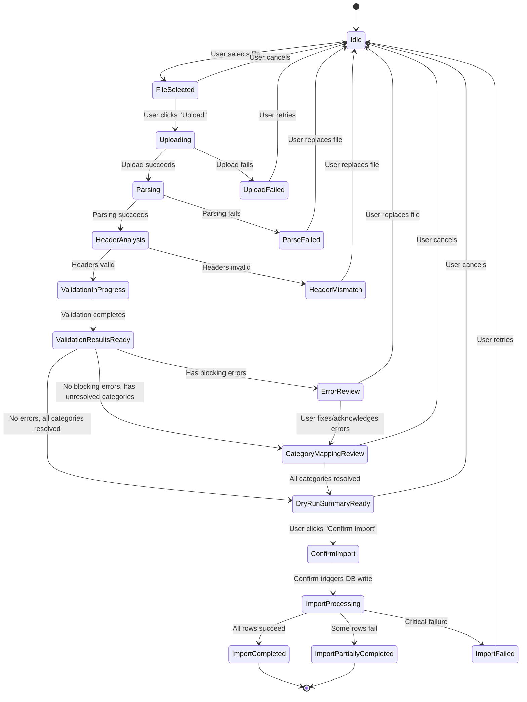
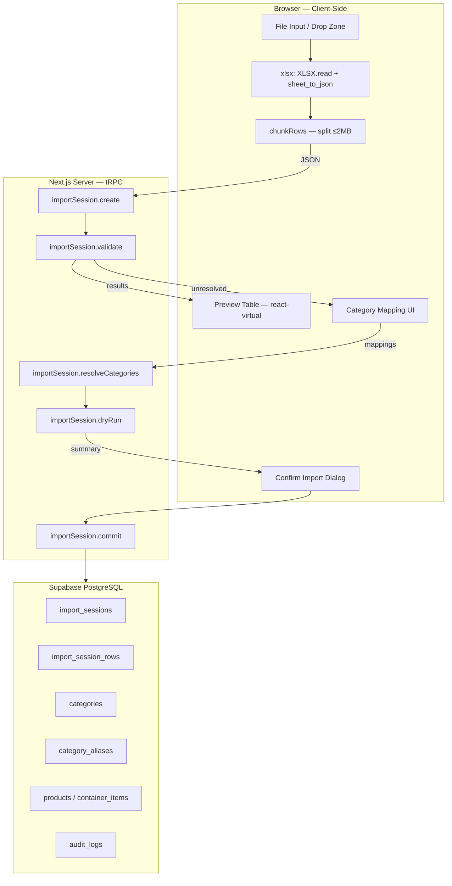

# Feature PRD — Spreadsheet Import Pipeline (`.xlsx` → Validate → Preview → Commit)

> **Version:** 1.0  
> **Status:** Implementation-Ready  
> **Module:** M4 — Compras, Contenedores e Importación  
> **Stack:** Next.js 16 (App Router) · TypeScript · Zod v4 · Drizzle ORM · Supabase PostgreSQL · `xlsx` (SheetJS) ^0.18.5  
> **Audience:** Product, Frontend, Backend, QA, DevOps  
> **Language:** English (technical), Spanish (UI copy where applicable)

---

## 1. Executive Summary

### Feature

A **staged, validated spreadsheet import pipeline** that allows Cendaro ERP users to upload `.xlsx` packing list files, parse them with SheetJS (`xlsx`), validate every row and cell against Zod schemas, present a detailed error/preview table, reconcile imported categories against the database category tree, display a dry-run summary of planned database operations (inserts, updates, skips, rejections), and — only after explicit user confirmation — commit valid rows to PostgreSQL via Drizzle ORM.

### Business Value

Cendaro processes high-cube containers with thousands of SKUs per packing list, often arriving in Chinese. The current import flow lacks structured validation, category reconciliation, and a reviewable preview — leading to data-quality issues, ghost products, miscategorized items, and costly manual correction cycles. A staged import pipeline eliminates blind imports and gives admin/supervisor confidence that every row entering the database has been inspected, normalized, and mapped.

### Why Validation-Before-Import Is Critical

1. **Packing lists are untrusted input** — they contain mixed types, locale-specific numbers (Chinese decimals, comma-delimited quantities), blank rows between sections, merged cells, formula artifacts, and duplicated headers.
2. **Category integrity** — a misspelled or unknown category bypassing validation creates orphaned products that break pricing rules, channel allocation, and reporting aggregations.
3. **Cost accuracy** — malformed prices propagate into cost-average calculations, distorting margin visibility for admin.
4. **Regulatory auditability** — Venezuelan operational context demands a full audit trail of what was imported, by whom, with what transformations applied.

### Why Staged Import (Not Direct DB Insertion)

Direct insertion conflates parsing, validation, and persistence into a single irreversible operation. Staged import decouples these concerns into discrete, reviewable checkpoints:

| Stage            | Purpose                                    | Reversible?                      |
| ---------------- | ------------------------------------------ | -------------------------------- |
| Upload + Parse   | Extract raw data from workbook             | Yes — user can replace file      |
| Validate         | Apply Zod schemas row-by-row               | Yes — user reviews errors        |
| Category Map     | Reconcile categories to DB entities        | Yes — user resolves ambiguities  |
| Dry-Run          | Calculate insert/update/skip/reject counts | Yes — user can abort             |
| Confirm + Commit | Write to DB in a transaction               | Partial — compensation via audit |

This architecture prevents data corruption, enables error correction before persistence, and aligns with the PRD v1.0 requirement that "the stock in tránsito / standby no se suma al stock real hasta que el contenedor esté aprobado/cerrado" (§11.6).

---

## 2. Problem Statement

### Operational Problems

1. **Blind imports** — current packing list upload sends raw rows to the API without structured validation. Bad data enters the DB silently.
2. **Category drift** — imported category strings don't match the hierarchical `categories` table, creating unmapped products invisible to pricing rules and channel allocation.
3. **Duplicate proliferation** — re-uploading the same packing list or importing a product that already exists creates duplicate `container_items` without upsert logic.
4. **No preview** — users cannot inspect what will happen before it happens. There is no dry-run summary.
5. **Partial failures are invisible** — if 3 out of 500 rows fail during DB write, the user has no visibility into which rows failed or why.

### Common Spreadsheet Import Failure Modes

| Failure Mode                              | Frequency | Impact                               |
| ----------------------------------------- | --------- | ------------------------------------ |
| Missing required columns                  | High      | Entire import fails silently         |
| Duplicate header names                    | Medium    | Column mapping becomes ambiguous     |
| Mixed cell types (number stored as text)  | Very High | Numeric validation fails             |
| Merged cells                              | Medium    | SheetJS fills only the top-left cell |
| Formula cells returning `#REF!` or `#N/A` | Medium    | Raw error string persisted as data   |
| Blank rows between data sections          | High      | Row count inflation, phantom records |
| Locale-specific decimals (`,` vs `.`)     | High      | Price parsing fails or truncates     |
| Impossible dates (e.g., `2025-02-30`)     | Low       | Date validation produces NaN         |
| BOM characters in headers                 | Low       | Header matching fails                |

### Why Users Need a Reviewable Preview

- **Admin** needs to see exactly which rows will be inserted vs. updated vs. skipped before committing — especially for containers with 1,000+ line items where manual spot-checking is impractical.
- **Supervisor** needs confidence that new product references have complete required fields before stock is promoted from standby to real inventory.
- **The business** needs an audit record of what the user saw before confirming, to defend data integrity in disputes.

### Why Normalization and Category Reconciliation Matter

- Packing list category strings are freeform text (often in Chinese or Spanglish). Without normalization and fuzzy matching, every import creates orphaned categories.
- The pricing engine depends on category membership for batch repricing rules. An unmapped category means a product's price won't update when BCV moves ≥5%.
- Channel stock allocation reports aggregate by category — unmapped categories create blind spots.

---

## 3. Goals and Non-Goals

### Goals (MVP)

| ID  | Goal                                                                           |
| --- | ------------------------------------------------------------------------------ |
| G1  | Accept `.xlsx` file upload with file-type and size validation                  |
| G2  | Parse workbook using `xlsx` (SheetJS) with safe read options                   |
| G3  | Support multi-sheet workbooks with user sheet selection                        |
| G4  | Extract and validate headers against expected schema                           |
| G5  | Validate every row and every cell using Zod schemas                            |
| G6  | Distinguish blocking errors from non-blocking warnings                         |
| G7  | Preserve raw values alongside normalized values for error reporting            |
| G8  | Generate a preview table with row-level and cell-level error highlighting      |
| G9  | Reconcile imported categories against `categories` table (exact + fuzzy)       |
| G10 | Present user-assisted category mapping UI for unresolved categories            |
| G11 | Generate dry-run summary: insert count, update count, skip count, reject count |
| G12 | Require explicit user confirmation before any DB write                         |
| G13 | Write valid rows to DB via Drizzle ORM in batched transactions                 |
| G14 | Record import session with full audit trail                                    |
| G15 | Return final import result summary to the UI                                   |

### Non-Goals (Out of Scope)

| ID  | Non-Goal                                       | Reason                                                                                                                               |
| --- | ---------------------------------------------- | ------------------------------------------------------------------------------------------------------------------------------------ |
| NG1 | CSV file support as a separate upload type     | CSV can be opened in Excel and saved as `.xlsx`. Single format simplifies validation.                                                |
| NG2 | Real-time collaborative editing of import data | Not an ERP requirement — single-user flow per import session.                                                                        |
| NG3 | AI-powered field inference                     | The AI packing list pipeline (`/api/ai/parse-packing-list`) is a separate feature. This PRD covers structured, schema-driven import. |
| NG4 | Image extraction from packing lists            | Handled by existing Tier 3 pipeline (`extractImageBlobs`).                                                                           |
| NG5 | Direct PDF packing list import                 | PDF parsing is a separate pipeline. This feature is `.xlsx` only.                                                                    |
| NG6 | Automatic category creation                    | Unresolved categories require explicit user mapping, not auto-creation.                                                              |
| NG7 | Multi-file batch import                        | One file per import session.                                                                                                         |

### Future Enhancements

- **Template download** — pre-formatted `.xlsx` template with headers and validation hints.
- **Import history** — searchable log of all past imports with re-download capability.
- **Saved column mappings** — persist user's column-to-field mapping preferences across imports.
- **Webhook notification** — notify external systems when a large import completes.
- **Background processing** — queue-based import for files exceeding 10,000 rows.

---

## 4. Users, Personas, and Core Jobs-To-Be-Done

### Primary Persona: Admin / Dueño

| Attribute            | Detail                                                                                                                                                               |
| -------------------- | -------------------------------------------------------------------------------------------------------------------------------------------------------------------- |
| **Role**             | `admin` — full system access per PRD v1.0 §7.3                                                                                                                       |
| **Goal**             | Import incoming container packing list into the system accurately and quickly                                                                                        |
| **Risk**             | Bad data entering the product catalog, incorrect cost averages, orphaned categories                                                                                  |
| **Success Criteria** | Every imported row is validated, categories are resolved, and the dry-run summary matches expectations before commit                                                 |
| **JTBD**             | "When I receive a packing list from the supplier, I want to upload it and see exactly what will be created or updated, so I can confirm the import with confidence." |

### Secondary Persona: Supervisor

| Attribute | Detail                                                                                                                 |
| --------- | ---------------------------------------------------------------------------------------------------------------------- |
| **Role**  | `supervisor` — can approve container reception per PRD v1.0 §7.3                                                       |
| **Goal**  | Validate that the packing list data passes quality checks before the admin approves the container                      |
| **Risk**  | Approving a container with incomplete product data                                                                     |
| **JTBD**  | "When admin uploads a packing list, I want to review the validation results and flag issues before stock is promoted." |

### Tertiary Persona: Employee (View-Only)

| Attribute | Detail                                                |
| --------- | ----------------------------------------------------- |
| **Role**  | `employee` — cannot import, can view container status |
| **Goal**  | See import progress and current container contents    |
| **Risk**  | None (read-only)                                      |

---

## 5. End-to-End User Flow

### State Machine



### Detailed State Transitions

#### State: Idle

| Aspect                | Detail                                                                                                       |
| --------------------- | ------------------------------------------------------------------------------------------------------------ |
| **Trigger**           | Page load, or reset after cancel/complete                                                                    |
| **User Action**       | Selects `.xlsx` file via file input or drag-and-drop                                                         |
| **Frontend Behavior** | Shows upload zone with accepted format hint. Container selector is visible if navigated from container page. |
| **Server Behavior**   | None                                                                                                         |
| **Data Returned**     | None                                                                                                         |
| **Success Outcome**   | File reference stored in local state → transition to `FileSelected`                                          |
| **Failure Outcome**   | Invalid file type rejected client-side with toast                                                            |
| **Next Transition**   | `FileSelected`                                                                                               |

#### State: FileSelected

| Aspect                | Detail                                                                             |
| --------------------- | ---------------------------------------------------------------------------------- |
| **Trigger**           | File passes client-side extension and size check                                   |
| **User Action**       | Reviews file name and size, clicks "Upload & Analyze"                              |
| **Frontend Behavior** | Shows file name, size, "Upload & Analyze" button enabled. "Remove" button visible. |
| **Server Behavior**   | None yet                                                                           |
| **Data Returned**     | File metadata (name, size, lastModified)                                           |
| **Success Outcome**   | Transition to `Uploading`                                                          |
| **Failure Outcome**   | User removes file → back to `Idle`                                                 |
| **Next Transition**   | `Uploading` or `Idle`                                                              |

#### State: Uploading

| Aspect                | Detail                                                                                                                                                                                                               |
| --------------------- | -------------------------------------------------------------------------------------------------------------------------------------------------------------------------------------------------------------------- |
| **Trigger**           | User clicks "Upload & Analyze"                                                                                                                                                                                       |
| **User Action**       | Waits; progress indicator shown                                                                                                                                                                                      |
| **Frontend Behavior** | Client-side: reads file as `ArrayBuffer`, parses with `xlsx`, extracts sheet metadata. Sends parsed JSON payload (not raw file) to server. For files >5MB, uses chunked upload from existing `chunkRows()` pipeline. |
| **Server Behavior**   | Receives parsed rows + sheet metadata. Creates `import_session` record.                                                                                                                                              |
| **Data Returned**     | `importSessionId`, workbook metadata (sheet names, row counts)                                                                                                                                                       |
| **Success Outcome**   | Transition to `Parsing`                                                                                                                                                                                              |
| **Failure Outcome**   | Network error or payload too large → `UploadFailed` with retry option                                                                                                                                                |
| **Next Transition**   | `Parsing`                                                                                                                                                                                                            |

#### State: Parsing

| Aspect                | Detail                                                                                                       |
| --------------------- | ------------------------------------------------------------------------------------------------------------ |
| **Trigger**           | Server receives parsed data                                                                                  |
| **User Action**       | Waits; parsing progress shown                                                                                |
| **Frontend Behavior** | Shows spinner with "Analyzing workbook structure..."                                                         |
| **Server Behavior**   | Validates raw row structure, detects sheet count. If multiple sheets, returns sheet list for user selection. |
| **Data Returned**     | Sheet metadata list OR auto-selected sheet with extracted headers                                            |
| **Success Outcome**   | Transition to `HeaderAnalysis`                                                                               |
| **Failure Outcome**   | Corrupted workbook / empty data → `ParseFailed`                                                              |
| **Next Transition**   | `HeaderAnalysis` (single sheet) or sheet selection modal (multiple sheets)                                   |

#### State: HeaderAnalysis

| Aspect                | Detail                                                                                                                               |
| --------------------- | ------------------------------------------------------------------------------------------------------------------------------------ |
| **Trigger**           | Sheet selected (auto or manual)                                                                                                      |
| **User Action**       | Reviews detected headers and column mapping                                                                                          |
| **Frontend Behavior** | Shows header mapping table: detected header → mapped field. Unknown columns highlighted. Missing required columns flagged as errors. |
| **Server Behavior**   | Matches headers against expected schema fields using normalized string comparison                                                    |
| **Data Returned**     | `headerMappingResult`: mapped fields, unmapped columns, missing required columns                                                     |
| **Success Outcome**   | All required columns present → transition to `ValidationInProgress`                                                                  |
| **Failure Outcome**   | Missing critical headers → `HeaderMismatch` with guidance                                                                            |
| **Next Transition**   | `ValidationInProgress` or `HeaderMismatch`                                                                                           |

#### State: ValidationInProgress

| Aspect                | Detail                                                                                                                       |
| --------------------- | ---------------------------------------------------------------------------------------------------------------------------- |
| **Trigger**           | Header mapping confirmed                                                                                                     |
| **User Action**       | Waits; progress bar shows row validation progress                                                                            |
| **Frontend Behavior** | Progress bar: "Validating row X of Y..."                                                                                     |
| **Server Behavior**   | Iterates every row, applies Zod schema per cell, collects errors and warnings, performs category existence checks against DB |
| **Data Returned**     | `ValidationResult` with per-row status, errors, warnings                                                                     |
| **Success Outcome**   | Transition to `ValidationResultsReady`                                                                                       |
| **Failure Outcome**   | Server error during validation → show error, allow retry                                                                     |
| **Next Transition**   | `ValidationResultsReady`                                                                                                     |

#### State: ValidationResultsReady

| Aspect                | Detail                                                                                                                                       |
| --------------------- | -------------------------------------------------------------------------------------------------------------------------------------------- |
| **Trigger**           | Validation pipeline completes                                                                                                                |
| **User Action**       | Reviews summary counts: valid rows, warning rows, error rows                                                                                 |
| **Frontend Behavior** | Shows summary card + preview table. Error/warning rows highlighted. Filter controls: "Show all" / "Show errors only" / "Show warnings only". |
| **Server Behavior**   | None — data already computed                                                                                                                 |
| **Data Returned**     | Full validation results cached in import session                                                                                             |
| **Success Outcome**   | If blocking errors: → `ErrorReview`. If unresolved categories: → `CategoryMappingReview`. If clean: → `DryRunSummaryReady`.                  |
| **Failure Outcome**   | N/A                                                                                                                                          |
| **Next Transition**   | `ErrorReview`, `CategoryMappingReview`, or `DryRunSummaryReady`                                                                              |

#### State: ErrorReview

| Aspect                | Detail                                                                                                                                                |
| --------------------- | ----------------------------------------------------------------------------------------------------------------------------------------------------- |
| **Trigger**           | Blocking errors exist in validation results                                                                                                           |
| **User Action**       | Reviews error table. Can choose to: (a) replace file and restart, (b) acknowledge errors and proceed with valid rows only                             |
| **Frontend Behavior** | Error table with columns: Row #, Column, Raw Value, Error, Severity. "Proceed with valid rows only" button (if >0 valid rows). "Replace File" button. |
| **Server Behavior**   | None                                                                                                                                                  |
| **Data Returned**     | None new                                                                                                                                              |
| **Success Outcome**   | User proceeds → transition to `CategoryMappingReview` or `DryRunSummaryReady`                                                                         |
| **Failure Outcome**   | User replaces file → back to `Idle`                                                                                                                   |
| **Next Transition**   | `CategoryMappingReview` or `DryRunSummaryReady` or `Idle`                                                                                             |

#### State: CategoryMappingReview

| Aspect                | Detail                                                                                                                                                                          |
| --------------------- | ------------------------------------------------------------------------------------------------------------------------------------------------------------------------------- |
| **Trigger**           | Unresolved categories detected                                                                                                                                                  |
| **User Action**       | For each unresolved category, selects from suggested DB categories or marks as "skip"                                                                                           |
| **Frontend Behavior** | Mapping table: Imported Category → Suggested Match (dropdown with confidence score) → User Selection. "Resolve All" button disabled until all categories are mapped or skipped. |
| **Server Behavior**   | Provides fuzzy match suggestions via normalized string comparison against `categories` table                                                                                    |
| **Data Returned**     | Updated category mapping resolution                                                                                                                                             |
| **Success Outcome**   | All categories resolved → transition to `DryRunSummaryReady`                                                                                                                    |
| **Failure Outcome**   | User cancels → back to `Idle`                                                                                                                                                   |
| **Next Transition**   | `DryRunSummaryReady` or `Idle`                                                                                                                                                  |

#### State: DryRunSummaryReady

| Aspect                | Detail                                                                                                                                                                     |
| --------------------- | -------------------------------------------------------------------------------------------------------------------------------------------------------------------------- |
| **Trigger**           | All validation passed (or errors acknowledged), all categories resolved                                                                                                    |
| **User Action**       | Reviews dry-run summary card                                                                                                                                               |
| **Frontend Behavior** | Summary card: "X rows to insert, Y rows to update, Z rows to skip, W rows rejected". Expandable sections for each group. "Confirm Import" button enabled. "Cancel" button. |
| **Server Behavior**   | Computes dry-run by checking each valid row against existing `products` + `container_items` for insert vs upsert determination                                             |
| **Data Returned**     | `DryRunSummary`                                                                                                                                                            |
| **Success Outcome**   | User clicks "Confirm Import" → `ConfirmImport`                                                                                                                             |
| **Failure Outcome**   | User cancels → `Idle`                                                                                                                                                      |
| **Next Transition**   | `ConfirmImport` or `Idle`                                                                                                                                                  |

#### State: ConfirmImport

| Aspect                | Detail                                                                                     |
| --------------------- | ------------------------------------------------------------------------------------------ |
| **Trigger**           | User clicks "Confirm Import"                                                               |
| **User Action**       | Confirms via confirmation dialog ("Are you sure? This will write X rows to the database.") |
| **Frontend Behavior** | Confirmation modal with summary counts. On confirm → `ImportProcessing`.                   |
| **Server Behavior**   | None until confirmation                                                                    |
| **Data Returned**     | None                                                                                       |
| **Success Outcome**   | Transition to `ImportProcessing`                                                           |
| **Failure Outcome**   | User cancels dialog → back to `DryRunSummaryReady`                                         |
| **Next Transition**   | `ImportProcessing` or `DryRunSummaryReady`                                                 |

#### State: ImportProcessing

| Aspect                | Detail                                                                                                                                     |
| --------------------- | ------------------------------------------------------------------------------------------------------------------------------------------ |
| **Trigger**           | User confirms import                                                                                                                       |
| **User Action**       | Waits; progress indicator shown                                                                                                            |
| **Frontend Behavior** | Progress bar: "Writing row X of Y..." with batch progress. Disable all navigation.                                                         |
| **Server Behavior**   | Executes batched INSERT/UPSERT within transactions. Records each row result. Updates `import_session` status. Creates `audit_log` entries. |
| **Data Returned**     | Streaming progress (optional) or final result                                                                                              |
| **Success Outcome**   | All rows succeed → `ImportCompleted`                                                                                                       |
| **Failure Outcome**   | Some rows fail → `ImportPartiallyCompleted`. Critical failure → `ImportFailed`.                                                            |
| **Next Transition**   | `ImportCompleted`, `ImportPartiallyCompleted`, or `ImportFailed`                                                                           |

#### State: ImportCompleted

| Aspect                | Detail                                                                                              |
| --------------------- | --------------------------------------------------------------------------------------------------- |
| **Trigger**           | All planned rows written successfully                                                               |
| **User Action**       | Reviews result summary                                                                              |
| **Frontend Behavior** | Success banner: "Import completed. X rows inserted, Y rows updated." Link to view container detail. |
| **Server Behavior**   | Marks `import_session.status = 'completed'`                                                         |
| **Data Returned**     | `ImportResult`                                                                                      |
| **Success Outcome**   | User navigates away                                                                                 |
| **Failure Outcome**   | N/A                                                                                                 |
| **Next Transition**   | Terminal                                                                                            |

#### State: ImportPartiallyCompleted

| Aspect                | Detail                                                                                                                                                |
| --------------------- | ----------------------------------------------------------------------------------------------------------------------------------------------------- |
| **Trigger**           | Some rows failed during DB write                                                                                                                      |
| **User Action**       | Reviews partial result with failed row details                                                                                                        |
| **Frontend Behavior** | Warning banner: "Import partially completed. X succeeded, Y failed." Failed rows table with error details. Option to download failed rows as `.xlsx`. |
| **Server Behavior**   | Marks `import_session.status = 'partial'`                                                                                                             |
| **Data Returned**     | `ImportResult` with per-row outcomes                                                                                                                  |
| **Success Outcome**   | User acknowledges and resolves failures manually                                                                                                      |
| **Failure Outcome**   | N/A                                                                                                                                                   |
| **Next Transition**   | Terminal                                                                                                                                              |

#### State: ImportFailed

| Aspect                | Detail                                                                                         |
| --------------------- | ---------------------------------------------------------------------------------------------- |
| **Trigger**           | Critical DB failure (connection lost, transaction timeout)                                     |
| **User Action**       | Reviews error message, retries or cancels                                                      |
| **Frontend Behavior** | Error banner with retry button. All previously confirmed data is rolled back.                  |
| **Server Behavior**   | Transaction rolled back. Marks `import_session.status = 'failed'`. Logs error to `audit_logs`. |
| **Data Returned**     | Error details                                                                                  |
| **Success Outcome**   | User retries → back to `DryRunSummaryReady`                                                    |
| **Failure Outcome**   | User cancels → `Idle`                                                                          |
| **Next Transition**   | `DryRunSummaryReady` or `Idle`                                                                 |

---

## 6. Functional Requirements

### 6.1 File Upload

| Req      | Detail                                                                                                                        |
| -------- | ----------------------------------------------------------------------------------------------------------------------------- |
| **FR-1** | Accept `.xlsx` files only. Reject `.xls`, `.csv`, `.pdf` at this entry point.                                                 |
| **FR-2** | Maximum file size: **50 MB**. Reject larger files client-side.                                                                |
| **FR-3** | MIME type check: `application/vnd.openxmlformats-officedocument.spreadsheetml.sheet`. Also accept `application/octet-stream`. |
| **FR-4** | Drag-and-drop and file picker input supported.                                                                                |
| **FR-5** | Only one file per import session. New file replaces and resets state.                                                         |

### 6.2 Workbook Parsing with `xlsx`

| Req       | Detail                                                                                                                                                                              |
| --------- | ----------------------------------------------------------------------------------------------------------------------------------------------------------------------------------- |
| **FR-6**  | Parse workbook **client-side** using `XLSX.read(buffer, { type: "array", cellDates: false, cellFormula: false, cellStyles: false })` — aligns with existing `parseExcelTextOnly()`. |
| **FR-7**  | If multiple sheets, present sheet selector UI. Default to first sheet.                                                                                                              |
| **FR-8**  | If single sheet, auto-select and proceed.                                                                                                                                           |
| **FR-9**  | Extract rows using `XLSX.utils.sheet_to_json<string[]>(sheet, { header: 1, defval: "", blankrows: false })`.                                                                        |
| **FR-10** | Convert every cell to `String(cell).trim()` — raw string is canonical input to validation.                                                                                          |

### 6.3 Header Extraction and Validation

| Req       | Detail                                                                                                                            |
| --------- | --------------------------------------------------------------------------------------------------------------------------------- |
| **FR-11** | First non-empty row is the header row.                                                                                            |
| **FR-12** | Headers normalized: trimmed, lowercased, whitespace collapsed, diacritics stripped.                                               |
| **FR-13** | Normalized headers matched against alias map (e.g., `"nombre del producto"` → `productName`, `"品名"` → `productName`).           |
| **FR-14** | **Required columns**: `productName`, `quantity`, `unitCostUsd`. Missing any is a blocking error.                                  |
| **FR-15** | **Optional columns**: `internalCode`, `barcode`, `categoryName`, `brandName`, `weight`, `volume`, `description`, `unitOfMeasure`. |
| **FR-16** | **Unknown columns** flagged as warnings, preserved in raw row data, not mapped.                                                   |
| **FR-17** | **Duplicate headers** are a blocking error — user must fix the spreadsheet.                                                       |

### 6.4 Column-to-Field Mapping

| Req       | Detail                                                          |
| --------- | --------------------------------------------------------------- |
| **FR-18** | Present mapping table: `Detected Header → Mapped Field`.        |
| **FR-19** | Auto-map via alias dictionary. User can override via dropdowns. |
| **FR-20** | No two detected headers can map to the same field.              |

### 6.5 Row-by-Row and Cell-by-Cell Validation

| Req       | Detail                                                                                              |
| --------- | --------------------------------------------------------------------------------------------------- |
| **FR-21** | Every row validated via Zod schema independently.                                                   |
| **FR-22** | Cell-level validation first, then cross-field rules per row.                                        |
| **FR-23** | Output: `ValidatedRow` → `{ rowIndex, rawValues, normalizedValues, errors[], warnings[], status }`. |
| **FR-24** | Original **raw string value** preserved for every cell for error reporting.                         |

### 6.6 Preview Table

| Req       | Detail                                                                                        |
| --------- | --------------------------------------------------------------------------------------------- |
| **FR-25** | Virtualized table (via `@tanstack/react-virtual`) displaying all rows with validation status. |
| **FR-26** | Error cells highlighted red. Warning cells highlighted yellow.                                |
| **FR-27** | Hover/click error cell → tooltip with raw value, error message, suggested fix.                |
| **FR-28** | Filter controls: All / Errors only / Warnings only / Valid only.                              |
| **FR-29** | Summary: "X valid, Y warnings, Z errors out of N total".                                      |

### 6.7 Blocking vs Non-Blocking Errors

| Classification           | Blocks?            | Examples                                                                      |
| ------------------------ | ------------------ | ----------------------------------------------------------------------------- |
| **Blocking Error**       | Yes — row rejected | Missing required field, invalid numeric, duplicate `internalCode` within file |
| **Non-Blocking Warning** | No — row proceeds  | Missing optional field, unknown column, value truncated                       |

| Req       | Detail                                                           |
| --------- | ---------------------------------------------------------------- |
| **FR-30** | Rows with blocking errors excluded from dry-run and commit.      |
| **FR-31** | Rows with only warnings included. User informed but not blocked. |
| **FR-32** | User can "proceed with valid rows only" or "replace file".       |

### 6.8 Transformation and Normalization (Summary)

| Req       | Detail                                                                                                  |
| --------- | ------------------------------------------------------------------------------------------------------- |
| **FR-33** | Prices: strip symbols, locale decimals (`,` → `.`), float → integer cents (USD × 100).                  |
| **FR-34** | Product names: trim, collapse whitespace, sentence case.                                                |
| **FR-35** | Empty strings → `null` for optional fields.                                                             |
| **FR-36** | Category names: trim, collapse whitespace, lowercase for matching. Original case preserved for display. |

### 6.9 Category Mapping

| Req       | Detail                                                                               |
| --------- | ------------------------------------------------------------------------------------ |
| **FR-37** | Per unique category: exact → case-insensitive normalized → alias → fuzzy suggestion. |
| **FR-38** | Categories with no match above confidence 0.7 flagged "unresolved".                  |
| **FR-39** | User resolves all before dry-run: select match, search full tree, or skip rows.      |
| **FR-40** | Accepted mappings persisted in `category_aliases` for future imports.                |

### 6.10 Dry-Run Summary

| Req       | Detail                                                                         |
| --------- | ------------------------------------------------------------------------------ |
| **FR-41** | Compute INSERT vs UPDATE per valid row (match by `internalCode` or `barcode`). |
| **FR-42** | Display: "X to insert, Y to update, Z to skip, W rejected".                    |
| **FR-43** | Expandable detail sections for each group.                                     |

### 6.11 Final Import Commit

| Req       | Detail                                                                                                     |
| --------- | ---------------------------------------------------------------------------------------------------------- |
| **FR-44** | Explicit user confirmation via dialog.                                                                     |
| **FR-45** | Batched Drizzle transactions (batch size: 100 rows).                                                       |
| **FR-46** | Each batch is a separate transaction. Previously committed batches NOT rolled back on later batch failure. |
| **FR-47** | Return `ImportResult`: `{ inserted, updated, skipped, failed, failedRows[] }`.                             |
| **FR-48** | `audit_log` entry: actor, timestamp, container ref, counts, session ID.                                    |

---

## 7. Non-Functional Requirements

### Performance

| NFR       | Requirement                                                       |
| --------- | ----------------------------------------------------------------- |
| **NFR-1** | Parse 10K-row workbook client-side in < 5s.                       |
| **NFR-2** | Validate 10K rows server-side in < 10s.                           |
| **NFR-3** | Commit 10K rows in < 30s (batch size 100).                        |
| **NFR-4** | Preview table renders 10K rows without lag via virtual scrolling. |

### Reliability

| NFR       | Requirement                                                         |
| --------- | ------------------------------------------------------------------- |
| **NFR-5** | Import sessions survive page refresh — state persisted server-side. |
| **NFR-6** | Partial DB failures recorded per-row, not silently dropped.         |
| **NFR-7** | Stale imports (>24h without confirmation) auto-expired.             |

### Security

| NFR        | Requirement                                                         |
| ---------- | ------------------------------------------------------------------- |
| **NFR-8**  | Only `admin` and `supervisor` can initiate imports (RBAC enforced). |
| **NFR-9**  | File content never stored on disk — parsed in-memory only.          |
| **NFR-10** | All import operations logged in `audit_logs`.                       |
| **NFR-11** | `cellFormula: false` neutralizes formula injection.                 |

### Observability & Auditability

| NFR        | Requirement                                                                          |
| ---------- | ------------------------------------------------------------------------------------ |
| **NFR-12** | Structured logging: session created, validation complete, commit complete/failed.    |
| **NFR-13** | Telemetry: import duration, row count, error rate, category resolution rate.         |
| **NFR-14** | Every import creates `import_session` record with actor, timestamps, counts, status. |
| **NFR-15** | Committed rows carry `source_import_session_id` for traceability.                    |

### Accessibility

| NFR        | Requirement                                                                    |
| ---------- | ------------------------------------------------------------------------------ |
| **NFR-16** | Error table uses ARIA roles. Color-coded cells also have text/icon indicators. |
| **NFR-17** | Keyboard navigation through error cells. Focus-trapped confirmation dialog.    |

### Idempotency & Concurrency

| NFR        | Requirement                                                                       |
| ---------- | --------------------------------------------------------------------------------- |
| **NFR-18** | Re-confirming same session returns cached result — no re-insert.                  |
| **NFR-19** | Import session has `idempotencyKey` (UUID v4).                                    |
| **NFR-20** | One active import session per container. Second attempt returns existing session. |
| **NFR-21** | Commit uses `ON CONFLICT DO UPDATE` for upsert safety.                            |

---

## 8. Required Library Decisions

### 8.1 `xlsx` (SheetJS) — Role in the Pipeline

`xlsx` is the **sole spreadsheet parsing library**, used at exactly two points:

1. **Client-side workbook read** — `XLSX.read(buffer, opts)` parses `.xlsx` binary into workbook object.
2. **Client-side row extraction** — `XLSX.utils.sheet_to_json<string[]>(sheet, { header: 1, defval: "", blankrows: false })` converts worksheet to `string[][]`.

After step 2, `xlsx` is no longer involved. The `string[][]` is the canonical input to the validation pipeline.

### 8.2 Client-Side vs Server-Side Parsing

**Recommended: Client-Side Parsing (with server-side validation)**

| Approach           | Pros                                                                                     | Cons                                         |
| ------------------ | ---------------------------------------------------------------------------------------- | -------------------------------------------- |
| **Client-side** ✅ | Avoids Vercel 4.5MB limit. No file upload. Aligns with existing `parse-file-browser.ts`. | Very large files (>100MB) may freeze tab.    |
| **Server-side**    | Controlled environment. Any file size.                                                   | Hits Vercel limit. Requires raw file upload. |
| **Hybrid**         | Best of both for varying sizes.                                                          | Two code paths to maintain.                  |

**Justification**: Cendaro already has a proven client-side pipeline (`parseExcelTextOnly()`, `chunkRows()`). The `FUNCTION_PAYLOAD_TOO_LARGE` error is documented in the Error Prevention Matrix as requiring "client-side parsing + chunked JSON upload via 3-Tier Pipeline." No reason to deviate.

### 8.3 Safe Workbook Read Configuration

```typescript
const workbook = XLSX.read(buffer, {
  type: "array",
  cellDates: false, // Serial numbers, not Date objects
  cellFormula: false, // Neutralize formula injection
  cellStyles: false, // Skip style parsing
  // @ts-expect-error — bookImages valid but not in all type defs
  bookImages: false, // Skip images (Tier 3 handles)
});
```

### 8.4 Data Extraction: Direct Row Array (NOT CSV Intermediate)

```typescript
const rows = XLSX.utils.sheet_to_json<string[]>(sheet, {
  header: 1,
  defval: "",
  blankrows: false,
});
```

**Why NO intermediate CSV file:**

1. **Data loss** — CSV round-tripping risks misinterpreting commas within values.
2. **Unnecessary I/O** — writing to disk adds latency with zero benefit.
3. **Memory waste** — `string[][]` is already the logical CSV.
4. **Encoding hazards** — UTF-8 BOM vs no BOM is another failure mode.

**Recommendation**: Treat "CSV conversion" as a **logical normalization step**. The `string[][]` IS the logical CSV. No physical CSV file anywhere in the pipeline.

### 8.5 Complementary Libraries

| Library                     | Purpose                   | Status          | Pros                                    | Cons                                  | Alternative                               |
| --------------------------- | ------------------------- | --------------- | --------------------------------------- | ------------------------------------- | ----------------------------------------- |
| **Zod v4** (`zod/v4`)       | Row/cell validation       | ✅ In stack     | Type-safe, composable, excellent errors | Verbose for complex cross-field rules | Never change — project standard           |
| **@tanstack/react-virtual** | Virtualized rows          | ✅ In stack     | Lightweight, handles 10K+ rows          | No column mgmt                        | Add `@tanstack/react-table` if needed     |
| **@tanstack/react-table**   | Table state (sort/filter) | ❌ Not in stack | Headless, TypeScript-first              | Requires install approval             | Skip if needs are simple                  |
| **Sonner**                  | Toast notifications       | ✅ In stack     | Simple API, beautiful defaults          | No persistent notifications           | —                                         |
| **Drizzle ORM**             | DB commit, queries        | ✅ In stack     | Batch insert, transactions, type-safe   | No background jobs                    | —                                         |
| **Fuse.js**                 | Fuzzy category matching   | ❌ Not in stack | <10KB, good scoring                     | Not linguistic                        | `string-similarity` or Postgres `pg_trgm` |

---

## 9. Technical Architecture

### 9.1 Architecture Overview



### 9.2 Pipeline Components

#### Upload Entry Point

- `<input type="file" accept=".xlsx">` in the container detail page (`apps/erp/src/app/(app)/containers/[id]/page.tsx`).
- Existing page already has upload UI — this feature enhances it with staged validation.

#### File Persistence Strategy

- **No file persistence**. Raw `.xlsx` is never stored on disk or object storage. Parsed entirely in-memory on client; only `string[][]` JSON sent to server.
- `import_sessions` stores metadata (file name, file hash, row count, timestamps) but NOT file content.
- **Rationale**: No storage costs, no stale cleanup, no sensitive data lingering.

#### Workbook Parsing

- Uses existing `parseExcelTextOnly()` from `apps/erp/src/lib/parse-file-browser.ts`.
- Enhancement: extract sheet metadata (names, row counts) before full extraction for sheet selection UI.

#### Sheet Selection

- `SheetNames.length === 1` → auto-select.
- `SheetNames.length > 1` → modal with names and row counts. User selects one.

#### Raw Row Extraction

- `sheet_to_json<string[]>(sheet, { header: 1, defval: "", blankrows: false })`.
- First non-empty row → headers. Remaining → data rows.
- Each cell → `String(cell).trim()`.

#### Validation Pipeline (Server-Side)

1. Receive raw rows + header mapping from client.
2. Apply column mapping → `RawMappedRow`.
3. Apply Zod schema per row.
4. Collect cell-level and row-level errors.
5. Cross-row duplicate checks (duplicate `internalCode` within file).
6. DB referential checks (category existence, product existence for upsert).
7. Return `ValidationResult`.

#### Normalization Pipeline (Server-Side)

Applied to valid rows after Zod validation:

1. Price → cents conversion. 2. Name → sentence case. 3. Whitespace normalization. 4. Empty → null. 5. Category canonicalization.

#### Category Resolution Pipeline

1. Collect unique categories from valid rows.
2. Each: exact → normalized → alias → fuzzy.
3. Return resolved + unresolved.
4. After user resolution, persist new aliases.

#### Dry-Run Pipeline

1. Per valid row with resolved category: check `products` by `internalCode`/`barcode`.
2. Exists → UPDATE. Not exists → INSERT.
3. Aggregate counts. Return `DryRunSummary`.

#### Final Commit Pipeline

1. Validate session status (`dry_run_ready`, not expired).
2. Check idempotency key.
3. Batch rows (100 per batch).
4. Per batch: Drizzle transaction → INSERT/UPSERT → record outcomes.
5. Update `import_sessions.status`.
6. Create `audit_log` entry.

### 9.3 Sync vs Async Model

| Operation                 | Model                    | Threshold           |
| ------------------------- | ------------------------ | ------------------- |
| Workbook parsing (client) | Synchronous              | Always              |
| Chunked upload            | Async sequential         | Files > 2MB JSON    |
| Validation (server)       | Sync ≤5K rows; async >5K | Poll for completion |
| Category resolution       | Synchronous              | Always              |
| Dry-run                   | Synchronous              | Always — read-only  |
| Final commit              | Sync ≤1K rows; async >1K | Poll for completion |

### 9.4 Import Session Lifecycle

```
created → parsing → validating → validation_complete →
  category_mapping → dry_run_ready → committing →
  completed | partial | failed | expired
```

Sessions expire after **24 hours** without confirmation.

### 9.5 Stale Preview Protection

- `import_session` stores `validatedAt` timestamp.
- Before commit: check `validatedAt` < 24h ago.
- If `categories` modified after `validatedAt`, re-validate mappings before commit.

### 9.6 Retry & Partial Failure

- **Upload retry**: client-side re-send.
- **Validation retry**: re-run on stored rows.
- **Commit retry**: skip already-committed batches (idempotency via row `committed` flag).
- **Partial failure**: Each batch of 100 is independent. Batch 3 fails? Batches 1-2 stay, 4-10 continue. Final result lists failures.
- **Rationale**: Rolling back 4,900 successes because 100 failed is worse operationally.

---

## 10. Data Contracts and Schemas

All types use `zod/v4` and TypeScript inference. Import from `"zod/v4"` per project rules.

### 10.1 Upload Request / Response

```typescript
// Upload Request (client → server)
const UploadRequestSchema = z.object({
  containerId: z.string().uuid(),
  fileName: z.string(),
  fileHash: z.string(), // SHA-256 of the ArrayBuffer
  fileSizeBytes: z.number().int().positive(),
  sheetName: z.string(),
  headerRow: z.array(z.string()),
  headerMapping: z.record(z.string(), z.string()), // detectedHeader → fieldName
  rawRows: z.array(z.array(z.string())), // string[][]
  totalRows: z.number().int().nonneg(),
  chunkIndex: z.number().int().nonneg().optional(),
  totalChunks: z.number().int().positive().optional(),
});

// Upload Response (server → client)
const UploadResponseSchema = z.object({
  importSessionId: z.string().uuid(),
  status: z.literal("created"),
  receivedRows: z.number().int(),
});
```

### 10.2 Workbook & Sheet Metadata

```typescript
const WorkbookMetadataSchema = z.object({
  fileName: z.string(),
  fileSizeBytes: z.number(),
  sheetCount: z.number().int().positive(),
  sheets: z.array(
    z.object({
      name: z.string(),
      rowCount: z.number().int().nonneg(),
      columnCount: z.number().int().nonneg(),
    }),
  ),
});

const SheetMetadataSchema = z.object({
  name: z.string(),
  rowCount: z.number().int().nonneg(),
  columnCount: z.number().int().nonneg(),
  detectedHeaders: z.array(z.string()),
  headerRowIndex: z.number().int().nonneg(),
});
```

### 10.3 Raw Row / Parsed Cell

```typescript
const RawRowSchema = z.object({
  rowIndex: z.number().int(), // 0-based index within data rows (excl. header)
  sheetRowIndex: z.number().int(), // 1-based index within sheet (for error messages)
  cells: z.record(z.string(), z.string()), // fieldName → raw string value
  unmappedColumns: z.record(z.string(), z.string()).optional(),
});

const ParsedCellSchema = z.object({
  fieldName: z.string(),
  rawValue: z.string(),
  normalizedValue: z.unknown().nullable(), // The typed value after coercion
  isValid: z.boolean(),
  error: z.string().nullable(),
  warning: z.string().nullable(),
});
```

### 10.4 Validated Row

```typescript
const ValidatedRowSchema = z.object({
  rowIndex: z.number().int(),
  sheetRowIndex: z.number().int(),
  status: z.enum(["valid", "warning", "error"]),
  rawValues: z.record(z.string(), z.string()),
  normalizedValues: z.record(z.string(), z.unknown()).nullable(),
  errors: z.array(ImportErrorSchema),
  warnings: z.array(ImportWarningSchema),
});
```

### 10.5 Import Error / Warning

```typescript
const ImportErrorSchema = z.object({
  rowIndex: z.number().int(),
  sheetRowIndex: z.number().int(),
  sheetName: z.string().optional(),
  columnName: z.string(),
  rawValue: z.string(),
  normalizedCandidate: z.string().nullable(),
  errorCode: z.string(), // e.g., "REQUIRED_FIELD", "INVALID_NUMBER"
  message: z.string(), // Human-readable
  severity: z.enum(["error", "warning"]),
  blocksImport: z.boolean(),
  suggestedFix: z.string().nullable(),
});

const ImportWarningSchema = ImportErrorSchema.extend({
  severity: z.literal("warning"),
  blocksImport: z.literal(false),
});
```

### 10.6 Category Mapping

```typescript
const CategoryMappingSchema = z.object({
  importedCategoryName: z.string(),
  normalizedKey: z.string(),
  matchType: z.enum([
    "exact",
    "normalized",
    "alias",
    "fuzzy",
    "user_selected",
    "unresolved",
  ]),
  resolvedCategoryId: z.string().uuid().nullable(),
  resolvedCategoryName: z.string().nullable(),
  confidence: z.number().min(0).max(1).nullable(),
  alternativeSuggestions: z
    .array(
      z.object({
        categoryId: z.string().uuid(),
        categoryName: z.string(),
        confidence: z.number(),
      }),
    )
    .optional(),
});
```

### 10.7 Dry-Run Summary

```typescript
const DryRunSummarySchema = z.object({
  importSessionId: z.string().uuid(),
  totalRows: z.number().int(),
  validRows: z.number().int(),
  toInsert: z.number().int(),
  toUpdate: z.number().int(),
  toSkip: z.number().int(),
  rejected: z.number().int(),
  unresolvedCategories: z.number().int(),
  insertRows: z
    .array(z.object({ rowIndex: z.number(), productName: z.string() }))
    .optional(),
  updateRows: z
    .array(
      z.object({
        rowIndex: z.number(),
        productName: z.string(),
        existingProductId: z.string().uuid(),
      }),
    )
    .optional(),
});
```

### 10.8 Final Import Result

```typescript
const ImportResultSchema = z.object({
  importSessionId: z.string().uuid(),
  status: z.enum(["completed", "partial", "failed"]),
  inserted: z.number().int(),
  updated: z.number().int(),
  skipped: z.number().int(),
  failed: z.number().int(),
  durationMs: z.number().int(),
  failedRows: z.array(
    z.object({
      rowIndex: z.number().int(),
      productName: z.string(),
      errorCode: z.string(),
      errorMessage: z.string(),
    }),
  ),
  auditLogId: z.string().uuid(),
});
```

### 10.9 Import Session (DB Persistence)

```typescript
const ImportSessionSchema = z.object({
  id: z.string().uuid(),
  containerId: z.string().uuid(),
  idempotencyKey: z.string().uuid(),
  userId: z.string().uuid(),
  fileName: z.string(),
  fileHash: z.string(),
  fileSizeBytes: z.number().int(),
  sheetName: z.string(),
  totalRows: z.number().int(),
  validRows: z.number().int().nullable(),
  errorRows: z.number().int().nullable(),
  warningRows: z.number().int().nullable(),
  status: z.enum([
    "created",
    "parsing",
    "validating",
    "validation_complete",
    "category_mapping",
    "dry_run_ready",
    "committing",
    "completed",
    "partial",
    "failed",
    "expired",
  ]),
  validatedAt: z.date().nullable(),
  committedAt: z.date().nullable(),
  expiresAt: z.date(),
  createdAt: z.date(),
  updatedAt: z.date(),
});
```

---

## 11. Validation Strategy

### 11.1 Packing List Row Schema

```typescript
import { z } from "zod/v4";

// Pre-validation transforms (applied before Zod parse)
function normalizeNumeric(raw: string): string {
  return raw.replace(/[^0-9.,\-]/g, "").replace(",", ".");
}

function normalizeEmpty(raw: string): string | null {
  const trimmed = raw.trim();
  return trimmed === "" ? null : trimmed;
}

// Main row schema
const PackingListRowSchema = z.object({
  // Required fields
  productName: z
    .string()
    .min(1, "Product name is required")
    .transform((v) => v.trim().replace(/\s+/g, " ")),
  quantity: z
    .string()
    .transform(normalizeNumeric)
    .pipe(
      z.coerce.number().int().positive("Quantity must be a positive integer"),
    ),
  unitCostUsd: z
    .string()
    .transform(normalizeNumeric)
    .pipe(z.coerce.number().nonneg("Cost cannot be negative")),

  // Optional fields
  internalCode: z.string().nullable().optional(),
  barcode: z.string().nullable().optional(),
  categoryName: z.string().nullable().optional(),
  brandName: z.string().nullable().optional(),
  weight: z
    .string()
    .transform(normalizeNumeric)
    .pipe(z.coerce.number().nonneg().optional())
    .optional(),
  volume: z
    .string()
    .transform(normalizeNumeric)
    .pipe(z.coerce.number().nonneg().optional())
    .optional(),
  description: z.string().nullable().optional(),
  unitOfMeasure: z
    .enum(["unit", "dozen", "box", "bundle"])
    .optional()
    .default("unit"),
});
```

### 11.2 Validation Examples

| Scenario                       | Raw Value                           | Behavior                                                  | Result                                 |
| ------------------------------ | ----------------------------------- | --------------------------------------------------------- | -------------------------------------- |
| Required field missing         | `""`                                | Zod `.min(1)` fails                                       | **Blocking error**: `REQUIRED_FIELD`   |
| Optional field empty           | `""`                                | `normalizeEmpty` → `null`                                 | Valid — stored as `null`               |
| Nullable field explicitly null | `"N/A"`                             | Treated as non-null string; downstream validation applies | Warning or valid depending on field    |
| Numeric with comma decimal     | `"12,50"`                           | `normalizeNumeric` → `"12.50"` → `12.50`                  | Valid                                  |
| Numeric with currency symbol   | `"$12.50"`                          | Strip `$` → `"12.50"` → `12.50`                           | Valid                                  |
| Numeric garbage                | `"abc"`                             | `NaN` after coercion                                      | **Blocking error**: `INVALID_NUMBER`   |
| Integer with decimals          | `"5.0"`                             | Coerce to `5`                                             | Valid                                  |
| Negative quantity              | `"-3"`                              | `.positive()` fails                                       | **Blocking error**: `INVALID_QUANTITY` |
| Price to cents                 | `"12.50"`                           | `12.50 * 100` = `1250`                                    | Transform after validation             |
| Leading/trailing spaces        | `"  Widget  "`                      | `.trim()` → `"Widget"`                                    | Valid                                  |
| Duplicate whitespace           | `"Big   Widget"`                    | Collapse → `"Big Widget"`                                 | Valid                                  |
| Date value                     | `"2025-03-15"`                      | Parse as ISO date                                         | Valid (if date field)                  |
| Impossible date                | `"2025-02-30"`                      | Date parse fails                                          | **Blocking error**: `INVALID_DATE`     |
| Boolean                        | `"yes"` / `"1"` / `"true"` / `"sí"` | Coerce to `true`                                          | Valid                                  |
| Enum field                     | `"dozen"`                           | Match against `["unit","dozen","box","bundle"]`           | Valid                                  |
| Unknown enum value             | `"pallet"`                          | No match                                                  | **Warning**: `UNKNOWN_ENUM`            |

### 11.3 Cross-Row and Structural Validations

| Check                                | Level      | Behavior                                                  |
| ------------------------------------ | ---------- | --------------------------------------------------------- |
| Duplicate `internalCode` within file | Cross-row  | **Blocking error** on the duplicate (second occurrence)   |
| Duplicate `barcode` within file      | Cross-row  | **Blocking error** on the duplicate                       |
| Missing required headers             | Structural | **Blocking error** — stops pipeline before row validation |
| Duplicate header names               | Structural | **Blocking error** — ambiguous column mapping             |
| Unknown columns                      | Structural | **Warning** — columns preserved but not mapped            |
| Row with all empty cells             | Row-level  | Silently skipped (not counted as error)                   |
| Row missing only optional fields     | Row-level  | Valid — fields set to `null`                              |

### 11.4 Error Object Contract

Every error returned to the UI includes:

```typescript
{
  rowIndex: 42,
  sheetRowIndex: 44,       // +2 for header row + 1-indexing
  sheetName: "Sheet1",
  columnName: "unitCostUsd",
  rawValue: "abc",
  normalizedCandidate: null,
  errorCode: "INVALID_NUMBER",
  message: "Cost must be a valid number. Received: \"abc\"",
  severity: "error",
  blocksImport: true,
  suggestedFix: "Enter a numeric value like \"12.50\""
}
```

---

## 12. Transformation and Normalization Rules

### 12.1 Transformation Ordering

```
Raw string → PRE-VALIDATION transforms → Zod validation → POST-VALIDATION transforms → DB-ready value
```

| Phase                 | Transforms Applied                                                                                                                                         |
| --------------------- | ---------------------------------------------------------------------------------------------------------------------------------------------------------- |
| **Pre-validation**    | Trim whitespace, collapse duplicate whitespace, strip BOM, normalize Unicode (NFC), convert known null tokens (`"N/A"`, `"n/a"`, `"-"`, `"null"`) to empty |
| **During validation** | Numeric coercion (strip symbols, locale decimal fix), enum matching, date parsing, boolean coercion                                                        |
| **Post-validation**   | Price to cents (`* 100`), sentence case for product name, category canonicalization, empty-to-null                                                         |

### 12.2 Specific Transform Examples

| Input                               | Transform                                | Output                                  |
| ----------------------------------- | ---------------------------------------- | --------------------------------------- |
| `"$12.50"`                          | Strip currency → parse float → × 100     | `1250` (integer cents)                  |
| `"12,50"`                           | Replace `,` → `.` → parse float → × 100  | `1250`                                  |
| `"  big WIDGET  "`                  | Trim → collapse spaces → sentence case   | `"Big widget"`                          |
| `""`                                | Pre-validation: empty string             | `null` (for optional fields)            |
| `"Ñoño"`                            | NFC normalize → preserve diacritics      | `"Ñoño"`                                |
| `"café"`                            | NFC normalize                            | `"café"`                                |
| `"  Electrónica  /  Cables  "`      | Trim → collapse → lowercase for matching | `"electrónica / cables"` (matching key) |
| `"N/A"`                             | Null token detection → empty             | `null`                                  |
| `"TRUE"` / `"yes"` / `"1"` / `"sí"` | Boolean coercion                         | `true`                                  |
| `"2025-03-15"`                      | ISO date parse                           | `Date(2025-03-15)`                      |
| `"03/15/2025"`                      | US date parse (configurable)             | `Date(2025-03-15)`                      |
| `"  hello   world  "`               | Collapse internal whitespace             | `"hello world"`                         |

### 12.3 Sanitization Before DB Write

- All string values are trimmed and whitespace-collapsed.
- HTML entities stripped.
- Control characters (U+0000-U+001F except newline) removed.
- String length capped per field definition (e.g., `productName` max 500 chars).
- Numeric values are finite (not `Infinity`, not `NaN`).
- Dates are valid ISO-8601.

---

## 13. Category Mapping System Design

### 13.1 Resolution Cascade

For each unique category string found in the import:

```
1. Exact match    → SELECT id FROM categories WHERE name = $input
2. Normalized     → SELECT id FROM categories WHERE lower(trim(name)) = lower(trim($input))
3. Alias lookup   → SELECT category_id FROM category_aliases WHERE alias_key = normalize($input)
4. Fuzzy match    → Score all categories against $input, return top 3 with confidence > 0.4
5. Unresolved     → No match found — require user intervention
```

### 13.2 Normalization for Matching

```typescript
function normalizeCategoryKey(raw: string): string {
  return raw
    .trim()
    .toLowerCase()
    .normalize("NFC")
    .replace(/\s+/g, " ") // Collapse whitespace
    .replace(/[^\p{L}\p{N}\s]/gu, "") // Strip punctuation
    .trim();
}
```

### 13.3 Alias Table Schema

```sql
CREATE TABLE category_aliases (
  id UUID PRIMARY KEY DEFAULT gen_random_uuid(),
  alias_key TEXT NOT NULL,         -- Normalized version of the imported string
  original_text TEXT NOT NULL,     -- Original imported text (for audit)
  category_id UUID NOT NULL REFERENCES categories(id),
  created_by UUID NOT NULL REFERENCES user_profile(id),
  created_at TIMESTAMPTZ NOT NULL DEFAULT now(),
  UNIQUE(alias_key)
);
```

### 13.4 Fuzzy Matching Strategy

- Use **Dice coefficient** (bigram similarity) for scoring.
- Threshold: confidence ≥ 0.7 → auto-suggest as primary recommendation.
- Confidence 0.4–0.7 → show as alternative suggestion.
- Confidence < 0.4 → not shown.
- If Fuse.js is approved, use it client-side for instant search in the category mapping UI.

### 13.5 User-Assisted Mapping UI

For each unresolved category, the UI presents:

| Imported Category    | Best Match             | Confidence | User Action                     |
| -------------------- | ---------------------- | ---------- | ------------------------------- |
| "Electronica/Cables" | "Electrónica > Cables" | 0.85       | ✅ Accept / 🔍 Search / ⏭ Skip |
| "Juguetes adultos"   | "Adulto"               | 0.52       | ✅ Accept / 🔍 Search / ⏭ Skip |
| "新品"               | —                      | —          | 🔍 Search / ⏭ Skip             |

- **Accept**: Maps this category string to the suggested `category_id`. Persists as alias.
- **Search**: Opens full category tree browser. User selects manually. Persists as alias.
- **Skip**: All rows with this category are excluded from the import.

### 13.6 Persistence of Mappings

Accepted mappings are saved to `category_aliases` so future imports of the same category string auto-resolve without user intervention. This is critical for recurring Chinese packing list formats.

### 13.7 Blocking Rule

The import CANNOT proceed to dry-run if any category is unresolved AND not skipped. Every valid row must have either a resolved `category_id` or be explicitly excluded.

---

## 14. Database Strategy

### 14.1 Insert vs Upsert Criteria

| Scenario                                                       | Strategy                                                                |
| -------------------------------------------------------------- | ----------------------------------------------------------------------- |
| `internalCode` not found in `products` AND `barcode` not found | **INSERT** new product + new `container_item`                           |
| `internalCode` found in `products`                             | **UPDATE** existing product (cost fields) + INSERT new `container_item` |
| `barcode` found but `internalCode` differs                     | **Warning** — potential duplicate. Flag for user review.                |

### 14.2 Transaction Strategy

```
For each batch of 100 rows:
  BEGIN TRANSACTION
    For each row in batch:
      INSERT/UPSERT product
      INSERT container_item
      INSERT import_session_row (status: 'committed')
    If any row fails:
      Record failure in import_session_row (status: 'failed', error)
      SKIP row, continue batch
  COMMIT TRANSACTION
```

Each batch is independent. If batch N fails completely, batch N+1 still proceeds.

### 14.3 Batching Strategy

- **Batch size**: 100 rows.
- **Why 100**: Balances transaction duration (short enough to avoid lock contention) with overhead (not too many round-trips).
- For imports ≤100 rows: single transaction.

### 14.4 Duplicate Prevention

- **Within file**: Cross-row duplicate check during validation (§11.3).
- **Across files**: `ON CONFLICT (internal_code) DO UPDATE` for upsert.
- **Across sessions**: Idempotency key prevents re-importing the same session.

### 14.5 Idempotency Key

- Generated client-side at session creation: `crypto.randomUUID()`.
- Stored on `import_sessions.idempotency_key`.
- Before commit, server checks: if session with this key is already `completed`, return cached result.

### 14.6 Import Session Records

```sql
-- import_sessions: one per upload attempt
-- import_session_rows: one per row in the import

CREATE TABLE import_session_rows (
  id UUID PRIMARY KEY DEFAULT gen_random_uuid(),
  import_session_id UUID NOT NULL REFERENCES import_sessions(id),
  row_index INT NOT NULL,
  status TEXT NOT NULL CHECK(status IN ('pending','committed','failed','skipped')),
  product_id UUID REFERENCES products(id),
  container_item_id UUID REFERENCES container_items(id),
  action TEXT CHECK(action IN ('insert','update','skip')),
  error_code TEXT,
  error_message TEXT,
  raw_data JSONB NOT NULL,
  normalized_data JSONB,
  created_at TIMESTAMPTZ NOT NULL DEFAULT now(),
  UNIQUE(import_session_id, row_index)
);
```

### 14.7 Audit Trail

Every import commit creates an `audit_log` entry:

```typescript
{
  module: "receiving",
  entity_type: "import_session",
  entity_id: importSessionId,
  action: "import_committed",
  after_json: {
    inserted: 450,
    updated: 30,
    skipped: 15,
    failed: 5,
    containerId: "...",
    fileName: "packing_list_march.xlsx",
  },
}
```

### 14.8 Rollback and Compensation

- **Within a batch**: Standard SQL transaction rollback if the entire batch fails.
- **Across batches**: No automatic rollback of previously committed batches. Instead:
  - Failed rows are recorded in `import_session_rows`.
  - Admin can manually review and correct failed rows.
  - Admin can re-run a "retry failed rows" operation on the same session.
- **Full reversal**: If needed, admin initiates a manual "undo import" that:
  1. Reads all `import_session_rows` where `status = 'committed'`.
  2. Deletes or deactivates the corresponding `container_items`.
  3. Reverses any product updates using `raw_data` snapshot.
  4. This is intentionally NOT automated — it's an admin-only recovery tool.

### 14.9 What Must Be Persisted Before vs After Confirmation

| Before Confirmation                                                              | After Confirmation                                                                             |
| -------------------------------------------------------------------------------- | ---------------------------------------------------------------------------------------------- |
| `import_sessions` record (status: created → validation_complete → dry_run_ready) | `import_sessions` status → committing → completed/partial/failed                               |
| `import_session_rows` with `status: 'pending'` and `raw_data`                    | `import_session_rows` with `status: 'committed'/'failed'` + `product_id` + `container_item_id` |
| `category_aliases` (new mappings)                                                | Actual `products` and `container_items` rows                                                   |
| Nothing in `products` or `container_items`                                       | `audit_log` entry                                                                              |

---

## 15. API Routes / Server Actions / Contracts

All procedures live in a new tRPC router: `importSession` within `@cendaro/api`.

### 15.1 `importSession.create`

| Field           | Detail                                                                                                                                                   |
| --------------- | -------------------------------------------------------------------------------------------------------------------------------------------------------- |
| **Purpose**     | Create a new import session and receive first chunk of parsed rows                                                                                       |
| **Request**     | `{ containerId, fileName, fileHash, fileSizeBytes, sheetName, headerRow, headerMapping, rawRows, totalRows, chunkIndex?, totalChunks?, idempotencyKey }` |
| **Response**    | `{ importSessionId, status: "created", receivedRows }`                                                                                                   |
| **Errors**      | `CONTAINER_NOT_FOUND`, `ACTIVE_SESSION_EXISTS`, `INVALID_HEADERS`, `UNAUTHORIZED`                                                                        |
| **Idempotency** | If `idempotencyKey` matches existing session → return existing session ID                                                                                |

### 15.2 `importSession.appendChunk`

| Field           | Detail                                                          |
| --------------- | --------------------------------------------------------------- |
| **Purpose**     | Append additional row chunks for large files                    |
| **Request**     | `{ importSessionId, rawRows, chunkIndex, totalChunks }`         |
| **Response**    | `{ receivedRows, totalReceivedRows, isComplete }`               |
| **Errors**      | `SESSION_NOT_FOUND`, `SESSION_EXPIRED`, `CHUNK_OUT_OF_ORDER`    |
| **Idempotency** | Same chunkIndex re-sent → idempotent (replace, don't duplicate) |

### 15.3 `importSession.validate`

| Field           | Detail                                                                                                      |
| --------------- | ----------------------------------------------------------------------------------------------------------- |
| **Purpose**     | Run Zod validation + category checks on all received rows                                                   |
| **Request**     | `{ importSessionId }`                                                                                       |
| **Response**    | `{ validRows, errorRows, warningRows, validatedRows: ValidatedRow[], categoryMappings: CategoryMapping[] }` |
| **Errors**      | `SESSION_NOT_FOUND`, `INCOMPLETE_UPLOAD`, `SESSION_EXPIRED`                                                 |
| **Idempotency** | Re-calling re-validates (useful after file replacement)                                                     |

### 15.4 `importSession.resolveCategories`

| Field           | Detail                                                                                  |
| --------------- | --------------------------------------------------------------------------------------- | ------------- |
| **Purpose**     | Submit user-resolved category mappings                                                  |
| **Request**     | `{ importSessionId, mappings: { importedCategoryName, resolvedCategoryId, action: "map" | "skip" }[] }` |
| **Response**    | `{ resolvedCount, skippedCount, remainingUnresolved }`                                  |
| **Errors**      | `SESSION_NOT_FOUND`, `CATEGORY_NOT_FOUND`, `SESSION_EXPIRED`                            |
| **Idempotency** | Re-submitting same mappings is safe — upsert into `category_aliases`                    |

### 15.5 `importSession.dryRun`

| Field           | Detail                                                          |
| --------------- | --------------------------------------------------------------- |
| **Purpose**     | Compute insert/update/skip/reject counts without writing        |
| **Request**     | `{ importSessionId }`                                           |
| **Response**    | `DryRunSummary` (see §10.7)                                     |
| **Errors**      | `SESSION_NOT_FOUND`, `UNRESOLVED_CATEGORIES`, `SESSION_EXPIRED` |
| **Idempotency** | Read-only — always safe to re-call                              |

### 15.6 `importSession.commit`

| Field           | Detail                                                                           |
| --------------- | -------------------------------------------------------------------------------- |
| **Purpose**     | Execute the final DB write                                                       |
| **Request**     | `{ importSessionId }`                                                            |
| **Response**    | `ImportResult` (see §10.8)                                                       |
| **Errors**      | `SESSION_NOT_FOUND`, `SESSION_EXPIRED`, `ALREADY_COMMITTED`, `SESSION_NOT_READY` |
| **Idempotency** | If already committed → return cached `ImportResult`                              |

### 15.7 `importSession.getStatus`

| Field        | Detail                                                                  |
| ------------ | ----------------------------------------------------------------------- |
| **Purpose**  | Poll current session status (for async operations)                      |
| **Request**  | `{ importSessionId }`                                                   |
| **Response** | `{ status, progress?: { current, total }, validatedAt?, committedAt? }` |
| **Errors**   | `SESSION_NOT_FOUND`                                                     |

### 15.8 `importSession.getResults`

| Field        | Detail                                   |
| ------------ | ---------------------------------------- |
| **Purpose**  | Fetch final import results after commit  |
| **Request**  | `{ importSessionId }`                    |
| **Response** | `ImportResult`                           |
| **Errors**   | `SESSION_NOT_FOUND`, `NOT_YET_COMMITTED` |

---

## 16. Frontend Implementation Guidance

### 16.1 Component Architecture

```
apps/erp/src/modules/receiving/import/
├── ImportWizard.tsx              ← Main orchestrator (client component)
├── steps/
│   ├── FileUploadStep.tsx        ← Drag-drop + file validation
│   ├── SheetSelectorStep.tsx     ← Multi-sheet selection modal
│   ├── HeaderMappingStep.tsx     ← Column-to-field mapping table
│   ├── ValidationPreviewStep.tsx ← Virtualized error/preview table
│   ├── CategoryMappingStep.tsx   ← Unresolved category resolution
│   ├── DryRunSummaryStep.tsx     ← Insert/update/skip/reject summary
│   └── ImportResultStep.tsx      ← Final result display
├── hooks/
│   ├── use-import-session.ts     ← tRPC mutations orchestration
│   ├── use-workbook-parser.ts    ← Client-side xlsx parsing
│   └── use-category-search.ts   ← Category tree search
├── components/
│   ├── ImportProgressBar.tsx
│   ├── ErrorCellTooltip.tsx
│   ├── CategoryMappingRow.tsx
│   └── DryRunCard.tsx
├── lib/
│   ├── header-alias-map.ts       ← Header name → field name dictionary
│   ├── import-state-machine.ts   ← State transitions enum
│   └── validators.ts             ← Client-side pre-validation helpers
└── types.ts                      ← Shared TypeScript types
```

### 16.2 State Machine (Frontend)

```typescript
type ImportState =
  | "idle"
  | "file_selected"
  | "uploading"
  | "parsing"
  | "header_analysis"
  | "header_mismatch"
  | "validating"
  | "validation_results"
  | "error_review"
  | "category_mapping"
  | "dry_run_ready"
  | "confirming"
  | "importing"
  | "completed"
  | "partial"
  | "failed";
```

Use a `useReducer` or a state machine library. State transitions are driven by tRPC mutation results and user actions.

### 16.3 Table Rendering

- Use `@tanstack/react-virtual` for row virtualization (already in stack).
- If column sorting/filtering is needed, add `@tanstack/react-table` (requires approval).
- Row heights: fixed at 40px for virtual scroll performance.
- Error cells: red background (`bg-destructive/10`) + error icon. Warning: yellow background (`bg-warning/10`) + warning icon.
- Accessible: `role="grid"`, `aria-label` on cells, error icons have `aria-describedby` linking to error message.

### 16.4 Error Highlighting UX

```tsx
// Cell rendering pseudo-code
function CellRenderer({ cell, errors, warnings }: CellProps) {
  const cellError = errors.find((e) => e.columnName === cell.fieldName);
  const cellWarning = warnings.find((w) => w.columnName === cell.fieldName);

  return (
    <td
      className={cn(
        cellError && "border-red-300 bg-red-50 dark:bg-red-950",
        cellWarning &&
          !cellError &&
          "border-yellow-300 bg-yellow-50 dark:bg-yellow-950",
      )}
      aria-invalid={!!cellError}
      title={cellError?.message ?? cellWarning?.message}
    >
      {cell.rawValue}
      {cellError && <ErrorIcon />}
      {cellWarning && !cellError && <WarningIcon />}
    </td>
  );
}
```

### 16.5 Category Mapping UX

- Render as a card list, not a table — each unresolved category gets its own card.
- Card content: imported name, suggested match (if any) with confidence badge, dropdown to search full category tree, "Skip" button.
- "Resolve All" button at bottom — disabled until all categories have a resolution or are skipped.
- Real-time search of category tree via debounced tRPC query.

### 16.6 Dry-Run Summary UX

- Summary card with 4 counters: Insert (green), Update (blue), Skip (gray), Rejected (red).
- Each counter is expandable to show the rows in that group.
- "Confirm Import" button — disabled until dry-run is computed. Enabled only when `rejected === 0` or user has acknowledged rejections.
- Confirmation modal: repeats counts + "This action cannot be undone. Proceed?"

### 16.7 Stale Data Prevention

- If the user navigates away and returns, check `import_session.status` via `importSession.getStatus`.
- If session is expired, show "Session expired. Please start a new import."
- If session is still valid, restore to the appropriate step.

### 16.8 Optimistic vs Non-Optimistic

- **Non-optimistic everywhere**. Import operations are destructive and must complete server-side before UI updates. Use `useMutation` with `onSuccess` callbacks, never optimistic updates.

---

## 17. Backend Implementation Guidance

### 17.1 tRPC Router Structure

```typescript
// packages/api/src/modules/import-session.ts
import { createTRPCRouter, protectedProcedure } from "../trpc";

export const importSessionRouter = createTRPCRouter({
  create: protectedProcedure
    .input(UploadRequestSchema)
    .mutation(async ({ ctx, input }) => {
      /* ... */
    }),

  appendChunk: protectedProcedure
    .input(AppendChunkSchema)
    .mutation(async ({ ctx, input }) => {
      /* ... */
    }),

  validate: protectedProcedure
    .input(z.object({ importSessionId: z.string().uuid() }))
    .mutation(async ({ ctx, input }) => {
      /* ... */
    }),

  resolveCategories: protectedProcedure
    .input(ResolveCategoriesSchema)
    .mutation(async ({ ctx, input }) => {
      /* ... */
    }),

  dryRun: protectedProcedure
    .input(z.object({ importSessionId: z.string().uuid() }))
    .query(async ({ ctx, input }) => {
      /* ... */
    }),

  commit: protectedProcedure
    .input(z.object({ importSessionId: z.string().uuid() }))
    .mutation(async ({ ctx, input }) => {
      /* ... */
    }),

  getStatus: protectedProcedure
    .input(z.object({ importSessionId: z.string().uuid() }))
    .query(async ({ ctx, input }) => {
      /* ... */
    }),
});
```

### 17.2 RBAC Enforcement

```typescript
// In each mutation/query, check role:
const allowedRoles = ["admin", "supervisor"];
if (!allowedRoles.includes(ctx.user.role)) {
  throw new TRPCError({
    code: "FORBIDDEN",
    message: "Import requires admin or supervisor role",
  });
}
```

### 17.3 Validation Orchestration (Server)

```typescript
async function validateImportRows(
  rows: RawMappedRow[],
  headerMapping: Record<string, string>,
  db: DrizzleClient,
): Promise<ValidationResult> {
  const validatedRows: ValidatedRow[] = [];
  const seenInternalCodes = new Set<string>();
  const seenBarcodes = new Set<string>();

  // Fetch existing categories for matching
  const dbCategories = await db.select().from(categories);

  for (let i = 0; i < rows.length; i++) {
    const raw = rows[i];
    const errors: ImportError[] = [];
    const warnings: ImportWarning[] = [];

    // 1. Apply Zod schema
    const parseResult = PackingListRowSchema.safeParse(raw.cells);

    if (!parseResult.success) {
      for (const issue of parseResult.error.issues) {
        errors.push({
          rowIndex: i,
          sheetRowIndex: raw.sheetRowIndex,
          columnName: issue.path.join("."),
          rawValue: String(raw.cells[issue.path[0]] ?? ""),
          normalizedCandidate: null,
          errorCode: mapZodCodeToErrorCode(issue.code),
          message: issue.message,
          severity: "error",
          blocksImport: true,
          suggestedFix: generateSuggestedFix(issue),
        });
      }
    }

    // 2. Cross-row duplicate checks
    if (raw.cells.internalCode) {
      if (seenInternalCodes.has(raw.cells.internalCode)) {
        errors.push({
          /* DUPLICATE_INTERNAL_CODE */
        });
      }
      seenInternalCodes.add(raw.cells.internalCode);
    }

    // 3. Category existence check
    // (resolved in category resolution step, flagged here)

    validatedRows.push({
      rowIndex: i,
      sheetRowIndex: raw.sheetRowIndex,
      status:
        errors.length > 0 ? "error" : warnings.length > 0 ? "warning" : "valid",
      rawValues: raw.cells,
      normalizedValues: parseResult.success ? parseResult.data : null,
      errors,
      warnings,
    });
  }

  return { validatedRows /* ... summary counts */ };
}
```

### 17.4 Commit Pipeline

```typescript
async function commitImport(sessionId: string, db: DrizzleClient) {
  const session = await getSession(sessionId);
  // Guard: status must be dry_run_ready, not expired, not already committed
  assertSessionReady(session);

  const rows = await getSessionRows(sessionId, "pending");
  const batches = chunk(rows, 100);
  let inserted = 0, updated = 0, failed = 0;
  const failedRows: FailedRow[] = [];

  for (const batch of batches) {
    try {
      await db.transaction(async (tx) => {
        for (const row of batch) {
          try {
            const existing = await tx.select().from(products)
              .where(eq(products.internalCode, row.normalizedData.internalCode))
              .limit(1);

            if (existing.length > 0) {
              await tx.update(products).set({ /* cost fields */ }).where(eq(products.id, existing[0].id));
              updated++;
            } else {
              const [newProduct] = await tx.insert(products).values({ /* ... */ }).returning();
              inserted++;
            }

            await tx.insert(containerItems).values({ /* ... */ });
            await tx.update(importSessionRows)
              .set({ status: "committed", productId: /* ... */ })
              .where(eq(importSessionRows.id, row.id));
          } catch (rowError) {
            failed++;
            failedRows.push({ rowIndex: row.rowIndex, error: rowError.message });
            await tx.update(importSessionRows)
              .set({ status: "failed", errorMessage: rowError.message })
              .where(eq(importSessionRows.id, row.id));
          }
        }
      });
    } catch (batchError) {
      // Entire batch transaction failed — mark all rows as failed
      for (const row of batch) {
        failed++;
        failedRows.push({ rowIndex: row.rowIndex, error: batchError.message });
      }
    }
  }

  // Update session status
  const status = failed === 0 ? "completed" : inserted + updated > 0 ? "partial" : "failed";
  await updateSession(sessionId, { status, committedAt: new Date() });

  // Audit log
  await createAuditLog({ module: "receiving", action: "import_committed", /* ... */ });

  return { inserted, updated, skipped: 0, failed, failedRows, status };
}
```

### 17.5 Structured Logging Points

| Event                         | Log Level | Data                                             |
| ----------------------------- | --------- | ------------------------------------------------ |
| Session created               | `info`    | sessionId, containerId, fileName, totalRows      |
| Validation started            | `info`    | sessionId, rowCount                              |
| Validation completed          | `info`    | sessionId, valid, errors, warnings, durationMs   |
| Category resolution submitted | `info`    | sessionId, resolved, skipped, remaining          |
| Dry-run computed              | `info`    | sessionId, toInsert, toUpdate, toSkip            |
| Commit started                | `info`    | sessionId, rowCount                              |
| Batch committed               | `debug`   | sessionId, batchIndex, rowCount                  |
| Batch failed                  | `error`   | sessionId, batchIndex, error                     |
| Commit completed              | `info`    | sessionId, inserted, updated, failed, durationMs |
| Session expired               | `warn`    | sessionId, age                                   |

---

## 18. Edge Cases and Failure Modes

| #   | Edge Case                                                | Expected Behavior                                                                                                         |
| --- | -------------------------------------------------------- | ------------------------------------------------------------------------------------------------------------------------- |
| 1   | Invalid file extension (`.doc`, `.pdf`)                  | Client-side rejection with toast: "Only .xlsx files are accepted"                                                         |
| 2   | Corrupted workbook (invalid ZIP)                         | `XLSX.read()` throws → catch → show "File is corrupted or not a valid Excel file"                                         |
| 3   | Empty workbook (no sheets)                               | Detect `SheetNames.length === 0` → "Workbook contains no sheets"                                                          |
| 4   | Empty sheet (no rows)                                    | Detect empty `rows[]` → "Selected sheet contains no data"                                                                 |
| 5   | Missing header row                                       | First row is blank → "No header row detected. First row must contain column names"                                        |
| 6   | Multiple sheets                                          | Show sheet selector modal with row counts                                                                                 |
| 7   | Duplicate headers (`"Name"`, `"Name"`)                   | Blocking error: "Duplicate header 'Name' found in columns B and E"                                                        |
| 8   | Unexpected extra columns                                 | Warning: "Columns X, Y are not recognized and will be ignored"                                                            |
| 9   | Missing required columns                                 | Blocking error: "Required column 'productName' not found. Check column headers."                                          |
| 10  | Mixed cell types (number as text)                        | `String(cell).trim()` normalizes all to string → validation handles coercion                                              |
| 11  | Merged cells                                             | SheetJS fills top-left only. Other cells in merge → empty string. May cause "required field missing" errors on those rows |
| 12  | Formulas in cells (`=A1*B1`)                             | `cellFormula: false` → SheetJS returns the cached display value as a string                                               |
| 13  | Formula errors (`#REF!`, `#N/A`)                         | Treated as literal strings → validation will flag as invalid (e.g., `"#REF!"` fails numeric validation)                   |
| 14  | Blank rows between records                               | `blankrows: false` skips fully blank rows. Partially blank rows still processed.                                          |
| 15  | Malformed prices (`"12..50"`, `"$,12"`)                  | `normalizeNumeric` best-effort → validation flags if NaN                                                                  |
| 16  | Locale-specific decimals (`"1.234,56"`)                  | Regex replaces `,` → `.` → `"1.234.56"` → `NaN` → blocking error. Documented limitation.                                  |
| 17  | Impossible dates (`"2025-02-30"`)                        | Date parse → Invalid Date → blocking error                                                                                |
| 18  | Duplicate `internalCode` within file                     | Second occurrence blocked. First occurrence valid.                                                                        |
| 19  | Duplicate `internalCode` across DB                       | Detected during dry-run → marked as UPDATE                                                                                |
| 20  | Category not found in DB                                 | Flagged during validation → category mapping step                                                                         |
| 21  | Stale category mappings (category deleted after mapping) | Re-validate before commit. If mapped category no longer exists → block commit, re-enter category mapping.                 |
| 22  | Race condition: two users import to same container       | `ONE_ACTIVE_SESSION_PER_CONTAINER` constraint. Second user gets error with link to active session.                        |
| 23  | Same file uploaded twice (same hash)                     | Warn: "This file was previously imported (session X). Proceed anyway?"                                                    |
| 24  | User submits confirmation twice (double-click)           | Idempotency key → second call returns cached result                                                                       |
| 25  | Import session expires (>24h)                            | Status set to `expired`. User must start new session.                                                                     |
| 26  | Partial DB failure (batch 3 of 10 fails)                 | Batches 1-2 committed, 3 fails, 4-10 continue. Result shows partial status.                                               |
| 27  | Total DB failure (connection lost)                       | Transaction rolled back. Session marked `failed`. User retries.                                                           |
| 28  | File >50MB                                               | Client-side rejection before any parsing                                                                                  |
| 29  | File with >50,000 rows                                   | Process normally (chunked upload handles it). Performance may degrade. Log warning.                                       |
| 30  | BOM characters in headers                                | Pre-validation strips BOM (`\uFEFF`) before header matching                                                               |
| 31  | Unicode normalization issues (`café` vs `café`)          | NFC normalization applied before all string comparisons                                                                   |
| 32  | Very long cell values (>10,000 chars)                    | Truncate to field max length. Warning: "Value truncated to X characters"                                                  |

---

## 19. Acceptance Criteria

### Upload

- [ ] **AC-1**: User can drag-and-drop or select a `.xlsx` file up to 50MB.
- [ ] **AC-2**: Files with extensions other than `.xlsx` are rejected with a clear error message.
- [ ] **AC-3**: Files exceeding 50MB are rejected client-side before any network request.

### Parsing

- [ ] **AC-4**: Workbook is parsed client-side using SheetJS. No raw file is uploaded to the server.
- [ ] **AC-5**: If workbook has multiple sheets, a sheet selector modal appears.
- [ ] **AC-6**: First non-empty row is detected as the header row.
- [ ] **AC-7**: All cell values are converted to trimmed strings.

### Header Mapping

- [ ] **AC-8**: Detected headers are auto-mapped to known fields via alias dictionary.
- [ ] **AC-9**: User can manually override column mappings via dropdowns.
- [ ] **AC-10**: Missing required columns prevent progression with a clear error.
- [ ] **AC-11**: Duplicate headers prevent progression with a clear error indicating which columns conflict.
- [ ] **AC-12**: Unknown columns generate a non-blocking warning.

### Validation

- [ ] **AC-13**: Every row is validated against a Zod schema. Results are displayed within 10 seconds for 10,000 rows.
- [ ] **AC-14**: Error cells are visually highlighted (red) with tooltip showing raw value and error message.
- [ ] **AC-15**: Warning cells are visually highlighted (yellow) with tooltip.
- [ ] **AC-16**: Filter controls allow viewing: all rows, errors only, warnings only, valid only.
- [ ] **AC-17**: Summary shows counts of valid, warning, and error rows.
- [ ] **AC-18**: Duplicate `internalCode` within the file is detected and the second occurrence is marked as a blocking error.
- [ ] **AC-19**: Original raw values are preserved and displayed in error messages.

### Category Mapping

- [ ] **AC-20**: Unresolved categories are presented with fuzzy match suggestions.
- [ ] **AC-21**: User can accept a suggestion, search the full category tree, or skip rows with that category.
- [ ] **AC-22**: Accepted mappings are persisted as aliases for future imports.
- [ ] **AC-23**: Import cannot proceed to dry-run with unresolved (non-skipped) categories.

### Dry-Run

- [ ] **AC-24**: Dry-run summary shows exact counts: to insert, to update, to skip, rejected.
- [ ] **AC-25**: Each group (insert/update/skip/reject) is expandable to show individual rows.
- [ ] **AC-26**: No data is written to `products` or `container_items` during dry-run.

### Import Confirmation and Commit

- [ ] **AC-27**: "Confirm Import" button requires a confirmation dialog with counts.
- [ ] **AC-28**: DB writes use batched transactions (batch size 100).
- [ ] **AC-29**: After commit, result summary shows inserted, updated, skipped, and failed counts.
- [ ] **AC-30**: Failed rows are listed with error details.
- [ ] **AC-31**: An `audit_log` entry is created for every committed import.
- [ ] **AC-32**: Re-confirming the same session returns the cached result (idempotent).

### Session Management

- [ ] **AC-33**: Only one active import session per container at a time.
- [ ] **AC-34**: Sessions expire after 24 hours without confirmation.
- [ ] **AC-35**: Only `admin` and `supervisor` roles can initiate imports.

### Error Handling

- [ ] **AC-36**: Corrupted files show "File is corrupted" error, not a stack trace.
- [ ] **AC-37**: Network errors during upload show a retry button.
- [ ] **AC-38**: Partial DB failures result in `partial` status with failed rows listed.
- [ ] **AC-39**: `cellFormula: false` prevents formula injection — formulas are treated as cached string values.

---

## 20. Security Considerations

### 20.1 Input Sanitization

| Vector                              | Mitigation                                                                                                                            |
| ----------------------------------- | ------------------------------------------------------------------------------------------------------------------------------------- |
| **Formula injection**               | `cellFormula: false` in `XLSX.read()` — formulas never evaluated. Cached display values returned as strings.                          |
| **Macro execution**                 | SheetJS does not execute macros. `.xlsx` format (OOXML) doesn't support auto-executing macros (unlike `.xls`).                        |
| **XSS via cell content**            | All cell values are treated as plain strings. Never rendered via `dangerouslySetInnerHTML`. React's default escaping handles display. |
| **SQL injection**                   | Drizzle ORM uses parameterized queries exclusively. Raw SQL is never constructed from cell values.                                    |
| **Path traversal**                  | File name from upload is stored as metadata only — never used to construct file system paths.                                         |
| **Denial of Service (large files)** | 50MB client-side limit. 50,000 row practical limit. Server-side timeout on validation (30s).                                          |
| **Zip bomb**                        | `xlsx` has built-in safeguards against zip bombs. Additionally, client-side file size check prevents oversized payloads.              |

### 20.2 Authorization

| Check                                                 | Enforcement Point                                                              |
| ----------------------------------------------------- | ------------------------------------------------------------------------------ |
| User is authenticated                                 | tRPC `protectedProcedure` middleware                                           |
| User has `admin` or `supervisor` role                 | Per-procedure RBAC check                                                       |
| User belongs to the organization owning the container | Container ownership verified via `containerId → organization_id → user.org_id` |
| Import session belongs to the requesting user         | `import_sessions.user_id = ctx.user.id`                                        |

### 20.3 Audit Requirements

- Every import creates an `audit_log` entry with: actor ID, timestamp, action, entity type, entity ID, before/after JSON.
- Import session rows preserve `raw_data` (the original cell values) for post-mortem review.
- All mutations log structured entries to the application logger.

### 20.4 Data Privacy

- No PII is expected in packing lists (product names, codes, prices — not customer data).
- If PII is accidentally included, it is treated as any other string — no special handling.
- Raw file content is never persisted to storage — only parsed row data in the DB.

---

## 21. Recommended Project Structure

```
apps/erp/src/
├── modules/
│   └── receiving/
│       └── import/
│           ├── ImportWizard.tsx
│           ├── steps/
│           │   ├── FileUploadStep.tsx
│           │   ├── SheetSelectorStep.tsx
│           │   ├── HeaderMappingStep.tsx
│           │   ├── ValidationPreviewStep.tsx
│           │   ├── CategoryMappingStep.tsx
│           │   ├── DryRunSummaryStep.tsx
│           │   └── ImportResultStep.tsx
│           ├── hooks/
│           │   ├── use-import-session.ts
│           │   ├── use-workbook-parser.ts
│           │   └── use-category-search.ts
│           ├── components/
│           │   ├── ImportProgressBar.tsx
│           │   ├── ErrorCellTooltip.tsx
│           │   ├── CategoryMappingRow.tsx
│           │   └── DryRunCard.tsx
│           ├── lib/
│           │   ├── header-alias-map.ts
│           │   ├── import-state-machine.ts
│           │   └── validators.ts
│           └── types.ts
├── app/(app)/containers/[id]/
│   └── import/
│       └── page.tsx              ← Route: /containers/:id/import
│
packages/api/src/
├── modules/
│   └── import-session.ts          ← tRPC router
├── services/
│   └── import/
│       ├── validate-rows.ts       ← Validation orchestration
│       ├── resolve-categories.ts  ← Category resolution logic
│       ├── compute-dry-run.ts     ← Dry-run computation
│       ├── commit-import.ts       ← DB write pipeline
│       └── normalize.ts           ← Transformation functions
│
packages/db/src/
├── schema/
│   ├── import-sessions.ts         ← Drizzle table definition
│   ├── import-session-rows.ts     ← Drizzle table definition
│   └── category-aliases.ts        ← Drizzle table definition
```

---

## 22. End-to-End Pseudocode

### Client-Side Orchestration

```typescript
// ImportWizard.tsx — simplified orchestration
async function handleImportFlow(file: File, containerId: string) {
  // Step 1: Client-side parse
  const buffer = await file.arrayBuffer();
  const workbook = XLSX.read(buffer, {
    type: "array",
    cellDates: false,
    cellFormula: false,
    cellStyles: false,
  });

  // Step 2: Sheet selection
  const sheetName =
    workbook.SheetNames.length === 1
      ? workbook.SheetNames[0]
      : await promptSheetSelection(workbook.SheetNames);

  const sheet = workbook.Sheets[sheetName];
  const rawRows = XLSX.utils.sheet_to_json<string[]>(sheet, {
    header: 1,
    defval: "",
    blankrows: false,
  });

  // Step 3: Header extraction
  const headerRow = rawRows[0].map((h: string) => String(h).trim());
  const dataRows = rawRows
    .slice(1)
    .map((row) => row.map((cell: unknown) => String(cell ?? "").trim()));

  // Step 4: Auto-map headers
  const headerMapping = autoMapHeaders(headerRow, HEADER_ALIAS_MAP);
  const mappingResult = await promptHeaderMapping(headerRow, headerMapping);

  // Step 5: Chunk and upload
  const chunks = chunkRows(dataRows, MAX_CHUNK_SIZE);
  const idempotencyKey = crypto.randomUUID();
  const fileHash = await computeSHA256(buffer);

  const { importSessionId } = await trpc.importSession.create.mutate({
    containerId,
    fileName: file.name,
    fileHash,
    fileSizeBytes: file.size,
    sheetName,
    headerRow,
    headerMapping: mappingResult,
    rawRows: chunks[0],
    totalRows: dataRows.length,
    chunkIndex: 0,
    totalChunks: chunks.length,
    idempotencyKey,
  });

  for (let i = 1; i < chunks.length; i++) {
    await trpc.importSession.appendChunk.mutate({
      importSessionId,
      rawRows: chunks[i],
      chunkIndex: i,
      totalChunks: chunks.length,
    });
  }

  // Step 6: Server validation
  const validationResult = await trpc.importSession.validate.mutate({
    importSessionId,
  });

  // Step 7: Show preview, handle errors
  if (validationResult.errorRows > 0) {
    const userChoice = await showErrorReview(validationResult);
    if (userChoice === "replace_file") return; // restart
  }

  // Step 8: Category mapping
  if (
    validationResult.categoryMappings.some((c) => c.matchType === "unresolved")
  ) {
    const mappings = await showCategoryMapping(
      validationResult.categoryMappings,
    );
    await trpc.importSession.resolveCategories.mutate({
      importSessionId,
      mappings,
    });
  }

  // Step 9: Dry-run
  const dryRun = await trpc.importSession.dryRun.fetch({ importSessionId });
  const confirmed = await showDryRunSummary(dryRun);
  if (!confirmed) return;

  // Step 10: Commit
  const result = await trpc.importSession.commit.mutate({ importSessionId });
  showImportResult(result);
}
```

### Server-Side Commit (Summarized)

```typescript
// packages/api/src/services/import/commit-import.ts
async function commitImport(
  sessionId: string,
  db: DrizzleClient,
): Promise<ImportResult> {
  const session = await assertSessionReady(sessionId, db);
  const rows = await db
    .select()
    .from(importSessionRows)
    .where(
      and(
        eq(importSessionRows.importSessionId, sessionId),
        eq(importSessionRows.status, "pending"),
      ),
    )
    .orderBy(importSessionRows.rowIndex);

  const batches = chunk(rows, BATCH_SIZE);
  const result: ImportResult = {
    inserted: 0,
    updated: 0,
    skipped: 0,
    failed: 0,
    failedRows: [],
  };

  for (const batch of batches) {
    await db.transaction(async (tx) => {
      for (const row of batch) {
        try {
          const action = await upsertProductAndContainerItem(
            tx,
            row,
            session.containerId,
          );
          result[action]++;
          await tx
            .update(importSessionRows)
            .set({ status: "committed", action })
            .where(eq(importSessionRows.id, row.id));
        } catch (e) {
          result.failed++;
          result.failedRows.push({ rowIndex: row.rowIndex, error: e.message });
          await tx
            .update(importSessionRows)
            .set({ status: "failed", errorMessage: e.message })
            .where(eq(importSessionRows.id, row.id));
        }
      }
    });
  }

  const status =
    result.failed === 0
      ? "completed"
      : result.inserted + result.updated > 0
        ? "partial"
        : "failed";
  await db
    .update(importSessions)
    .set({ status, committedAt: new Date() })
    .where(eq(importSessions.id, sessionId));

  await createAuditLog(db, {
    module: "receiving",
    entityType: "import_session",
    entityId: sessionId,
    action: "import_committed",
    afterJson: result,
  });

  return { ...result, status, importSessionId: sessionId };
}
```

---

## 23. Recommended Default Implementation Order

### Phase 1: Foundation (Week 1)

1. **Database schema migration** — Create `import_sessions`, `import_session_rows`, `category_aliases` tables in Drizzle.
2. **Zod schemas** — Define all data contract schemas in a shared types file.
3. **Header alias map** — Build the comprehensive header alias dictionary.
4. **Basic tRPC router** — Scaffold `importSessionRouter` with `create` and `getStatus` procedures.

### Phase 2: Parse + Validate (Week 2)

5. **Client-side parser hook** — `use-workbook-parser.ts` wrapping `xlsx` read + extract.
6. **File upload step** — `FileUploadStep.tsx` with drag-drop, validation, size check.
7. **Sheet selector** — `SheetSelectorStep.tsx` modal for multi-sheet workbooks.
8. **Header mapping step** — `HeaderMappingStep.tsx` with auto-map + manual override.
9. **Validation service** — `validate-rows.ts` server-side Zod validation + cross-row checks.
10. **Validation tRPC route** — `importSession.validate`.

### Phase 3: Preview + Category (Week 3)

11. **Validation preview table** — `ValidationPreviewStep.tsx` with virtual scrolling.
12. **Error highlighting** — Cell-level error/warning indicators with tooltips.
13. **Category resolution service** — `resolve-categories.ts` with fuzzy matching.
14. **Category mapping UI** — `CategoryMappingStep.tsx` with suggestions + search.
15. **Resolve categories tRPC route** — `importSession.resolveCategories`.

### Phase 4: Dry-Run + Commit (Week 4)

16. **Dry-run service** — `compute-dry-run.ts` with insert/update detection.
17. **Dry-run UI** — `DryRunSummaryStep.tsx` with expandable groups.
18. **Commit service** — `commit-import.ts` with batched transactions.
19. **Import result UI** — `ImportResultStep.tsx` with success/partial/failed states.
20. **Audit logging** — Integration with existing `audit_log` table.

### Phase 5: Polish + Hardening (Week 5)

21. **Session expiration** — Cron or scheduled check for expired sessions.
22. **Idempotency enforcement** — Double-submit protection.
23. **Chunked upload** — Integration with existing `chunkRows()` for large files.
24. **Error boundary** — Graceful error handling for all failure modes.
25. **Accessibility audit** — ARIA roles, keyboard navigation, color + icon indicators.
26. **E2E testing** — Playwright tests for the full import flow.

---

## Appendix A: Header Alias Map

```typescript
// apps/erp/src/modules/receiving/import/lib/header-alias-map.ts

export const HEADER_ALIAS_MAP: Record<string, string[]> = {
  productName: [
    "product name",
    "product",
    "nombre",
    "nombre del producto",
    "nombre producto",
    "item",
    "item name",
    "description",
    "descripcion",
    "descripción",
    "desc",
    "品名",
    "产品名称",
    "商品名",
    "product description",
  ],
  quantity: [
    "quantity",
    "qty",
    "cantidad",
    "cant",
    "units",
    "unidades",
    "pcs",
    "pieces",
    "数量",
    "qty.",
  ],
  unitCostUsd: [
    "unit cost",
    "cost",
    "unit price",
    "price",
    "precio",
    "precio unitario",
    "costo",
    "costo unitario",
    "unit cost usd",
    "price usd",
    "fob",
    "fob price",
    "单价",
    "价格",
  ],
  internalCode: [
    "internal code",
    "code",
    "sku",
    "codigo",
    "código",
    "codigo interno",
    "código interno",
    "ref",
    "reference",
    "referencia",
    "item code",
    "item no",
    "item number",
    "编号",
    "货号",
    "art",
    "articulo",
    "artículo",
  ],
  barcode: [
    "barcode",
    "bar code",
    "ean",
    "upc",
    "gtin",
    "codigo de barras",
    "código de barras",
    "条码",
    "条形码",
  ],
  categoryName: [
    "category",
    "categoria",
    "categoría",
    "cat",
    "product category",
    "类别",
    "分类",
    "类目",
    "rubro",
    "linea",
    "línea",
  ],
  brandName: ["brand", "marca", "brand name", "品牌"],
  weight: [
    "weight",
    "peso",
    "weight kg",
    "peso kg",
    "gross weight",
    "net weight",
    "重量",
  ],
  volume: ["volume", "volumen", "cbm", "cubic meters", "volume cbm", "体积"],
  description: [
    "description",
    "desc",
    "details",
    "detalle",
    "detalles",
    "notes",
    "notas",
    "说明",
    "备注",
  ],
  unitOfMeasure: [
    "unit",
    "uom",
    "unit of measure",
    "unidad",
    "unidad de medida",
    "measure",
    "单位",
  ],
};
```

---

## Appendix B: Error Code Reference

| Code                      | Severity | Message Template                                             | Suggested Fix                               |
| ------------------------- | -------- | ------------------------------------------------------------ | ------------------------------------------- |
| `REQUIRED_FIELD`          | error    | `"{field}" is required but was empty`                        | "Enter a value for this field"              |
| `INVALID_NUMBER`          | error    | `"{field}" must be a valid number. Received: "{raw}"`        | "Enter a numeric value like \"12.50\""      |
| `INVALID_QUANTITY`        | error    | `Quantity must be a positive integer. Received: "{raw}"`     | "Enter a whole number greater than 0"       |
| `NEGATIVE_COST`           | error    | `Cost cannot be negative. Received: "{raw}"`                 | "Enter a non-negative number"               |
| `INVALID_DATE`            | error    | `Invalid date: "{raw}"`                                      | "Use YYYY-MM-DD format"                     |
| `DUPLICATE_INTERNAL_CODE` | error    | `Duplicate internal code "{value}" (also in row {otherRow})` | "Remove or change the duplicate code"       |
| `DUPLICATE_BARCODE`       | error    | `Duplicate barcode "{value}" (also in row {otherRow})`       | "Remove or change the duplicate barcode"    |
| `DUPLICATE_HEADERS`       | error    | `Column "{header}" appears more than once`                   | "Rename or remove the duplicate column"     |
| `MISSING_REQUIRED_HEADER` | error    | `Required column "{field}" not found in headers`             | "Add a column with header: {aliases}"       |
| `UNKNOWN_COLUMN`          | warning  | `Column "{header}" was not recognized and will be ignored`   | —                                           |
| `VALUE_TRUNCATED`         | warning  | `Value truncated from {original} to {max} characters`        | "Shorten the value"                         |
| `UNKNOWN_ENUM`            | warning  | `Unknown value "{raw}" for {field}. Expected: {options}`     | "Use one of: {options}"                     |
| `CATEGORY_UNRESOLVED`     | warning  | `Category "{raw}" not found in database`                     | "Will be resolved in category mapping step" |
| `EMPTY_OPTIONAL`          | info     | `Optional field "{field}" is empty — will be stored as null` | —                                           |

---

> **Document end. This PRD is version 1.0 and is implementation-ready.**  
> **Maintainer:** Engineering Lead  
> **Last updated:** 2026-03-14
