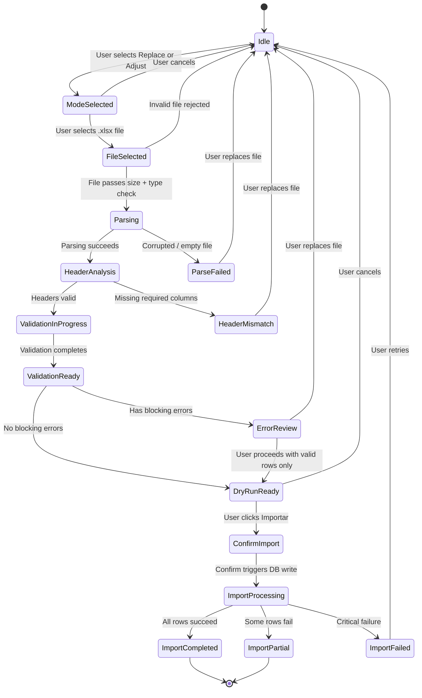

# Feature PRD — Spreadsheet Inventory Import (`.xlsx` → Validate → Preview → Commit)

> **Parent PRD**: [FEATURE_PRD_SPREADSHEET_IMPORT.md](./FEATURE_PRD_SPREADSHEET_IMPORT.md)  
> **Sibling PRD**: [FEATURE_PRD_CATALOG_IMPORT.md](./FEATURE_PRD_CATALOG_IMPORT.md)  
> **Version:** 1.0  
> **Status:** Implementation-Ready  
> **Module:** M3 — Inventario & Almacenes  
> **Stack:** Next.js 16 (App Router) · TypeScript · Zod v4 · Drizzle ORM · Supabase PostgreSQL · `xlsx` (SheetJS) ^0.18.5  
> **Audience:** Product, Frontend, Backend, QA  
> **Language:** English (technical), Spanish (UI copy where applicable)  
> **Last Updated:** 2026-03-14  
> **Author:** Cendaro Product & Engineering

---

## Table of Contents

1. [Executive Summary](#1-executive-summary)
2. [Problem Statement](#2-problem-statement)
3. [Goals & Non-Goals](#3-goals--non-goals)
4. [User Personas & RBAC](#4-user-personas--rbac)
5. [User Flow — State Machine](#5-user-flow--state-machine)
6. [Functional Requirements](#6-functional-requirements)
7. [Non-Functional Requirements](#7-non-functional-requirements)
8. [Data Model — Existing Schema](#8-data-model--existing-schema)
9. [New Schema Requirements](#9-new-schema-requirements)
10. [Data Contracts & Zod Schemas](#10-data-contracts--zod-schemas)
11. [Validation Strategy](#11-validation-strategy)
12. [Transformation & Normalization](#12-transformation--normalization)
13. [Database Strategy](#13-database-strategy)
14. [API Contracts — tRPC Procedures](#14-api-contracts--trpc-procedures)
15. [Frontend Implementation](#15-frontend-implementation)
16. [Backend Implementation](#16-backend-implementation)
17. [Security Considerations](#17-security-considerations)
18. [Project Structure](#18-project-structure)
19. [Acceptance Criteria](#19-acceptance-criteria)
20. [Detailed State Transitions](#20-detailed-state-transitions)
21. [Edge Cases & Error Boundaries](#21-edge-cases--error-boundaries)
22. [End-to-End Pseudocode](#22-end-to-end-pseudocode)
23. [Recommended Implementation Order](#23-recommended-implementation-order)
24. [Appendix A — Header Alias Map](#appendix-a--header-alias-map)
25. [Appendix B — Error Code Reference](#appendix-b--error-code-reference)
26. [Appendix C — Excel Template Specification](#appendix-c--excel-template-specification)

---

## 1. Executive Summary

This feature enables **bulk import of inventory stock quantities from an `.xlsx` file into any warehouse** in the Cendaro ERP. Users select a warehouse, upload a spreadsheet listing products and their quantities, preview the parsed data with row-level validation, review a dry-run summary, and commit stock updates in a single audited transaction.

The feature supports two modes:

| Mode        | Behavior                                                  | When to Use                                     |
| ----------- | --------------------------------------------------------- | ----------------------------------------------- |
| **Replace** | Sets `StockLedger.quantity` to the imported value         | Full physical recount / initial warehouse setup |
| **Adjust**  | Adds or subtracts from the current `StockLedger.quantity` | Partial adjustments from a recount or receiving |

All processing (file read, parsing, normalization) happens **client-side** using the existing `xlsx ^0.18.5` dependency. Only the validated, typed rows are sent to the backend via tRPC.

**AI integration is currently disabled and out of scope.** The packing list AI pipeline (Groq) remains in the codebase but is not invoked by this feature.

---

## 2. Problem Statement

### Operational Problems

1. **No bulk update** — warehouse stock can only be edited one product at a time via the inline editor on `/inventory/warehouse/[id]`.
2. **Recount friction** — warehouse managers perform physical recounts producing Excel files. There is no way to upload those files.
3. **No audit trail for mass changes** — manual edits are logged individually, but there is no session-level record of a batch stock adjustment.
4. **Lock unawareness** — the current inline editor does not warn when a product is locked, leading to accidental edits.
5. **No delta visibility** — users cannot preview the aggregate impact (total stock change) before committing.

### Common Inventory Spreadsheet Failure Modes

| Failure Mode                              | Frequency | Impact                                    |
| ----------------------------------------- | --------- | ----------------------------------------- |
| SKU typos or non-existent references      | High      | Silent skip or wrong product updated      |
| Mixed cell types (number stored as text)  | Very High | Quantity parsing fails or truncates       |
| Negative quantities in Replace mode       | Medium    | Impossible stock value persisted          |
| Duplicate SKU rows in same file           | Medium    | Last-write-wins ambiguity                 |
| Blank rows between data sections          | High      | Row count inflation, phantom records      |
| Locale-specific decimals (`,` vs `.`)     | Medium    | Quantity truncated to integer incorrectly |
| Formula cells returning `#REF!` or `#N/A` | Low       | Raw error string parsed as SKU            |
| BOM characters in headers                 | Low       | Header matching fails silently            |
| Importing to inactive warehouse           | Low       | Data written to unusable warehouse        |

### Impact

| Before                                          | After                                                       |
| ----------------------------------------------- | ----------------------------------------------------------- |
| 200 products × 30s/edit = **~1.5h manual work** | Upload 1 file, review, commit → **5 minutes**               |
| No audit trail for bulk changes                 | Every import logged per-row in `StockMovement` + `AuditLog` |
| Risk of typos during manual edits               | Zod validation blocks invalid quantities before commit      |
| No lock awareness                               | Import warns/blocks updates to locked products              |
| No preview of aggregate delta                   | Dry-run shows total stock change per warehouse              |

---

## 3. Goals & Non-Goals

### Goals (MVP)

| ID  | Goal                                                                                        |
| --- | ------------------------------------------------------------------------------------------- |
| G-1 | Accept `.xlsx` / `.xls` / `.csv` files with up to **10,000 rows**                           |
| G-2 | Parse client-side → validate → preview → dry-run → commit                                   |
| G-3 | Support **Replace** and **Adjust** import modes                                             |
| G-4 | Match products by `sku` (the product `Referencia`), with case-insensitive matching          |
| G-5 | Generate `StockMovement` records for every updated row (`adjustment_in` / `adjustment_out`) |
| G-6 | Respect product lock status (`StockLedger.isLocked`) — warn on locked products              |
| G-7 | Record full audit trail in `AuditLog`                                                       |
| G-8 | Show dry-run summary before commit: products updated, quantities changed, warnings          |
| G-9 | Allow download of failed/skipped rows as `.xlsx` for correction                             |

### Non-Goals

| ID   | Non-Goal                                                                                          |
| ---- | ------------------------------------------------------------------------------------------------- |
| NG-1 | Creating new products — only updating stock for **existing** products                             |
| NG-2 | Updating product metadata (name, price, category) — see Catalog Import PRD                        |
| NG-3 | AI-assisted matching or parsing — AI pipeline is currently disabled                               |
| NG-4 | Image or multi-sheet processing — single data sheet only                                          |
| NG-5 | Automatic channel allocation — import updates `StockLedger` only, channels are managed separately |
| NG-6 | Cross-warehouse import — each import targets **one warehouse**                                    |

---

### Future Enhancements

> These items are **specific to inventory import**. Shared infrastructure (template download, import history, saved mappings, background processing) is defined in the [parent PRD](./FEATURE_PRD_SPREADSHEET_IMPORT.md) §3.

- **Multi-warehouse import** — single file with a "warehouse" column to distribute stock across warehouses.
- **Automatic channel re-allocation** — after stock update, trigger channel allocation recalculation.
- **Scheduled recount imports** — recurring uploads from warehouses on a schedule (e.g., weekly recount).
- **Barcode scanning cross-validation** — validate imported SKUs by cross-referencing barcode values against the product barcode registry.
- **Differential recount report** — generate a variance report (`imported qty − current qty`) downloadable as `.xlsx` before committing.

---

## 4. User Personas & RBAC

### Primary Persona: Admin / Dueño

| Attribute            | Detail                                                                                                                                                               |
| -------------------- | -------------------------------------------------------------------------------------------------------------------------------------------------------------------- |
| **Role**             | `admin` / `owner` — full system access per PRD v1.0 §7.3                                                                                                             |
| **Goal**             | Bulk-update warehouse stock from a physical recount spreadsheet accurately and quickly                                                                               |
| **Risk**             | Incorrect quantities entering the system, overwriting locked products, unaudited mass changes                                                                        |
| **Success Criteria** | Every imported row is validated, locked products are flagged, and the dry-run summary matches expectations before commit                                             |
| **JTBD**             | "When I finish a physical recount, I want to upload the Excel file and see exactly what will change in each warehouse, so I can confirm the update with confidence." |

### Secondary Persona: Supervisor

| Attribute | Detail                                                                                                                                              |
| --------- | --------------------------------------------------------------------------------------------------------------------------------------------------- |
| **Role**  | `supervisor` — can upload and preview, cannot commit                                                                                                |
| **Goal**  | Validate the recount data before the admin commits it                                                                                               |
| **Risk**  | Approving a file with incorrect quantities                                                                                                          |
| **JTBD**  | "When the warehouse sends me a recount file, I want to upload it and preview the validation results so I can flag issues before the admin commits." |

### Tertiary Persona: Employee (View-Only)

| Attribute | Detail                                               |
| --------- | ---------------------------------------------------- |
| **Role**  | `employee` — cannot import, can view warehouse stock |
| **Goal**  | See current stock quantities after an import         |
| **Risk**  | None (read-only)                                     |

**Enforcement**: All import procedures use `roleRestrictedProcedure(["owner", "admin", "supervisor"])`. The `commit` step uses `roleRestrictedProcedure(["owner", "admin"])`.

---

## 5. User Flow — State Machine

### Mermaid State Diagram



### Step Descriptions

| Step                    | User Action                            | System Action                                                    |
| ----------------------- | -------------------------------------- | ---------------------------------------------------------------- |
| 1. Select Warehouse     | Pick warehouse from dropdown           | Load warehouse detail (name, type, current product count)        |
| 2. Select Import Mode   | Choose **Replace** or **Adjust**       | Display mode explanation                                         |
| 3. Upload File          | Drag & drop or click to upload `.xlsx` | Client-side: `XLSX.read()` → extract `string[][]`                |
| 4. Header Detection     | Review auto-mapped columns             | Map headers → `{ sku, quantity }` using alias map                |
| 5. Validation & Preview | Review row-level results               | Validate SKU exists, quantity is integer ≥ 0, product not locked |
| 6. Dry-Run Summary      | Review aggregate changes               | Show: X products updated, Y skipped, Z warnings                  |
| 7. Confirm / Cancel     | Click "Importar" or "Cancelar"         | Commit to DB or discard session                                  |
| 8. Result               | View final summary + download errors   | Show committed count + failed rows download link                 |

---

## 6. Functional Requirements

### File Upload

| ID   | Requirement                                                                                                                                        |
| ---- | -------------------------------------------------------------------------------------------------------------------------------------------------- |
| FR-1 | Accept `.xlsx`, `.xls`, `.csv` (MIME: `application/vnd.openxmlformats-officedocument.spreadsheetml.sheet`, `application/vnd.ms-excel`, `text/csv`) |
| FR-2 | Maximum file size: **10 MB**                                                                                                                       |
| FR-3 | Maximum rows: **10,000** (excluding header)                                                                                                        |
| FR-4 | Drag-and-drop upload zone with file type indicator                                                                                                 |
| FR-5 | Parse client-side using `XLSX.read(buffer, { type: "array", cellFormula: false, cellHTML: false })`                                                |

### Header Detection

| ID    | Requirement                                                                                    |
| ----- | ---------------------------------------------------------------------------------------------- |
| FR-6  | **Required columns**: `sku` (or alias), `quantity` (or alias)                                  |
| FR-7  | **Optional columns**: `barcode` (for cross-validation only — not used for SKU lookup), `notes` |
| FR-8  | Auto-detect headers using alias map (see Appendix A) — case-insensitive, accent-insensitive    |
| FR-9  | If required headers missing, show error with available column names                            |
| FR-10 | User can manually remap columns if auto-detection fails                                        |

### Validation

| ID    | Requirement                                                                                                         |
| ----- | ------------------------------------------------------------------------------------------------------------------- |
| FR-11 | **SKU validation**: check that `sku` exists in `Product` table (case-insensitive exact match)                       |
| FR-12 | **Quantity validation**: must be a non-negative integer (for Replace mode) or any integer (for Adjust mode)         |
| FR-13 | **Duplicate detection**: if same SKU appears multiple times, keep last occurrence, warn user                        |
| FR-14 | **Lock detection**: if `StockLedger.isLocked = true` for the product in the target warehouse, mark row as `warning` |
| FR-15 | **Empty row handling**: skip rows where both SKU and quantity are empty                                             |

### Preview

| ID    | Requirement                                                                                              |
| ----- | -------------------------------------------------------------------------------------------------------- | ----------- | --------- | --------- |
| FR-16 | Show table with columns: Row #, SKU, Product Name (resolved), Quantity, Status, Notes                    |
| FR-17 | Color-code rows: ✅ green (valid), ⚠️ yellow (warning — locked), ❌ red (error — not found, invalid qty) |
| FR-18 | Show aggregate counters: `Valid: X                                                                       | Warnings: Y | Errors: Z | Total: N` |
| FR-19 | Allow filtering table by status (all / valid / warnings / errors)                                        |
| FR-20 | Show current stock alongside imported quantity in Replace mode: `Current: 50 → New: 120`                 |

### Dry-Run

| ID    | Requirement                                                                                                |
| ----- | ---------------------------------------------------------------------------------------------------------- |
| FR-21 | Generate summary: total products to update, total quantity delta (sum of changes), locked products skipped |
| FR-22 | In Replace mode: show `current → new` for each product                                                     |
| FR-23 | In Adjust mode: show `current + delta = new` for each product                                              |
| FR-24 | Show warehouse name and type prominently in summary header                                                 |

### Commit

| ID    | Requirement                                                                                                                                              |
| ----- | -------------------------------------------------------------------------------------------------------------------------------------------------------- |
| FR-25 | **Replace mode**: `UPDATE stock_ledger SET quantity = :newQty WHERE product_id = :pid AND warehouse_id = :wid`                                           |
| FR-26 | **Adjust mode**: `UPDATE stock_ledger SET quantity = quantity + :delta WHERE product_id = :pid AND warehouse_id = :wid`                                  |
| FR-27 | If no `StockLedger` row exists for the product×warehouse pair, **INSERT** one (upsert)                                                                   |
| FR-28 | Generate one `StockMovement` per updated row: `movementType = 'adjustment_in'` (quantity increase) or `'adjustment_out'` (quantity decrease)             |
| FR-29 | Record import session metadata in `AuditLog`: `entity = 'inventory_import'`, with JSON payload containing warehouse ID, filename, row count, import mode |
| FR-30 | Batch commit: 100 rows per batch transaction                                                                                                             |
| FR-31 | Return result summary: `{ committed: N, skipped: M, failed: K, errors: [...] }`                                                                          |
| FR-32 | Failed rows available for download as `.xlsx` using `downloadAsXlsx()` from sheetjs-nextjs skill                                                         |
| FR-33 | Locked products are **skipped by default**. User can opt-in to "force update locked" (requires owner/admin).                                             |

---

## 7. Non-Functional Requirements

| ID    | Requirement                                | Target                                 |
| ----- | ------------------------------------------ | -------------------------------------- |
| NFR-1 | Parse 10,000 rows client-side              | ≤ 3 seconds                            |
| NFR-2 | Validate 10,000 rows against product list  | ≤ 5 seconds                            |
| NFR-3 | Commit 10,000 rows (100/batch)             | ≤ 30 seconds                           |
| NFR-4 | Max tRPC payload size                      | ≤ 2 MB                                 |
| NFR-5 | One active import session per warehouse    | Enforced via lazy check                |
| NFR-6 | Session expiration                         | 24h (lazy — checked at access time)    |
| NFR-7 | Audit trail retention                      | Permanent (as per existing `AuditLog`) |
| NFR-8 | Import mode must be selected before upload | UI enforcement                         |

---

## 8. Data Model — Existing Schema

### Tables Used (No Modifications Required)

| Table           | Role in Import                | Key Fields                                                                                                   |
| --------------- | ----------------------------- | ------------------------------------------------------------------------------------------------------------ |
| `Warehouse`     | Target warehouse selection    | `id`, `name`, `type`, `isActive`                                                                             |
| `Product`       | SKU resolution for validation | `id`, `sku` (unique), `name`, `status`                                                                       |
| `StockLedger`   | Target of stock updates       | `productId` × `warehouseId` (unique), `quantity` (integer), `isLocked`                                       |
| `StockMovement` | Audit trail per row           | `productId`, `movementType`, `quantity`, `warehouseId`, `referenceId`, `referenceType`, `notes`, `createdBy` |
| `AuditLog`      | Session-level audit           | `action`, `entity`, `entityId`, `newValue` (JSONB)                                                           |

### Enum Values

| Enum                | Relevant Values                                                         |
| ------------------- | ----------------------------------------------------------------------- |
| `warehouseTypeEnum` | `showroom`, `warehouse`, `external`, `transit`, `reserved`, `defective` |
| `movementTypeEnum`  | `adjustment_in`, `adjustment_out` (used for import-generated movements) |

### Important Constraints

- `StockLedger`: `UNIQUE (product_id, warehouse_id)` — one row per product per warehouse
- `Product`: `UNIQUE (sku)` — guaranteed unique product references
- `StockLedger.quantity`: `INTEGER NOT NULL DEFAULT 0` — always a whole number
- `StockLedger.isLocked`: `BOOLEAN NOT NULL DEFAULT false` — locked products should be warned/skipped

---

## 9. New Schema Requirements

### ⚠️ No New Tables Required

This feature operates entirely on existing tables. The import session state is managed **client-side** via React state (no `import_sessions` table needed). The backend receives validated, typed rows and writes directly to `StockLedger` + `StockMovement` + `AuditLog`.

**Rationale**: Unlike the catalog import (which has multi-step server-side state for category mapping), the inventory import is a simpler flow:

1. Client parses and validates locally
2. Client resolves SKUs against a product list (pre-fetched)
3. Client sends validated batch → server commits atomically
4. No intermediate server state needed

---

## 10. Data Contracts & Zod Schemas

```typescript
import { z } from "zod/v4";

// ── Import Mode ───────────────────────────────────
export const importModeSchema = z.enum(["replace", "adjust"]);
export type ImportMode = z.infer<typeof importModeSchema>;

// ── Single Row (client → server) ──────────────────
export const inventoryImportRowSchema = z.object({
  /** 1-indexed row number from the original spreadsheet */
  rowNumber: z.int().min(1),
  /** Product SKU (must exist in Product table) */
  sku: z.string().min(1).max(64),
  /** Target quantity (Replace: absolute | Adjust: delta) */
  quantity: z.int(),
  /** Optional per-row notes */
  notes: z.string().max(512).optional(),
  /** Resolved product ID (populated during client-side validation) */
  productId: z.string().uuid(),
  /** Current stock quantity (populated during client-side validation) */
  currentQuantity: z.int().min(0),
});
export type InventoryImportRow = z.infer<typeof inventoryImportRowSchema>;

// ── Validation Result (client-side) ───────────────
export const rowValidationStatus = z.enum(["valid", "warning", "error"]);

export const validatedRowSchema = inventoryImportRowSchema.extend({
  status: rowValidationStatus,
  /** Human-readable validation message */
  message: z.string().optional(),
  /** Resolved product name (for display) */
  productName: z.string().optional(),
  /** Whether the product is locked in the target warehouse */
  isLocked: z.boolean().default(false),
});
export type ValidatedRow = z.infer<typeof validatedRowSchema>;

// ── Commit Request ────────────────────────────────
export const inventoryImportCommitSchema = z.object({
  /** Target warehouse UUID */
  warehouseId: z.string().uuid(),
  /** Import mode */
  mode: importModeSchema,
  /** Validated rows to commit (only status = 'valid') */
  rows: z.array(inventoryImportRowSchema).min(1).max(10000),
  /** Original filename for audit logging */
  filename: z.string().max(256),
  /** Idempotency key to prevent double submits */
  idempotencyKey: z.string().uuid(),
  /** Whether to force-update locked products (requires owner/admin) */
  forceLocked: z.boolean().default(false),
});
export type InventoryImportCommit = z.infer<typeof inventoryImportCommitSchema>;

// ── Commit Result ─────────────────────────────────
export const importResultSchema = z.object({
  /** Number of rows successfully committed */
  committed: z.int().min(0),
  /** Number of rows skipped (locked, duplicate, etc.) */
  skipped: z.int().min(0),
  /** Number of rows that failed during commit */
  failed: z.int().min(0),
  /** Total quantity delta applied */
  totalDelta: z.int(),
  /** Error details for failed rows */
  errors: z.array(
    z.object({
      rowNumber: z.int(),
      sku: z.string(),
      code: z.string(),
      message: z.string(),
    }),
  ),
  /** Audit log entry ID */
  auditLogId: z.string().uuid().optional(),
});
export type ImportResult = z.infer<typeof importResultSchema>;
```

---

## 11. Validation Strategy

### Client-Side Validation (Step 5)

All validation happens in the browser before any server call:

```
┌─────────────┐     ┌──────────────────┐     ┌───────────────┐     ┌──────────────┐
│ Parse Excel │────▶│ Normalize Values │────▶│ Resolve SKUs  │────▶│ Check Locks  │
│ string[][]  │     │ trim, parseInt   │     │ vs productMap │     │ vs stockMap  │
└─────────────┘     └──────────────────┘     └───────────────┘     └──────────────┘
```

1. **Pre-fetch product list**: `api.catalog.list()` → build `Map<string, { id, name, sku }>` (lowercase SKU as key)
2. **Pre-fetch warehouse stock**: `api.inventory.warehouseStock({ warehouseId })` → build `Map<string, { quantity, isLocked }>` (productId as key)
3. **For each parsed row**:
   - Normalize: `sku.trim().toUpperCase()`, `parseInt(quantity)`
   - Look up in `productMap` — if not found → `status: "error"`, `code: "PRODUCT_NOT_FOUND"`
   - Validate quantity schema — if invalid → `status: "error"`, `code: "INVALID_QUANTITY"`
   - Check lock status from `stockMap` — if locked → `status: "warning"`, `code: "PRODUCT_LOCKED"`
   - Duplicate SKU in same file — keep last, warn → `status: "warning"`
   - If all pass → `status: "valid"`

### Server-Side Validation (On Commit)

The server re-validates critical invariants before writing:

1. `warehouseId` exists and `isActive = true`
2. Each `productId` exists in `Product` table
3. Idempotency key has not been used before (check `AuditLog` for existing reference)
4. User has required role for the operation
5. If `forceLocked = false`, skip rows where `StockLedger.isLocked = true`

---

## 12. Transformation & Normalization

### Column Value Processing

| Field      | Transformation                                    | Example                              |
| ---------- | ------------------------------------------------- | ------------------------------------ |
| `sku`      | `String.trim().toUpperCase()`                     | `" abc-123 "` → `"ABC-123"`          |
| `quantity` | `parseInt(value, 10)` — reject NaN, reject floats | `"150"` → `150`, `"12.5"` → ❌ error |
| `notes`    | `String.trim()`, max 512 chars                    | `"  recount  "` → `"recount"`        |

### Quantity Rules by Mode

| Mode        | Accepted Values                                   | Behavior                                                |
| ----------- | ------------------------------------------------- | ------------------------------------------------------- |
| **Replace** | `quantity ≥ 0`                                    | Direct assignment: `StockLedger.quantity = quantity`    |
| **Adjust**  | Any integer (positive = add, negative = subtract) | Delta update: `StockLedger.quantity = quantity + delta` |
| **Adjust**  | Result must be `≥ 0`                              | If `current + delta < 0` → error: `NEGATIVE_RESULT`     |

---

## 13. Database Strategy

### Commit Pipeline

```sql
-- Per row (inside transaction batch of 100):

-- 1. Upsert StockLedger
INSERT INTO stock_ledger (product_id, warehouse_id, quantity)
VALUES (:productId, :warehouseId, :newQuantity)
ON CONFLICT (product_id, warehouse_id)
DO UPDATE SET
  quantity = CASE
    WHEN :mode = 'replace' THEN :newQuantity
    WHEN :mode = 'adjust'  THEN stock_ledger.quantity + :delta
  END,
  updated_at = NOW();

-- 2. Record movement
INSERT INTO stock_movement (
  product_id, movement_type, quantity, warehouse_id,
  reference_id, reference_type, notes, created_by
) VALUES (
  :productId,
  CASE WHEN :delta >= 0 THEN 'adjustment_in' ELSE 'adjustment_out' END,
  ABS(:delta),
  :warehouseId,
  :auditLogId,
  'inventory_import',
  :rowNotes,
  :userId
);
```

### Transaction Strategy

```
┌─────────────────────────────────────────┐
│ Batch 1 (rows 1–100)                   │
│   BEGIN                                 │
│     UPSERT stock_ledger × 100           │
│     INSERT stock_movement × 100         │
│   COMMIT                                │
├─────────────────────────────────────────┤
│ Batch 2 (rows 101–200)                  │
│   BEGIN                                 │
│     ...                                 │
│   COMMIT                                │
├─────────────────────────────────────────┤
│ ...                                     │
├─────────────────────────────────────────┤
│ Session Audit Log Entry                 │
│   INSERT audit_log (summary)            │
└─────────────────────────────────────────┘
```

**Partial failure handling**: If batch N fails, batches 1..N-1 remain committed. The result reports which rows succeeded and which failed. User can download failed rows and re-import.

### Idempotency

- Client generates a UUID `idempotencyKey` at session start
- Server checks `AuditLog` for existing entry with this key in `newValue`
- If found → return previous result without re-executing

---

## 14. API Contracts — tRPC Procedures

### `inventoryImport.commit`

```typescript
inventoryImport: createTRPCRouter({
  commit: roleRestrictedProcedure(["owner", "admin"])
    .input(inventoryImportCommitSchema)
    .mutation(async ({ ctx, input }) => {
      // 1. Validate warehouse exists and is active
      // 2. Check idempotency key
      // 3. Batch process rows (100/batch)
      //    - Upsert StockLedger
      //    - Insert StockMovement
      // 4. Log to AuditLog
      // 5. Return ImportResult
    }),

  // Pre-fetch data for client-side validation
  getWarehouseProducts: protectedProcedure
    .input(z.object({ warehouseId: z.string().uuid() }))
    .query(async ({ ctx, input }) => {
      // Returns all products with their current stock in this warehouse
      // Used to build productMap + stockMap on the client
    }),
});
```

### Procedure Summary

| Procedure                              | Role              | Input                   | Output                                    | Purpose                              |
| -------------------------------------- | ----------------- | ----------------------- | ----------------------------------------- | ------------------------------------ |
| `inventoryImport.commit`               | owner, admin      | `InventoryImportCommit` | `ImportResult`                            | Execute the stock updates            |
| `inventoryImport.getWarehouseProducts` | any authenticated | `{ warehouseId }`       | `{ id, sku, name, quantity, isLocked }[]` | Pre-fetch for client-side validation |

---

## 15. Frontend Implementation

### Access Point

**Location**: `/inventory/warehouse/[id]` — Add "Importar Inventario" button to the warehouse detail page header.

**New Route**: `/inventory/warehouse/[id]/import` — Full-page import wizard.

### Component Architecture

```
/inventory/warehouse/[id]/import/page.tsx
├── InventoryImportWizard.tsx          ← Main orchestrator (state machine)
│   ├── Step1_ModeSelect.tsx           ← Replace vs Adjust selector
│   ├── Step2_FileUpload.tsx           ← Drag-and-drop upload zone
│   ├── Step3_HeaderMapping.tsx        ← Auto-detected + manual override
│   ├── Step4_ValidationPreview.tsx    ← Table with status indicators
│   ├── Step5_DryRunSummary.tsx        ← Aggregate summary before commit
│   └── Step6_ResultSummary.tsx        ← Final result + error download
├── hooks/
│   ├── use-inventory-import.ts        ← Core state management hook
│   ├── use-parse-inventory-file.ts    ← XLSX parsing + header detection
│   └── use-validate-inventory.ts      ← Client-side validation logic
└── lib/
    ├── inventory-header-aliases.ts    ← Header alias map
    ├── inventory-validators.ts        ← Zod schemas + validation functions
    └── inventory-normalizers.ts       ← Value transformation functions
```

### State Management

```typescript
interface ImportState {
  step: 1 | 2 | 3 | 4 | 5 | 6;
  warehouseId: string;
  warehouseName: string;
  mode: "replace" | "adjust";
  rawRows: string[][];
  headerMap: Record<string, string>;
  validatedRows: ValidatedRow[];
  commitResult: ImportResult | null;
  idempotencyKey: string; // UUID generated at session start
}
```

### UX Details

**Step 1 — Mode Selection**:

```
┌──────────────────────────────────────────────────────────┐
│  Importar Inventario — Almacén Principal                 │
│                                                          │
│  ┌─────────────────┐    ┌─────────────────┐              │
│  │  📋 Reemplazar   │    │  📊 Ajustar      │              │
│  │                 │    │                 │              │
│  │  Establece la   │    │  Suma o resta   │              │
│  │  cantidad exacta│    │  cantidades a   │              │
│  │  del conteo     │    │  lo existente   │              │
│  │  físico.        │    │                 │              │
│  └─────────────────┘    └─────────────────┘              │
│                                                          │
│  ⚠️ Reemplazar sobreescribe el stock actual              │
└──────────────────────────────────────────────────────────┘
```

**Step 4 — Validation Preview**:

```
┌───────────────────────────────────────────────────────────────────┐
│  ✅ 342 válidos  │  ⚠️ 8 advertencias  │  ❌ 5 errores  │ Total: 355 │
├───────────────────────────────────────────────────────────────────┤
│  # │ SKU       │ Producto           │ Actual │ Nuevo │ Estado     │
│ ───┼───────────┼────────────────────┼────────┼───────┼────────────│
│  1 │ REF-001   │ Cable HDMI 2m      │   50   │  120  │ ✅ Válido  │
│  2 │ REF-002   │ Adaptador USB-C    │   30   │   45  │ ✅ Válido  │
│  3 │ REF-003   │ Audífonos BT       │   15   │   20  │ ⚠️ Bloqueado│
│  4 │ ZZZ-999   │ —                  │   —    │   10  │ ❌ No existe│
└───────────────────────────────────────────────────────────────────┘
```

---

## 16. Backend Implementation

### Commit Procedure (Pseudocode)

```typescript
// packages/api/src/modules/inventory-import.ts

export const inventoryImportRouter = createTRPCRouter({
  getWarehouseProducts: protectedProcedure
    .input(z.object({ warehouseId: z.string().uuid() }))
    .query(async ({ ctx, input }) => {
      const rows = await ctx.db.execute<{
        id: string;
        sku: string;
        name: string;
        quantity: number;
        is_locked: boolean;
      }>(sql`
        SELECT p.id, p.sku, p.name,
          COALESCE(sl.quantity, 0) AS quantity,
          COALESCE(sl.is_locked, false) AS is_locked
        FROM product p
        LEFT JOIN stock_ledger sl
          ON sl.product_id = p.id AND sl.warehouse_id = ${input.warehouseId}
        WHERE p.status != 'discontinued'
        ORDER BY p.sku
      `);
      return rows.map((r) => ({
        id: r.id,
        sku: r.sku,
        name: r.name,
        quantity: r.quantity,
        isLocked: r.is_locked,
      }));
    }),

  commit: roleRestrictedProcedure(["owner", "admin"])
    .input(inventoryImportCommitSchema)
    .mutation(async ({ ctx, input }) => {
      // 1. Validate warehouse
      const [wh] = await ctx.db
        .select({ id: Warehouse.id, isActive: Warehouse.isActive })
        .from(Warehouse)
        .where(eq(Warehouse.id, input.warehouseId))
        .limit(1);
      if (!wh || !wh.isActive) throw new TRPCError({ code: "BAD_REQUEST" });

      // 2. Idempotency check
      const existing = await checkIdempotency(ctx.db, input.idempotencyKey);
      if (existing) return existing;

      // 3. Process rows in batches of 100
      const BATCH_SIZE = 100;
      let committed = 0,
        skipped = 0,
        failed = 0;
      let totalDelta = 0;
      const errors: {
        rowNumber: number;
        sku: string;
        code: string;
        message: string;
      }[] = [];

      for (let i = 0; i < input.rows.length; i += BATCH_SIZE) {
        const batch = input.rows.slice(i, i + BATCH_SIZE);
        await ctx.db.transaction(async (tx) => {
          for (const row of batch) {
            // Check lock status
            if (!input.forceLocked) {
              const [sl] = await tx
                .select({ isLocked: StockLedger.isLocked })
                .from(StockLedger)
                .where(
                  and(
                    eq(StockLedger.productId, row.productId),
                    eq(StockLedger.warehouseId, input.warehouseId),
                  ),
                )
                .limit(1);
              if (sl?.isLocked) {
                skipped++;
                continue;
              }
            }

            // Compute delta
            const delta =
              input.mode === "replace"
                ? row.quantity - row.currentQuantity
                : row.quantity;
            const newQuantity =
              input.mode === "replace"
                ? row.quantity
                : row.currentQuantity + row.quantity;

            if (newQuantity < 0) {
              errors.push({
                rowNumber: row.rowNumber,
                sku: row.sku,
                code: "NEGATIVE_RESULT",
                message: `Result would be ${newQuantity}`,
              });
              failed++;
              continue;
            }

            // Upsert StockLedger
            await tx
              .insert(StockLedger)
              .values({
                productId: row.productId,
                warehouseId: input.warehouseId,
                quantity: newQuantity,
              })
              .onConflictDoUpdate({
                target: [StockLedger.productId, StockLedger.warehouseId],
                set: { quantity: newQuantity },
              });

            // Record movement
            await tx.insert(StockMovement).values({
              productId: row.productId,
              movementType: delta >= 0 ? "adjustment_in" : "adjustment_out",
              quantity: Math.abs(delta),
              warehouseId: input.warehouseId,
              referenceType: "inventory_import",
              notes: row.notes ?? `Import ${input.mode}: ${row.sku}`,
              createdBy: ctx.user.id,
            });

            totalDelta += delta;
            committed++;
          }
        });
      }

      // 4. Audit log
      await logAudit(ctx.db, ctx.user, {
        action: "inventory.bulk_import",
        entity: "inventory_import",
        entityId: input.warehouseId,
        newValue: {
          warehouseId: input.warehouseId,
          mode: input.mode,
          filename: input.filename,
          idempotencyKey: input.idempotencyKey,
          committed,
          skipped,
          failed,
          totalDelta,
        },
      });

      return { committed, skipped, failed, totalDelta, errors };
    }),
});
```

---

## 17. Security Considerations

| Threat                    | Mitigation                                                            |
| ------------------------- | --------------------------------------------------------------------- |
| **Formula injection**     | `cellFormula: false` on `XLSX.read()`                                 |
| **File size DoS**         | 10 MB limit enforced client-side before parsing                       |
| **Row count DoS**         | 10,000 row limit enforced client-side                                 |
| **SQL injection**         | Drizzle ORM parameterized queries — no raw string interpolation       |
| **XSS**                   | React default escaping on all rendered cell values                    |
| **Double submit**         | UUID idempotency key checked against `AuditLog` before commit         |
| **RBAC bypass**           | `roleRestrictedProcedure` on all mutation endpoints                   |
| **Negative stock**        | Server validates `current + delta ≥ 0` before write                   |
| **Locked product bypass** | Server re-checks `isLocked` even if client sends `forceLocked: false` |

---

## 18. Project Structure

```
apps/erp/src/
├── app/(app)/inventory/warehouse/[id]/
│   ├── page.tsx                          ← EXISTING (add "Importar" button)
│   └── import/
│       └── page.tsx                      ← NEW — Import wizard page
├── modules/receiving/inventory-import/
│   ├── inventory-import-wizard.tsx        ← Main component
│   ├── steps/
│   │   ├── mode-select.tsx
│   │   ├── file-upload.tsx
│   │   ├── header-mapping.tsx
│   │   ├── validation-preview.tsx
│   │   ├── dry-run-summary.tsx
│   │   └── result-summary.tsx
│   ├── hooks/
│   │   ├── use-inventory-import.ts
│   │   ├── use-parse-inventory-file.ts
│   │   └── use-validate-inventory.ts
│   └── lib/
│       ├── inventory-header-aliases.ts
│       ├── inventory-validators.ts
│       └── inventory-normalizers.ts

packages/api/src/modules/
├── inventory.ts                           ← EXISTING (unchanged)
└── inventory-import.ts                    ← NEW — Import router
```

---

## 19. Acceptance Criteria

### Upload & Parse

| ID   | Criteria                                                         |
| ---- | ---------------------------------------------------------------- |
| AC-1 | User can drag-and-drop an `.xlsx` file onto the upload zone      |
| AC-2 | Files > 10 MB are rejected with clear error message              |
| AC-3 | Files > 10,000 rows show error: "Máximo 10,000 filas permitidas" |
| AC-4 | `.xlsx`, `.xls`, `.csv` are all successfully parsed              |

### Mode Selection

| ID   | Criteria                                                    |
| ---- | ----------------------------------------------------------- |
| AC-5 | User must select Replace or Adjust before upload is enabled |
| AC-6 | Mode explanation is clearly visible                         |
| AC-7 | Mode cannot be changed after upload (must restart)          |

### Validation

| ID    | Criteria                                                       |
| ----- | -------------------------------------------------------------- |
| AC-8  | Unknown SKUs are marked red with "Producto no encontrado"      |
| AC-9  | Non-integer quantities are marked red with "Cantidad inválida" |
| AC-10 | Locked products are marked yellow with "Producto bloqueado"    |
| AC-11 | Duplicate SKUs keep last occurrence, show warning              |
| AC-12 | Empty rows are silently skipped                                |

### Preview & Dry-Run

| ID    | Criteria                                                      |
| ----- | ------------------------------------------------------------- |
| AC-13 | Preview table shows all rows with status color-coding         |
| AC-14 | Counters show Valid / Warning / Error counts                  |
| AC-15 | Replace mode shows "Current → New" columns                    |
| AC-16 | Adjust mode shows "Current + Delta = New" columns             |
| AC-17 | Dry-run summary shows total affected products and total delta |

### Commit

| ID    | Criteria                                                        |
| ----- | --------------------------------------------------------------- |
| AC-18 | Only `valid` status rows are committed (not warning/error)      |
| AC-19 | Owner/admin can opt-in to include `warning` (locked) rows       |
| AC-20 | `StockMovement` records are created for each updated row        |
| AC-21 | `AuditLog` entry includes warehouse, filename, counts, and mode |
| AC-22 | Double-clicking "Importar" does not create duplicate entries    |
| AC-23 | Result summary shows committed/skipped/failed counts            |
| AC-24 | Failed rows can be downloaded as `.xlsx`                        |

### Integration

| ID    | Criteria                                                                          |
| ----- | --------------------------------------------------------------------------------- |
| AC-25 | After import, warehouse detail page reflects new quantities                       |
| AC-26 | Stock overview page reflects updated totals                                       |
| AC-27 | `StockMovement` log shows import entries with `referenceType: 'inventory_import'` |

---

## 20. Detailed State Transitions

#### State: Idle

| Aspect                | Detail                                                              |
| --------------------- | ------------------------------------------------------------------- |
| **Trigger**           | Page load, or reset after cancel/complete                           |
| **User Action**       | Navigates to `/inventory/warehouse/[id]/import`                     |
| **Frontend Behavior** | Shows warehouse header (name, type, product count) + mode selector. |
| **Server Behavior**   | None                                                                |
| **Next Transition**   | `ModeSelected`                                                      |

#### State: ModeSelected

| Aspect                | Detail                                                                         |
| --------------------- | ------------------------------------------------------------------------------ |
| **Trigger**           | User clicks Replace or Adjust card                                             |
| **User Action**       | Reviews mode description, proceeds to file upload                              |
| **Frontend Behavior** | Highlights selected mode card. Shows upload zone. Displays mode-specific hint. |
| **Server Behavior**   | None                                                                           |
| **Next Transition**   | `FileSelected` or `Idle` (cancel)                                              |

#### State: FileSelected → Parsing

| Aspect                | Detail                                                                                                                             |
| --------------------- | ---------------------------------------------------------------------------------------------------------------------------------- |
| **Trigger**           | File passes client-side extension and size check                                                                                   |
| **User Action**       | Waits; progress indicator shown                                                                                                    |
| **Frontend Behavior** | Client-side: reads file as `ArrayBuffer`, parses with `XLSX.read()`, extracts `string[][]`. Shows spinner: "Analizando archivo..." |
| **Server Behavior**   | None — parsing is 100% client-side                                                                                                 |
| **Success**           | Transition to `HeaderAnalysis`                                                                                                     |
| **Failure**           | Corrupted/empty → `ParseFailed` with retry                                                                                         |

#### State: HeaderAnalysis

| Aspect                | Detail                                                                                                                          |
| --------------------- | ------------------------------------------------------------------------------------------------------------------------------- |
| **Trigger**           | Sheet parsed successfully                                                                                                       |
| **User Action**       | Reviews detected column mapping: `sku`, `quantity`, `notes`                                                                     |
| **Frontend Behavior** | Mapping table: detected header → mapped field. Missing required columns flagged as errors. Manual override dropdowns available. |
| **Success**           | All required columns present → `ValidationInProgress`                                                                           |
| **Failure**           | Missing `sku` or `quantity` → `HeaderMismatch` with guidance                                                                    |

#### State: ValidationInProgress → ValidationReady

| Aspect                | Detail                                                                                   |
| --------------------- | ---------------------------------------------------------------------------------------- |
| **Trigger**           | Header mapping confirmed                                                                 |
| **User Action**       | Waits; progress bar: "Validando fila X de Y..."                                          |
| **Frontend Behavior** | Iterates rows, applies normalization + SKU lookup + lock check. Builds `ValidatedRow[]`. |
| **Data Returned**     | `validatedRows` with per-row status                                                      |
| **Next Transition**   | `ErrorReview` (has errors) or `DryRunReady` (clean)                                      |

#### State: DryRunReady

| Aspect                | Detail                                                                                                             |
| --------------------- | ------------------------------------------------------------------------------------------------------------------ |
| **Trigger**           | All validation passed (or errors acknowledged)                                                                     |
| **User Action**       | Reviews dry-run summary card                                                                                       |
| **Frontend Behavior** | Summary: "X productos a actualizar, delta total: +Y / -Z". Expandable row groups. "Importar" + "Cancelar" buttons. |
| **Next Transition**   | `ConfirmImport` or `Idle`                                                                                          |

#### State: ImportProcessing

| Aspect                | Detail                                                                                         |
| --------------------- | ---------------------------------------------------------------------------------------------- |
| **Trigger**           | User confirms import via confirmation dialog                                                   |
| **User Action**       | Waits; progress bar: "Escribiendo lote X de Y..."                                              |
| **Frontend Behavior** | Progress bar with batch progress. All navigation disabled.                                     |
| **Server Behavior**   | Executes batched UPSERT within transactions. Records each `StockMovement`. Updates `AuditLog`. |
| **Success**           | All rows succeed → `ImportCompleted`                                                           |
| **Partial**           | Some fail → `ImportPartial` (download failed rows)                                             |
| **Failure**           | Critical DB error → `ImportFailed` (retry option)                                              |

#### State: ImportCompleted / ImportPartial

| Aspect                | Detail                                                                                                  |
| --------------------- | ------------------------------------------------------------------------------------------------------- |
| **Frontend Behavior** | Success/warning banner with counts. Link to warehouse detail. Download button for failed rows (if any). |
| **Server Behavior**   | `AuditLog` entry finalized with full result summary.                                                    |
| **Next Transition**   | Terminal — user navigates away                                                                          |

---

## 21. Edge Cases & Error Boundaries

| #   | Scenario                                                              | Expected Behavior                                                                       |
| --- | --------------------------------------------------------------------- | --------------------------------------------------------------------------------------- |
| 1   | File is 0 bytes                                                       | Client rejects immediately: "Archivo vacío"                                             |
| 2   | File has headers but no data rows                                     | Show info: "No se encontraron filas de datos"                                           |
| 3   | All rows fail validation                                              | "Importar" button disabled. Only "Descargar errores" available.                         |
| 4   | Same SKU appears 5 times                                              | Last occurrence kept. Warning shown per duplicate row.                                  |
| 5   | SKU exists in Product but has no StockLedger entry for this warehouse | Treated as `currentQuantity = 0`. UPSERT creates new ledger row.                        |
| 6   | Product is `discontinued` status                                      | Excluded from `getWarehouseProducts` → row marked as `PRODUCT_NOT_FOUND`                |
| 7   | Warehouse is inactive (`isActive = false`)                            | Server rejects commit: `WAREHOUSE_INACTIVE`                                             |
| 8   | User closes browser mid-commit                                        | Batches already committed remain. Idempotency key prevents re-execution on retry.       |
| 9   | tRPC payload exceeds 2 MB (>10K rows with long notes)                 | Client chunks rows into multiple tRPC calls (future enhancement)                        |
| 10  | Concurrent imports to same warehouse                                  | Lazy check: if another import is in-progress, show warning. User can override.          |
| 11  | File contains formula cells (`=SUM(...)`)                             | `cellFormula: false` — formulas return cached value or empty string                     |
| 12  | Cells are merged in spreadsheet                                       | SheetJS fills top-left cell only. SKU may be empty for merged ranges → `EMPTY_ROW`      |
| 13  | Quantity is `12.5` (float)                                            | `parseInt` truncates to `12`. Validation shows warning: "Valor truncado a entero"       |
| 14  | Adjust mode: `current = 3, delta = -5`                                | Result = -2 → `NEGATIVE_RESULT` error. Row not committed.                               |
| 15  | Network timeout during batch 5 of 10                                  | Batches 1-4 committed. Error result shows failed batch. User re-imports remaining rows. |

---

## 22. End-to-End Pseudocode

### Client-Side Orchestration

```typescript
// InventoryImportWizard.tsx — simplified orchestration
async function handleInventoryImport(
  file: File,
  warehouseId: string,
  mode: "replace" | "adjust",
) {
  // Step 1: Client-side parse
  const buffer = await file.arrayBuffer();
  const workbook = XLSX.read(buffer, {
    type: "array",
    cellFormula: false,
    cellHTML: false,
    cellStyles: false,
  });

  // Step 2: Extract first sheet
  const sheet = workbook.Sheets[workbook.SheetNames[0]!]!;
  const rawRows = XLSX.utils.sheet_to_json<string[]>(sheet, {
    header: 1,
    defval: "",
    blankrows: false,
  });

  // Step 3: Header detection
  const headerRow = rawRows[0]!.map((h: string) =>
    String(h)
      .trim()
      .toLowerCase()
      .normalize("NFD")
      .replace(/[\u0300-\u036f]/g, ""),
  );
  const headerMap = autoMapHeaders(headerRow, INVENTORY_HEADER_ALIASES);
  if (!headerMap.sku || !headerMap.quantity) throw new HeaderMissingError();

  // Step 4: Pre-fetch product + stock data
  const products = await trpc.inventoryImport.getWarehouseProducts.query({
    warehouseId,
  });
  const productMap = new Map(products.map((p) => [p.sku.toUpperCase(), p]));

  // Step 5: Validate each row
  const dataRows = rawRows.slice(1);
  const validatedRows: ValidatedRow[] = [];
  const seenSKUs = new Map<string, number>();

  for (let i = 0; i < dataRows.length; i++) {
    const row = dataRows[i]!;
    const sku = String(row[headerMap.sku] ?? "")
      .trim()
      .toUpperCase();
    const qtyRaw = String(row[headerMap.quantity] ?? "").trim();
    const notes = headerMap.notes
      ? String(row[headerMap.notes] ?? "").trim()
      : undefined;

    if (!sku && !qtyRaw) continue; // skip empty rows

    const qty = parseInt(qtyRaw, 10);
    const product = productMap.get(sku);

    let status: "valid" | "warning" | "error" = "valid";
    let message: string | undefined;

    if (!product) {
      status = "error";
      message = `SKU "${sku}" no encontrado`;
    } else if (isNaN(qty)) {
      status = "error";
      message = `Cantidad inválida: "${qtyRaw}"`;
    } else if (mode === "replace" && qty < 0) {
      status = "error";
      message = "Cantidad negativa no permitida en modo Reemplazar";
    } else if (mode === "adjust" && product.quantity + qty < 0) {
      status = "error";
      message = `Resultado negativo: ${product.quantity + qty}`;
    } else if (product.isLocked) {
      status = "warning";
      message = "Producto bloqueado";
    }

    // Duplicate detection
    if (seenSKUs.has(sku)) {
      validatedRows[seenSKUs.get(sku)!]!.status = "warning";
      validatedRows[seenSKUs.get(sku)!]!.message =
        "Duplicado — se usa la última fila";
    }
    seenSKUs.set(sku, validatedRows.length);

    validatedRows.push({
      rowNumber: i + 2,
      sku,
      quantity: qty,
      productId: product?.id ?? "",
      currentQuantity: product?.quantity ?? 0,
      productName: product?.name,
      isLocked: product?.isLocked ?? false,
      status,
      message,
      notes,
    });
  }

  // Step 6: Show preview → user reviews
  // Step 7: Show dry-run summary → user confirms
  // Step 8: Commit
  const idempotencyKey = crypto.randomUUID();
  const validRows = validatedRows.filter((r) => r.status === "valid");

  const result = await trpc.inventoryImport.commit.mutate({
    warehouseId,
    mode,
    rows: validRows,
    filename: file.name,
    idempotencyKey,
    forceLocked: false,
  });

  showImportResult(result);
}
```

---

## 23. Recommended Implementation Order

### Phase 1: Foundation (Week 1)

1. **Zod schemas** — Define all data contract schemas (`inventoryImportRowSchema`, `inventoryImportCommitSchema`, `importResultSchema`) in `packages/api/src/modules/inventory-import.ts`.
2. **Header alias map** — Build `INVENTORY_HEADER_ALIASES` dictionary.
3. **tRPC router** — Scaffold `inventoryImportRouter` with `getWarehouseProducts` and `commit` procedures.
4. **Register router** — Add `inventoryImport` to the app router.

### Phase 2: Parse + Validate (Week 2)

5. **Client-side parser hook** — `use-parse-inventory-file.ts` wrapping `XLSX.read()` + header detection.
6. **Validation hook** — `use-validate-inventory.ts` with product map lookup + lock checking.
7. **File upload step** — `Step2_FileUpload.tsx` with drag-drop, size check, type indicator.
8. **Header mapping step** — `Step3_HeaderMapping.tsx` with auto-map + manual override.

### Phase 3: Preview + Dry-Run (Week 3)

9. **Validation preview table** — `Step4_ValidationPreview.tsx` with status filter, color coding, counters.
10. **Dry-run summary** — `Step5_DryRunSummary.tsx` with aggregate delta + expandable groups.
11. **Mode selection step** — `Step1_ModeSelect.tsx` with Replace/Adjust card selector.
12. **Wizard orchestrator** — `InventoryImportWizard.tsx` state machine connecting all steps.

### Phase 4: Commit + Polish (Week 4)

13. **Commit implementation** — `inventoryImport.commit` with batched transactions, upsert, movement logging.
14. **Result summary** — `Step6_ResultSummary.tsx` with success/partial/failed states.
15. **Error download** — `downloadAsXlsx()` integration for failed rows export.
16. **Idempotency** — UUID key check against `AuditLog` before commit execution.
17. **Warehouse detail integration** — Add "Importar Inventario" button to existing page header.

### Phase 5: Hardening (Week 5)

18. **Error boundaries** — Graceful handling for all failure modes from §21.
19. **Accessibility audit** — ARIA roles, keyboard navigation, screen reader support.
20. **E2E testing** — Playwright tests for the full import flow (upload → preview → commit → verify).
21. **Performance validation** — Verify NFR targets: 10K rows parse ≤3s, validate ≤5s, commit ≤30s.

---

## Appendix A — Header Alias Map

```typescript
// apps/erp/src/modules/receiving/inventory-import/lib/inventory-header-aliases.ts

export const INVENTORY_HEADER_ALIASES: Record<string, string> = {
  // SKU / Reference (Referencia del producto)
  sku: "sku",
  ref: "sku",
  referencia: "sku",
  reference: "sku",
  código: "sku",
  codigo: "sku",
  code: "sku",
  product_code: "sku",
  "product code": "sku",
  item: "sku",
  item_code: "sku",
  artículo: "sku",
  articulo: "sku",
  "item no": "sku",
  "item number": "sku",
  art: "sku",
  编号: "sku",
  货号: "sku",

  // Barcode (optional — for cross-validation, NOT for SKU lookup)
  // Barcodes are preserved as-is for POS scanning use cases.
  barcode: "barcode",
  "bar code": "barcode",
  ean: "barcode",
  upc: "barcode",
  gtin: "barcode",
  "codigo de barras": "barcode",
  "código de barras": "barcode",
  条码: "barcode",
  条形码: "barcode",

  // Quantity
  quantity: "quantity",
  cantidad: "quantity",
  qty: "quantity",
  stock: "quantity",
  existencia: "quantity",
  existencias: "quantity",
  inventario: "quantity",
  unidades: "quantity",
  units: "quantity",
  count: "quantity",
  conteo: "quantity",
  cantidad_fisica: "quantity",
  physical_count: "quantity",
  pcs: "quantity",
  pieces: "quantity",
  数量: "quantity",
  "qty.": "quantity",

  // Notes
  notes: "notes",
  notas: "notes",
  observaciones: "notes",
  comentarios: "notes",
  comments: "notes",
  nota: "notes",
  备注: "notes",
  说明: "notes",
};
```

---

## Appendix B — Error Code Reference

| Code                   | Severity | Message Template                                             | Suggested Fix                          |
| ---------------------- | -------- | ------------------------------------------------------------ | -------------------------------------- |
| `PRODUCT_NOT_FOUND`    | error    | `Producto con SKU "{sku}" no encontrado`                     | Verify SKU exists in catalog           |
| `INVALID_QUANTITY`     | error    | `Cantidad "{value}" no es un número entero válido`           | Enter a whole number                   |
| `NEGATIVE_RESULT`      | error    | `La cantidad resultante sería negativa ({result})`           | Check the delta value (Adjust mode)    |
| `PRODUCT_LOCKED`       | warning  | `Producto "{sku}" está bloqueado en este almacén`            | Unlock product or use "forzar" option  |
| `DUPLICATE_SKU`        | warning  | `SKU "{sku}" aparece más de una vez — se usa la última fila` | Remove duplicate rows                  |
| `EMPTY_ROW`            | info     | `Fila vacía — omitida`                                       | No action needed                       |
| `FILE_TOO_LARGE`       | error    | `Archivo excede 10 MB`                                       | Use a smaller file                     |
| `TOO_MANY_ROWS`        | error    | `Archivo excede 10,000 filas`                                | Split into multiple files              |
| `MISSING_HEADER`       | error    | `Columna requerida "{column}" no encontrada`                 | Add required column to spreadsheet     |
| `WAREHOUSE_INACTIVE`   | error    | `Almacén no está activo`                                     | Activate warehouse first               |
| `DUPLICATE_HEADERS`    | error    | `Columna "{header}" aparece más de una vez`                  | Rename or remove the duplicate column  |
| `UNKNOWN_COLUMN`       | warning  | `Columna "{header}" no reconocida — será ignorada`           | —                                      |
| `VALUE_TRUNCATED`      | warning  | `Valor truncado de {original} a entero: {result}`            | Use números enteros                    |
| `IDEMPOTENCY_CONFLICT` | error    | `Esta importación ya fue ejecutada`                          | Inicie una nueva sesión de importación |

---

## Appendix C — Excel Template Specification

The recommended template for inventory import (downloadable from the UI):

| Column             | Required | Format                                                            | Example                      |
| ------------------ | -------- | ----------------------------------------------------------------- | ---------------------------- |
| `Referencia`       | ✅       | Text, max 64 chars                                                | `REF-001`                    |
| `Cantidad`         | ✅       | Integer ≥ 0 (Replace) or any integer (Adjust)                     | `150` or `-5`                |
| `Código de Barras` | ❌       | Text, max 128 chars (for cross-validation only — not used as SKU) | `7501234567890`              |
| `Notas`            | ❌       | Text, max 512 chars                                               | `Reconteo físico marzo 2026` |

> **Important**: The `Código de Barras` column is optional and used for cross-validation only. The product is always matched by `Referencia` (SKU), never by barcode. If a barcode column is present, its value is logged but does not affect the SKU resolution process.

**Template download**: Available from the import wizard (Step 2) via `downloadAsXlsx()` from the sheetjs-nextjs skill.

---

> **Document end. This PRD is version 1.0 and is implementation-ready.**  
> **Maintainer:** Engineering Lead  
> **Last updated:** 2026-03-14
